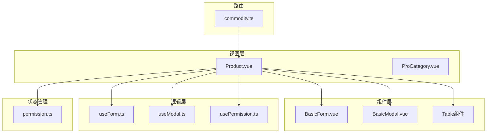
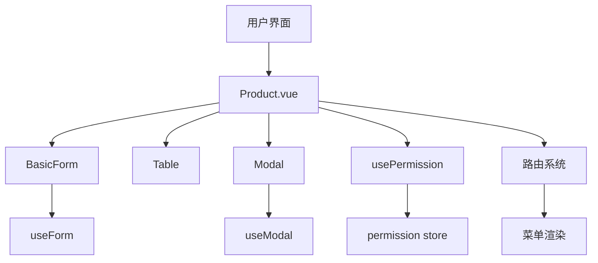
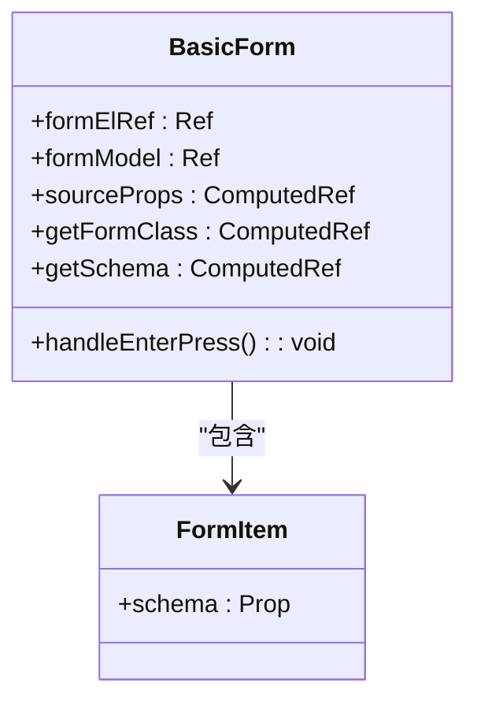
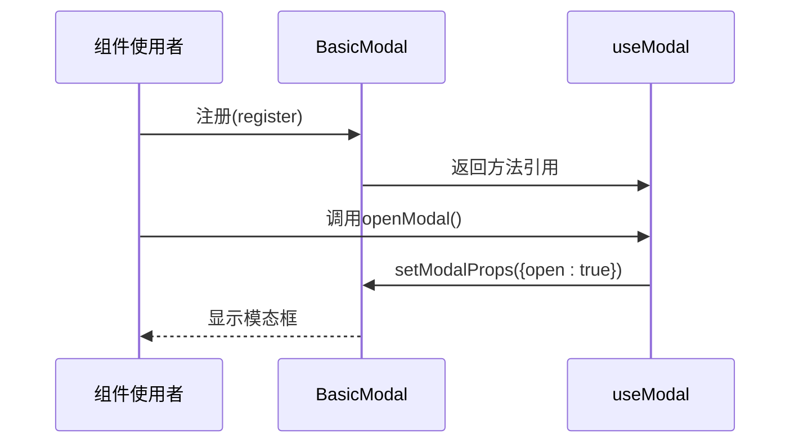
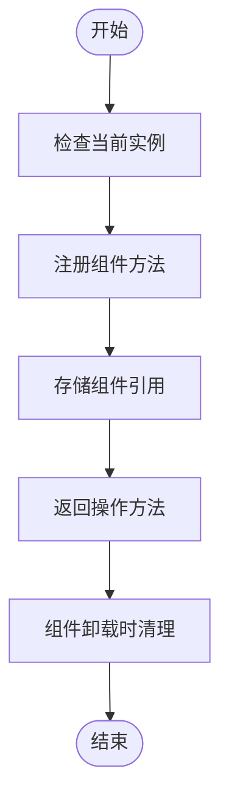
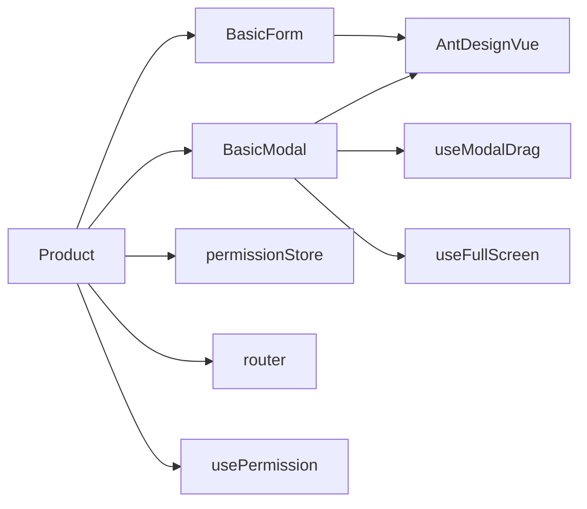

# 产品列表

<cite>
**本文档引用的文件**   
- [Product.vue](file://src/views/commodity/Product/Product.vue)
- [BasicForm.vue](file://src/components/Form/src/BasicForm.vue)
- [useForm.ts](file://src/components/Form/src/hooks/useForm.ts)
- [BasicModal.vue](file://src/components/Modal/src/BasicModal.vue)
- [useModal.ts](file://src/components/Modal/src/hooks/useModal.ts)
- [permission.ts](file://src/stores/modules/permission.ts)
- [commodity.ts](file://src/router/modules/commodity.ts)
- [usePage.ts](file://src/hooks/usePage.ts)
</cite>

## 目录
1. [介绍](#介绍)
2. [项目结构](#项目结构)
3. [核心组件](#核心组件)
4. [架构概述](#架构概述)
5. [详细组件分析](#详细组件分析)
6. [依赖分析](#依赖分析)
7. [性能考虑](#性能考虑)
8. [故障排除指南](#故障排除指南)
9. [结论](#结论)

## 介绍
本文档深入分析了产品列表页面的实现机制，重点说明`Product.vue`组件如何通过集成`BasicForm`、`Table`、`Modal`等UI组件来实现商品数据的展示与交互功能。文档详细描述了分页逻辑、搜索过滤条件的实现方式，以及如何利用组合式API（如`useForm`、`useModal`）封装表单验证和模态框控制逻辑。同时，文档还探讨了该页面与Pinia状态管理模块（如权限store）的权限联动机制，分析了其在路由配置中的结构位置及其元信息对菜单渲染的影响，并提供了扩展字段或自定义操作列的最佳实践建议。

## 项目结构
产品列表功能位于`src/views/commodity/Product/`目录下，主要由`Product.vue`组件构成。该组件作为产品管理模块的一部分，与产品分类组件（ProCategory.vue）共同构成商品管理功能体系。系统采用模块化路由设计，通过`src/router/modules/commodity.ts`文件定义路由结构，并利用Pinia进行状态管理。

**Diagram sources**
- [Product.vue](file://src/views/commodity/Product/Product.vue)
- [commodity.ts](file://src/router/modules/commodity.ts)

**Section sources**
- [Product.vue](file://src/views/commodity/Product/Product.vue)
- [commodity.ts](file://src/router/modules/commodity.ts)

## 核心组件
`Product.vue`组件作为产品列表页面的核心，负责整合各类UI组件和业务逻辑。尽管当前实现较为简单，仅包含基本的模板结构，但其设计意图是通过组合式API集成`BasicForm`、`Table`和`Modal`等组件来实现完整的商品管理功能。组件通过路由元信息获取页面标题和图标，并与权限系统联动控制功能可见性。

**Section sources**
- [Product.vue](file://src/views/commodity/Product/Product.vue)

## 架构概述
产品列表页面采用分层架构设计，前端组件层与业务逻辑层分离，通过组合式API进行通信。页面通过路由系统注册，利用meta信息控制菜单渲染和权限校验。数据交互通过组合式API封装，确保代码的可维护性和复用性。

**Diagram sources**
- [Product.vue](file://src/views/commodity/Product/Product.vue)
- [BasicForm.vue](file://src/components/Form/src/BasicForm.vue)
- [BasicModal.vue](file://src/components/Modal/src/BasicModal.vue)
- [useForm.ts](file://src/components/Form/src/hooks/useForm.ts)
- [useModal.ts](file://src/components/Modal/src/hooks/useModal.ts)
- [permission.ts](file://src/stores/modules/permission.ts)

## 详细组件分析

### Product.vue 组件分析
`Product.vue`组件作为产品列表的入口，目前实现了基本的页面结构。该组件通过路由配置中的meta信息获取页面标题"产品列表"，并将在后续开发中集成商品查询、新增、编辑和删除等功能。组件设计遵循Vue 3的组合式API规范，为后续功能扩展提供了良好的基础。

**Section sources**
- [Product.vue](file://src/views/commodity/Product/Product.vue)

### 表单组件分析
`BasicForm`组件封装了Ant Design Vue的表单功能，提供了灵活的表单构建能力。组件通过`getSchema`计算属性获取表单配置，并利用`FormItem`组件动态渲染表单字段。`handleEnterPress`方法为回车键事件提供了默认处理机制，可在子组件中重写以实现特定业务逻辑。

**Diagram sources**
- [BasicForm.vue](file://src/components/Form/src/BasicForm.vue)

### 模态框组件分析
`BasicModal`组件提供了完整的模态框功能封装，支持标题、页脚、关闭图标等自定义内容插槽。组件通过`mergeProps`计算属性合并基础属性和动态属性，实现了灵活的配置能力。`useModalDrag`和`useFullScreen`钩子提供了拖拽和全屏功能，增强了用户体验。

**Diagram sources**
- [BasicModal.vue](file://src/components/Modal/src/BasicModal.vue)
- [useModal.ts](file://src/components/Modal/src/hooks/useModal.ts)

### 组合式API分析
`useForm`和`useModal`钩子函数提供了表单和模态框的组合式API封装。`useModal`通过`dataTransfer`响应式对象实现跨组件数据传递，利用`register`方法建立组件实例引用，提供`openModal`、`closeModal`等便捷操作方法。这种设计模式实现了逻辑与视图的分离，提高了代码的可测试性和复用性。

**Diagram sources**
- [useModal.ts](file://src/components/Modal/src/hooks/useModal.ts)

## 依赖分析
产品列表页面依赖多个核心模块，包括UI组件库、状态管理、路由系统和工具函数。这些依赖关系通过模块导入机制建立，确保了功能的完整性和一致性。

**Diagram sources**
- [Product.vue](file://src/views/commodity/Product/Product.vue)
- [BasicForm.vue](file://src/components/Form/src/BasicForm.vue)
- [BasicModal.vue](file://src/components/Modal/src/BasicModal.vue)
- [permission.ts](file://src/stores/modules/permission.ts)

**Section sources**
- [Product.vue](file://src/views/commodity/Product/Product.vue)
- [BasicForm.vue](file://src/components/Form/src/BasicForm.vue)
- [BasicModal.vue](file://src/components/Modal/src/BasicModal.vue)
- [permission.ts](file://src/stores/modules/permission.ts)

## 性能考虑
当前实现中，`useModal`钩子通过`dataTransfer`响应式对象管理跨组件数据，需要注意避免内存泄漏。建议在组件卸载时及时清理相关数据引用。`BasicForm`组件的`getSchema`计算属性应确保schema数据的稳定性，避免不必要的重新计算。路由配置中的异步组件导入（import）有助于代码分割和按需加载，提升初始加载性能。

## 故障排除指南
当遇到模态框无法正常打开或关闭的问题时，首先检查`useModal`的注册过程是否正确完成。确保在模板中正确使用`@register`指令，并验证组件实例是否成功传递。对于表单验证问题，检查`useForm`的配置是否正确，确认表单规则定义的完整性。若权限控制失效，请验证`permission store`中的权限数据是否正确加载，并检查路由meta中的auths配置。

**Section sources**
- [useModal.ts](file://src/components/Modal/src/hooks/useModal.ts)
- [permission.ts](file://src/stores/modules/permission.ts)
- [useForm.ts](file://src/components/Form/src/hooks/useForm.ts)

## 结论
产品列表页面的设计体现了现代Vue应用的典型架构模式，通过组件化和组合式API实现了功能的解耦和复用。尽管当前实现较为基础，但其架构设计为后续功能扩展提供了良好的基础。建议完善`useForm`钩子的实现，增强表单验证和数据处理能力；同时扩展`Product.vue`组件，集成完整的商品管理功能，包括分页、搜索、增删改查等操作。通过进一步优化权限控制机制和用户体验，可打造一个高效、稳定的产品管理界面。