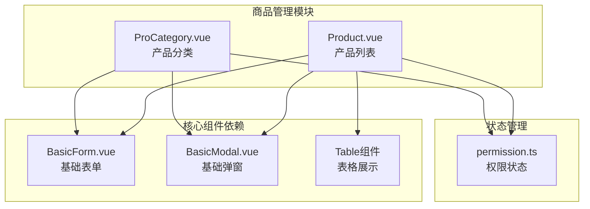
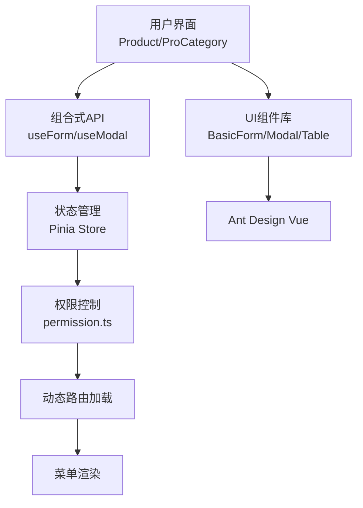
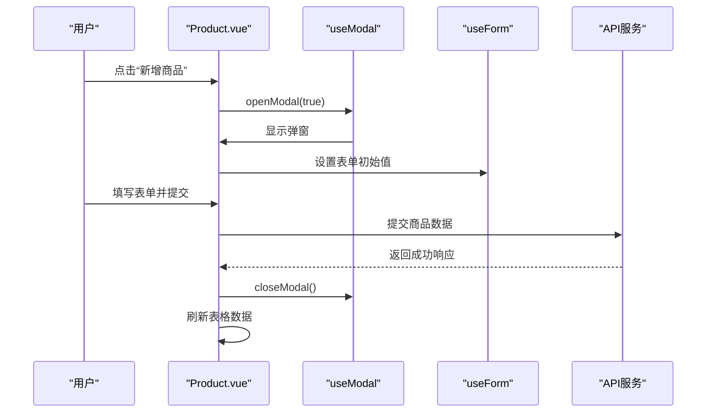
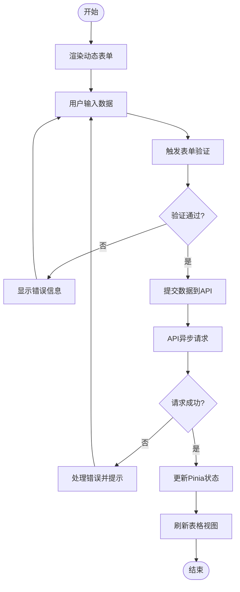
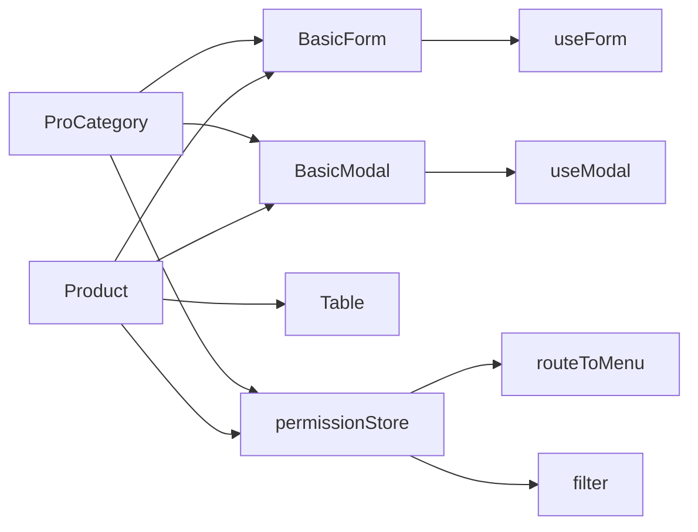

# 商品管理

<cite>
**本文档引用的文件**  
- [Product.vue](file://src/views/commodity/Product/Product.vue)
- [ProCategory.vue](file://src/views/commodity/ProCategory/ProCategory.vue)
- [commodity.ts](file://src/router/modules/commodity.ts)
- [useModal.ts](file://src/components/Modal/src/hooks/useModal.ts)
- [BasicForm.vue](file://src/components/Form/src/BasicForm.vue)
- [useForm.ts](file://src/components/Form/src/hooks/useForm.ts)
- [permission.ts](file://src/stores/modules/permission.ts)
- [table.ts](file://src/components/Table/types/table.ts)
</cite>

## 目录
1. [介绍](#介绍)
2. [项目结构](#项目结构)
3. [核心组件](#核心组件)
4. [架构概览](#架构概览)
5. [详细组件分析](#详细组件分析)
6. [依赖分析](#依赖分析)
7. [性能考虑](#性能考虑)
8. [故障排除指南](#故障排除指南)
9. [结论](#结论)

## 介绍
本文档深入分析商品管理模块的设计与实现，涵盖商品列表（Product.vue）和商品分类（ProCategory.vue）两个子模块。文档详细说明这两个页面如何构成完整的商品管理体系，描述其使用BasicForm、Table、Modal等UI组件实现增删改查（CRUD）操作的具体方式。同时，文档记录了表单验证逻辑、分页处理、搜索过滤及批量操作的实现机制，并解释页面如何通过组合式API（如useForm、useModal）封装可复用逻辑，并与Pinia store中的权限状态进行联动控制。

## 项目结构
商品管理模块位于`src/views/commodity/`目录下，包含两个主要子模块：Product（产品列表）和ProCategory（产品分类）。该模块通过路由配置集成到整体应用中，其结构遵循基于功能划分的组织方式。

**图示来源**  
- [Product.vue](file://src/views/commodity/Product/Product.vue)
- [ProCategory.vue](file://src/views/commodity/ProCategory/ProCategory.vue)
- [BasicForm.vue](file://src/components/Form/src/BasicForm.vue)
- [useModal.ts](file://src/components/Modal/src/hooks/useModal.ts)

**本节来源**  
- [commodity.ts](file://src/router/modules/commodity.ts)
- [Product.vue](file://src/views/commodity/Product/Product.vue)
- [ProCategory.vue](file://src/views/commodity/ProCategory/ProCategory.vue)

## 核心组件
商品管理模块的核心组件包括Product.vue和ProCategory.vue，分别负责产品列表展示与产品分类管理。这两个组件均基于统一的UI组件库（BasicForm、Modal、Table）构建，确保了界面风格和交互逻辑的一致性。组件通过组合式API（Composition API）实现逻辑复用，并与Pinia状态管理进行深度集成，以支持权限控制和动态路由加载。

**本节来源**  
- [Product.vue](file://src/views/commodity/Product/Product.vue)
- [ProCategory.vue](file://src/views/commodity/ProCategory/ProCategory.vue)
- [useForm.ts](file://src/components/Form/src/hooks/useForm.ts)
- [useModal.ts](file://src/components/Modal/src/hooks/useModal.ts)

## 架构概览
商品管理模块采用分层架构设计，前端组件层通过组合式API调用逻辑层服务，逻辑层与Pinia状态管理模块交互，实现权限判断和数据同步。整体架构支持动态路由加载和菜单权限控制，确保不同用户角色只能访问其授权范围内的功能。

**图示来源**  
- [permission.ts](file://src/stores/modules/permission.ts)
- [useForm.ts](file://src/components/Form/src/hooks/useForm.ts)
- [useModal.ts](file://src/components/Modal/src/hooks/useModal.ts)

## 详细组件分析

### 商品列表组件分析
商品列表组件（Product.vue）作为商品管理的核心界面，负责展示所有商品信息并提供增删改查操作入口。该组件通过集成Table组件实现数据展示，利用BasicForm和Modal组件构建新增和编辑表单，支持动态表单项配置和异步数据提交。

#### 表单与弹窗逻辑

**图示来源**  
- [Product.vue](file://src/views/commodity/Product/Product.vue)
- [useModal.ts](file://src/components/Modal/src/hooks/useModal.ts)
- [useForm.ts](file://src/components/Form/src/hooks/useForm.ts)

#### 表单验证与数据处理流程

**图示来源**  
- [BasicForm.vue](file://src/components/Form/src/BasicForm.vue)
- [useForm.ts](file://src/components/Form/src/hooks/useForm.ts)
- [Product.vue](file://src/views/commodity/Product/Product.vue)

**本节来源**  
- [Product.vue](file://src/views/commodity/Product/Product.vue)
- [BasicForm.vue](file://src/components/Form/src/BasicForm.vue)
- [useForm.ts](file://src/components/Form/src/hooks/useForm.ts)

### 商品分类组件分析
商品分类组件（ProCategory.vue）提供产品分类的管理功能，其技术实现与商品列表组件类似，均依赖于相同的UI组件库和组合式API。该组件同样支持通过权限状态控制操作按钮的显示与隐藏，确保安全性。

**本节来源**  
- [ProCategory.vue](file://src/views/commodity/ProCategory/ProCategory.vue)
- [permission.ts](file://src/stores/modules/permission.ts)

## 依赖分析
商品管理模块依赖于多个核心组件和状态管理模块，形成清晰的依赖关系网络。通过分析这些依赖，可以更好地理解模块间的耦合度和可维护性。

**图示来源**  
- [commodity.ts](file://src/router/modules/commodity.ts)
- [permission.ts](file://src/stores/modules/permission.ts)
- [Product.vue](file://src/views/commodity/Product/Product.vue)
- [ProCategory.vue](file://src/views/commodity/ProCategory/ProCategory.vue)

**本节来源**  
- [commodity.ts](file://src/router/modules/commodity.ts)
- [permission.ts](file://src/stores/modules/permission.ts)

## 性能考虑
当前商品管理模块的实现较为基础，尚未包含复杂的性能优化措施。建议在实际数据量较大时引入虚拟滚动、懒加载、防抖搜索等性能优化技术，以提升用户体验。同时，表单和弹窗的复用机制已通过组合式API实现，有助于减少重复代码和内存占用。

## 故障排除指南
当商品管理模块出现功能异常时，可按照以下步骤进行排查：
1. 检查路由配置是否正确加载
2. 验证Pinia store中的权限状态是否正常
3. 确认useModal和useForm等组合式API的注册与调用是否匹配
4. 检查表单提交时的数据结构是否符合API要求

**本节来源**  
- [useModal.ts](file://src/components/Modal/src/hooks/useModal.ts)
- [permission.ts](file://src/stores/modules/permission.ts)

## 结论
商品管理模块目前提供了基本的框架结构，包含商品列表和商品分类两个核心页面。模块采用现代化的Vue 3组合式API设计，通过useForm和useModal等自定义Hook实现了逻辑复用，结合Pinia状态管理实现了权限控制。尽管当前实现较为简单，但其架构设计合理，具备良好的扩展性。未来可在此基础上完善CRUD功能，增加分页、搜索、批量操作等实用特性，并进一步优化性能和用户体验。