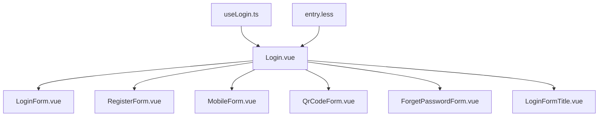
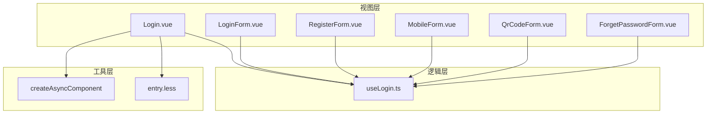
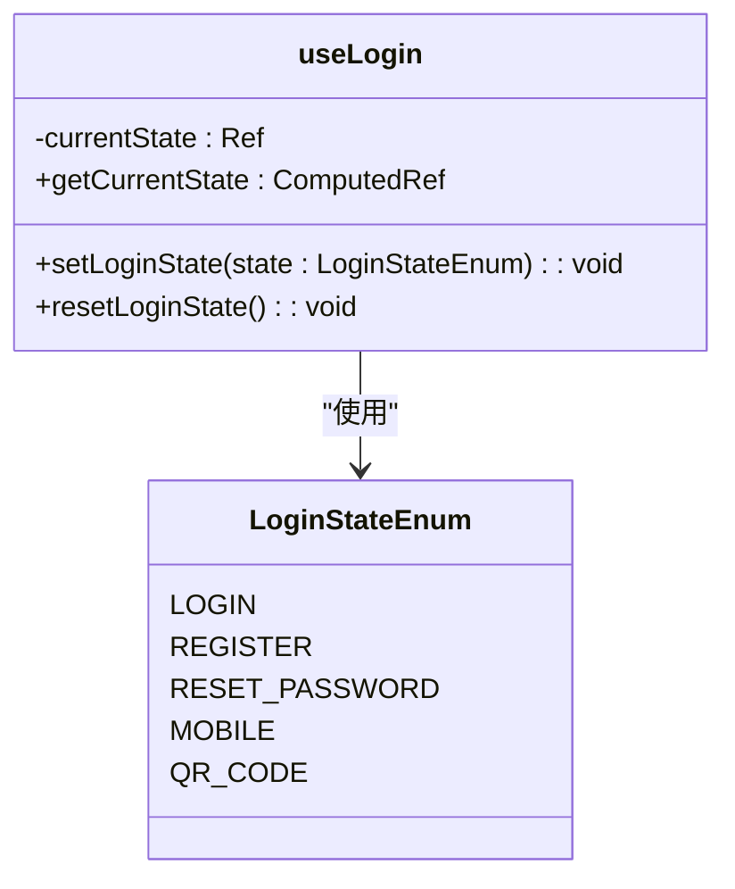
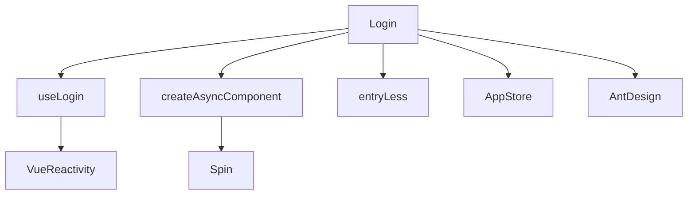

# 登录主组件

<cite>
**本文档引用的文件**  
- [Login.vue](file://src/views/system/login/Login.vue)
- [useLogin.ts](file://src/views/system/login/useLogin.ts)
- [LoginForm.vue](file://src/views/system/login/components/LoginForm.vue)
- [RegisterForm.vue](file://src/views/system/login/components/RegisterForm.vue)
- [MobileForm.vue](file://src/views/system/login/components/MobileForm.vue)
- [QrCodeForm.vue](file://src/views/system/login/components/QrCodeForm.vue)
- [ForgetPasswordForm.vue](file://src/views/system/login/components/ForgetPasswordForm.vue)
- [LoginFormTitle.vue](file://src/views/system/login/components/LoginFormTitle.vue)
- [entry.less](file://src/assets/less/entry.less)
- [createAsyncComponent.tsx](file://src/utils/createAsyncComponent.tsx)
</cite>

## 目录

1. [简介](#简介)
2. [项目结构](#项目结构)
3. [核心组件](#核心组件)
4. [架构概述](#架构概述)
5. [详细组件分析](#详细组件分析)
6. [依赖分析](#依赖分析)
7. [性能考虑](#性能考虑)
8. [故障排除指南](#故障排除指南)
9. [结论](#结论)

## 简介

`Login.vue` 是系统登录模块的主组件，作为多登录方式的容器，支持账号密码登录、注册、手机验证码登录、二维码登录和忘记密码等多种表单切换。该组件通过响应式状态管理实现动态表单渲染，并结合 CSS 过渡动画提升用户体验。同时，它集成了组合式函数 `useLogin.ts` 来统一管理登录状态、初始化表单及监听全局错误。

## 项目结构

`Login.vue` 位于 `src/views/system/login/` 目录下，其结构清晰地分离了不同功能的子组件。主组件负责布局与状态驱动，各登录表单以独立组件形式存放于 `components/` 子目录中，便于维护和复用。



**Diagram sources**
- [Login.vue](file://src/views/system/login/Login.vue)
- [useLogin.ts](file://src/views/system/login/useLogin.ts)
- [entry.less](file://src/assets/less/entry.less)

**Section sources**
- [Login.vue](file://src/views/system/login/Login.vue)
- [useLogin.ts](file://src/views/system/login/useLogin.ts)

## 核心组件

`Login.vue` 的核心机制在于通过 `currentForm` 状态（实际为 `LoginStateEnum` 枚举值）控制当前显示的登录表单。虽然模板中未直接使用 `<component :is="currentForm"/>`，但通过 `v-if="getShow"` 配合 `getCurrentState` 实现了等效的动态组件切换逻辑。

所有表单组件均通过 `createAsyncComponent` 异步加载，提升首屏性能。主组件通过 `useLogin()` 获取状态管理能力，实现跨组件的状态同步。

**Section sources**
- [Login.vue](file://src/views/system/login/Login.vue#L41-L54)
- [useLogin.ts](file://src/views/system/login/useLogin.ts#L18-L40)

## 架构概述

该登录系统采用组合式 API 架构，将状态逻辑抽离至 `useLogin.ts`，实现逻辑复用与关注点分离。主组件仅负责视图渲染与用户交互，业务逻辑由组合函数统一处理。



**Diagram sources**
- [Login.vue](file://src/views/system/login/Login.vue)
- [useLogin.ts](file://src/views/system/login/useLogin.ts)
- [createAsyncComponent.tsx](file://src/utils/createAsyncComponent.tsx)
- [entry.less](file://src/assets/less/entry.less)

## 详细组件分析

### 登录状态管理机制

`useLogin.ts` 提供了登录状态的响应式管理，包括状态设置、获取和重置功能。`currentState` 使用 `ref` 定义，通过 `setLoginState` 修改，`getCurrentState` 以 `computed` 形式暴露，确保依赖自动更新。



**Diagram sources**
- [useLogin.ts](file://src/views/system/login/useLogin.ts#L18-L40)

**Section sources**
- [useLogin.ts](file://src/views/system/login/useLogin.ts#L7-L40)

### 动态表单切换流程

各表单组件通过 `getShow` 计算属性判断是否显示，该属性依赖 `getCurrentState` 与当前表单类型进行比对。当用户点击切换按钮时，调用 `setLoginState` 更新状态，触发视图重新渲染。

例如，在 `LoginForm.vue` 中：
```ts
const getShow = computed(() => unref(getCurrentState) === LoginStateEnum.LOGIN)
```

**Section sources**
- [LoginForm.vue](file://src/views/system/login/components/LoginForm.vue#L49)
- [RegisterForm.vue](file://src/views/system/login/components/RegisterForm.vue#L42)
- [MobileForm.vue](file://src/views/system/login/components/MobileForm.vue#L31)
- [QrCodeForm.vue](file://src/views/system/login/components/QrCodeForm.vue#L24)
- [ForgetPasswordForm.vue](file://src/views/system/login/components/ForgetPasswordForm.vue#L33)

### CSS 过渡动画实现

通过 `entry.less` 文件定义了 `enter-x` 和 `enter-y` 类名，结合 CSS 动画实现入场动画。元素初始状态为透明并偏移，随后通过 `animation` 属性在指定延迟后执行动画，平滑过渡到最终位置。

```mermaid
flowchart TD
A[元素添加 enter-x 类] --> B[初始状态: opacity=0, translateX(50px)]
B --> C[等待 animation-delay]
C --> D[执行 enter-x-animation 动画]
D --> E[最终状态: opacity=1, translateX(0)]
```

**Diagram sources**
- [entry.less](file://src/assets/less/entry.less#L1-L42)

**Section sources**
- [entry.less](file://src/assets/less/entry.less#L1-L42)

### 组件生命周期与组合函数调用

在 `Login.vue` 的 `<script setup>` 中，直接调用 `useLogin()` 初始化状态管理器。组件挂载时，各子组件通过相同的 `useLogin()` 获取共享状态，实现跨组件通信。

表单状态重置通过 `resetLoginState()` 方法完成，通常在登录成功或取消操作后调用。全局错误监听虽在文档中提及，但当前代码中尚未实现具体监听逻辑。

**Section sources**
- [Login.vue](file://src/views/system/login/Login.vue#L40-L60)
- [useLogin.ts](file://src/views/system/login/useLogin.ts#L24-L40)

### 响应式布局设计

`Login.vue` 使用 Tailwind CSS 实现响应式布局。通过 `xl:flex`、`sm:px-10` 等类名控制不同屏幕尺寸下的显示效果。左侧背景图在小屏幕上隐藏，右侧表单区域在移动端自动居中，确保良好的移动设备体验。

**Section sources**
- [Login.vue](file://src/views/system/login/Login.vue#L7-L35)

## 依赖分析

`Login.vue` 及其子组件依赖多个核心模块：
- `useLogin.ts`：提供登录状态管理
- `createAsyncComponent`：实现异步组件加载
- `entry.less`：提供入场动画样式
- Pinia store：获取应用配置（如站点名称、Logo）
- Ant Design Vue 组件库：提供表单、按钮等 UI 元素



**Diagram sources**
- [Login.vue](file://src/views/system/login/Login.vue)
- [useLogin.ts](file://src/views/system/login/useLogin.ts)
- [createAsyncComponent.tsx](file://src/utils/createAsyncComponent.tsx)

**Section sources**
- [Login.vue](file://src/views/system/login/Login.vue)
- [useLogin.ts](file://src/views/system/login/useLogin.ts)
- [createAsyncComponent.tsx](file://src/utils/createAsyncComponent.tsx)

## 性能考虑

- **异步组件加载**：除 `LoginForm` 外，其余表单均采用异步加载，减少初始包体积。
- **缓存机制**：登录表单支持“记住账号”功能，利用 `CacheTypeEnum.MEMORY_ACCOUNT_KEY` 在本地存储账户信息。
- **动画性能**：使用 CSS `transform` 和 `opacity` 实现动画，避免触发布局重排，提升渲染性能。

## 故障排除指南

### 第三方 OAuth 登录集成方法

要在主组件中集成第三方 OAuth 登录（如微信、Google），可按以下步骤操作：
1. 在 `LoginStateEnum` 中新增 `OAUTH` 状态。
2. 创建 `OAuthForm.vue` 组件，处理授权跳转与回调。
3. 在主组件中导入并注册新表单。
4. 在登录按钮区域添加 OAuth 登录入口。

### 内存泄漏注意事项

- **避免未清理的定时器**：如 `QrCodeForm.vue` 中的二维码刷新定时器，应在组件销毁或状态切换时清除。
- **事件监听器解绑**：若在组件中手动添加了全局事件监听（如键盘事件），需在 `onUnmounted` 中解绑。
- **异步操作取消**：对于可能延迟完成的异步请求，应提供取消机制，防止在组件销毁后更新状态。

**Section sources**
- [QrCodeForm.vue](file://src/views/system/login/components/QrCodeForm.vue#L30-L34)

## 结论

`Login.vue` 主组件通过组合式函数 `useLogin.ts` 实现了多登录方式的统一管理，利用响应式状态驱动动态表单切换，并结合 CSS 动画提升用户体验。其模块化设计便于扩展新登录方式，异步加载策略优化了性能表现。未来可进一步完善全局错误监听机制，并规范第三方登录的集成流程，以增强系统的健壮性与可维护性。