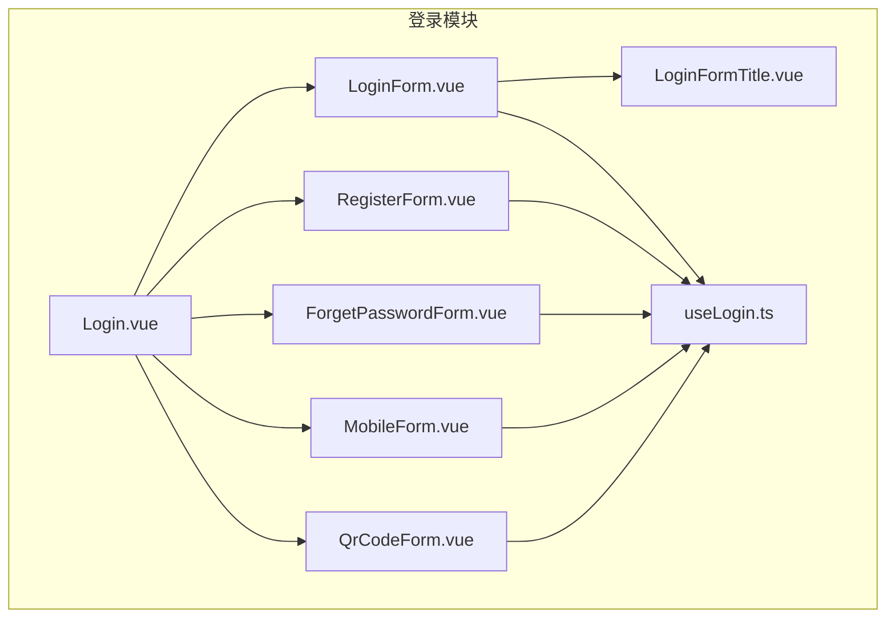
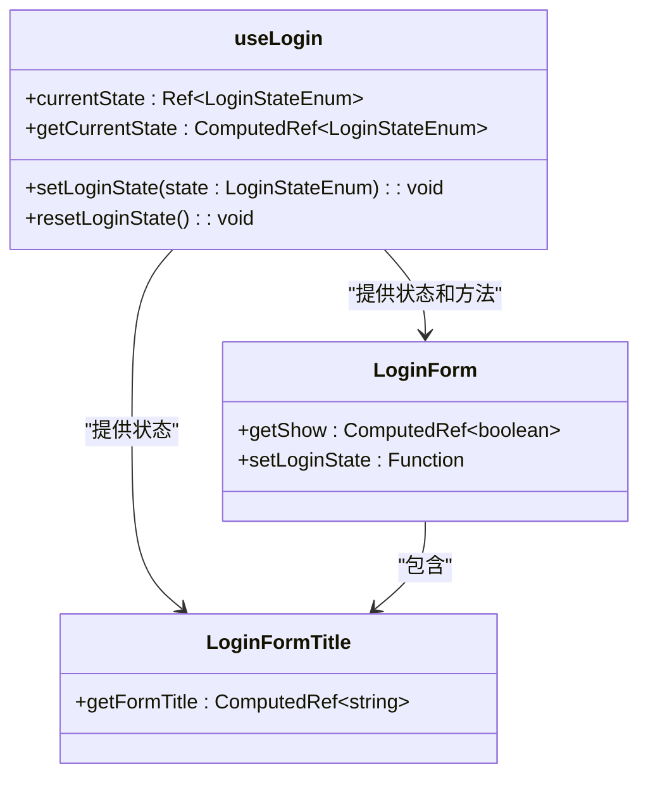
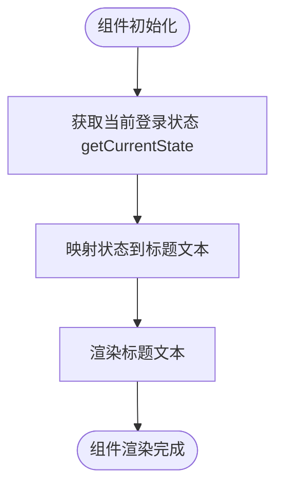
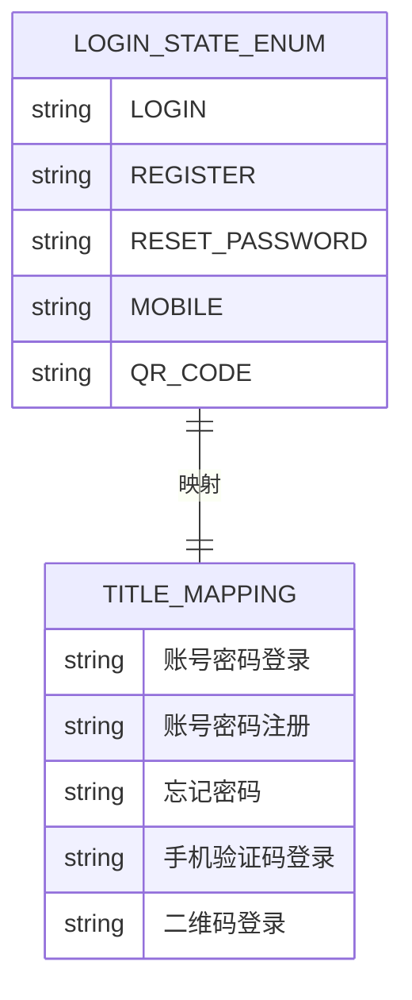
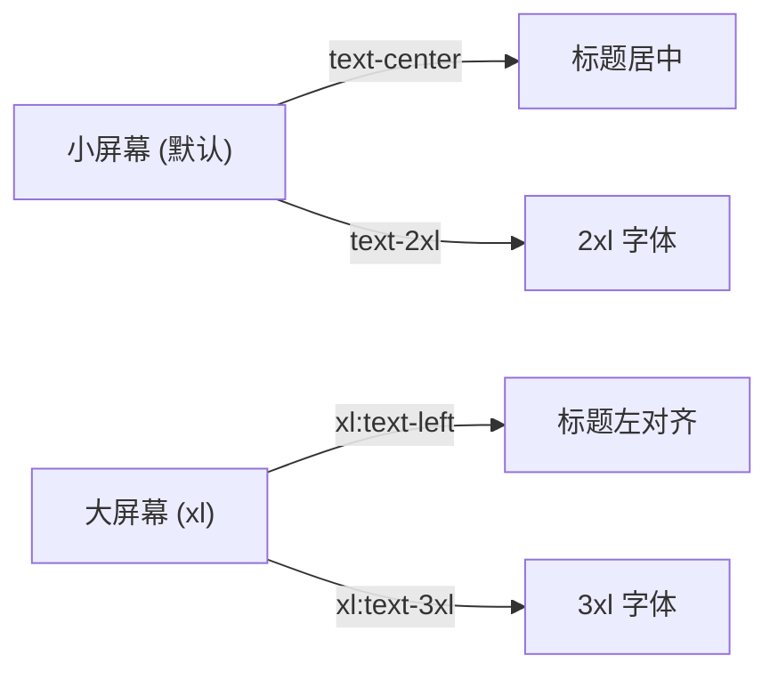
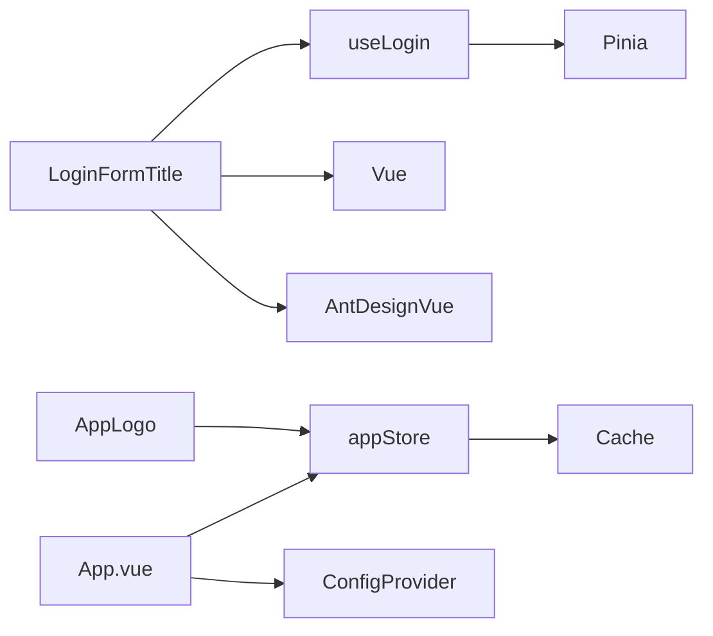

# 登录标题组件

<cite>
**本文档中引用的文件**  
- [LoginFormTitle.vue](file://src/views/system/login/components/LoginFormTitle.vue)
- [useLogin.ts](file://src/views/system/login/useLogin.ts)
- [LoginForm.vue](file://src/views/system/login/components/LoginForm.vue)
- [AppLogo.vue](file://src/components/Application/AppLogo.vue)
- [App.vue](file://src/App.vue)
- [tailwind.config.js](file://tailwind.config.js)
- [project.ts](file://src/config/project.ts)
- [BasicTitle.vue](file://src/components/Basic/BasicTitle.vue)
- [useClass.ts](file://src/hooks/useClass.ts)
- [app.ts](file://src/stores/modules/app.ts)
</cite>

## 目录
1. [介绍](#介绍)
2. [项目结构](#项目结构)
3. [核心组件](#核心组件)
4. [架构概述](#架构概述)
5. [详细组件分析](#详细组件分析)
6. [依赖分析](#依赖分析)
7. [性能考虑](#性能考虑)
8. [故障排除指南](#故障排除指南)
9. [结论](#结论)

## 介绍
`LoginFormTitle.vue` 组件是登录界面中的关键视觉元素，负责展示当前登录状态的标题文本。该组件通过动态绑定登录状态，实现多表单场景下的标题切换，如账号密码登录、注册、忘记密码、手机验证码登录和二维码登录等。组件结合了响应式设计、国际化支持和暗色模式适配，确保在不同设备和用户偏好下都能提供一致的用户体验。

## 项目结构
登录功能模块位于 `src/views/system/login/` 目录下，包含多个表单组件和状态管理逻辑。`LoginFormTitle.vue` 作为子组件被集成在 `LoginForm.vue` 中，通过 `useLogin` 组合式函数与父级登录状态保持同步。



**Diagram sources**  
- [Login.vue](file://src/views/system/login/Login.vue)
- [LoginForm.vue](file://src/views/system/login/components/LoginForm.vue)
- [LoginFormTitle.vue](file://src/views/system/login/components/LoginFormTitle.vue)
- [useLogin.ts](file://src/views/system/login/useLogin.ts)

**Section sources**  
- [Login.vue](file://src/views/system/login/Login.vue)
- [LoginForm.vue](file://src/views/system/login/components/LoginForm.vue)

## 核心组件
`LoginFormTitle.vue` 的核心功能是根据当前登录状态动态显示相应的标题文本。组件通过 `useLogin` 提供的 `getCurrentState` 计算属性获取当前状态，并映射到预定义的中文标题上。标题文本使用 `h2` 标签呈现，结合 Tailwind CSS 实现响应式字体大小和居中布局。

**Section sources**  
- [LoginFormTitle.vue](file://src/views/system/login/components/LoginFormTitle.vue)
- [useLogin.ts](file://src/views/system/login/useLogin.ts)

## 架构概述
登录组件采用组合式 API 架构，通过 `useLogin` 函数集中管理登录状态。`LoginFormTitle.vue` 作为无状态展示组件，仅负责渲染由状态管理函数提供的数据。这种分离使得组件逻辑清晰，易于维护和测试。



**Diagram sources**  
- [useLogin.ts](file://src/views/system/login/useLogin.ts)
- [LoginFormTitle.vue](file://src/views/system/login/components/LoginFormTitle.vue)
- [LoginForm.vue](file://src/views/system/login/components/LoginForm.vue)

## 详细组件分析

### LoginFormTitle 组件分析
`LoginFormTitle.vue` 是一个简单的展示组件，其主要职责是将登录状态转换为用户友好的标题文本。组件使用 Vue 3 的 `<script setup>` 语法，通过 `computed` 属性实现响应式标题生成。

#### 组件实现


**Diagram sources**  
- [LoginFormTitle.vue](file://src/views/system/login/components/LoginFormTitle.vue)
- [useLogin.ts](file://src/views/system/login/useLogin.ts)

#### 国际化与文本映射
组件通过一个静态对象 `TITLE_ENUM` 将 `LoginStateEnum` 枚举值映射到中文标题。虽然当前实现直接使用中文，但可通过引入 i18n 框架轻松扩展为多语言支持。



**Diagram sources**  
- [LoginFormTitle.vue](file://src/views/system/login/components/LoginFormTitle.vue)
- [useLogin.ts](file://src/views/system/login/useLogin.ts)

**Section sources**  
- [LoginFormTitle.vue](file://src/views/system/login/components/LoginFormTitle.vue)
- [useLogin.ts](file://src/views/system/login/useLogin.ts)

### 响应式设计策略
组件利用 Tailwind CSS 的响应式断点系统，在不同屏幕尺寸下调整字体大小和对齐方式。在小屏幕上标题居中显示，在大屏幕上则左对齐，以适应不同的布局需求。



**Diagram sources**  
- [LoginFormTitle.vue](file://src/views/system/login/components/LoginFormTitle.vue)
- [tailwind.config.js](file://tailwind.config.js)

**Section sources**  
- [LoginFormTitle.vue](file://src/views/system/login/components/LoginFormTitle.vue)

### 与主登录组件的集成
`LoginForm.vue` 通过 `v-show` 指令控制 `LoginFormTitle` 的显示，确保只有在当前状态为登录时才显示该标题。这种条件渲染策略优化了用户体验，避免了不必要的视觉干扰。

```mermaid
sequenceDiagram
participant LoginForm as "LoginForm"
participant UseLogin as "useLogin"
participant Title as "LoginFormTitle"
UseLogin->>LoginForm : 提供 getCurrentState
LoginForm->>LoginForm : 计算 getShow
LoginForm->>Title : v-show="getShow"
Title->>Title : 显示/隐藏标题
```

**Diagram sources**  
- [LoginForm.vue](file://src/views/system/login/components/LoginForm.vue)
- [LoginFormTitle.vue](file://src/views/system/login/components/LoginFormTitle.vue)
- [useLogin.ts](file://src/views/system/login/useLogin.ts)

**Section sources**  
- [LoginForm.vue](file://src/views/system/login/components/LoginForm.vue)

## 依赖分析
`LoginFormTitle.vue` 组件依赖于多个核心模块，包括状态管理、UI 库和工具函数。这些依赖关系确保了组件的功能完整性和样式一致性。



**Diagram sources**  
- [LoginFormTitle.vue](file://src/views/system/login/components/LoginFormTitle.vue)
- [useLogin.ts](file://src/views/system/login/useLogin.ts)
- [App.vue](file://src/App.vue)
- [app.ts](file://src/stores/modules/app.ts)

**Section sources**  
- [LoginFormTitle.vue](file://src/views/system/login/components/LoginFormTitle.vue)
- [useLogin.ts](file://src/views/system/login/useLogin.ts)
- [App.vue](file://src/App.vue)

## 性能考虑
组件采用轻量级实现，避免不必要的计算和渲染开销。通过使用 `computed` 属性，确保标题文本仅在登录状态变化时重新计算，提高了渲染效率。同时，组件不包含复杂的 DOM 操作或第三方库依赖，保证了快速加载和响应。

## 故障排除指南
当 `LoginFormTitle` 不显示或显示错误标题时，应检查以下方面：
1. 确认 `useLogin` 的 `currentState` 是否正确设置
2. 检查 `LoginForm` 中的 `getShow` 计算属性逻辑
3. 验证 `TITLE_ENUM` 映射是否完整覆盖所有登录状态
4. 确保 Tailwind CSS 类名正确应用，特别是响应式类

**Section sources**  
- [LoginFormTitle.vue](file://src/views/system/login/components/LoginFormTitle.vue)
- [LoginForm.vue](file://src/views/system/login/components/LoginForm.vue)
- [useLogin.ts](file://src/views/system/login/useLogin.ts)

## 结论
`LoginFormTitle.vue` 组件通过简洁的设计和高效的实现，为登录界面提供了清晰的状态指示。组件与 `useLogin` 状态管理系统的紧密集成，确保了多表单场景下的无缝切换体验。其响应式设计和暗色模式支持，使得组件在各种设备和用户偏好下都能保持良好的可读性和美观性。未来可通过引入国际化框架进一步增强其多语言支持能力。