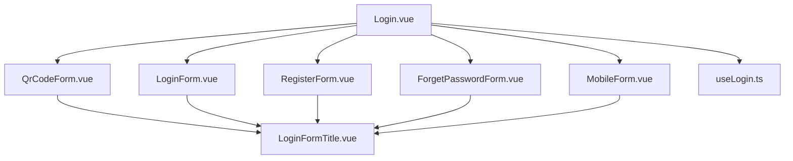
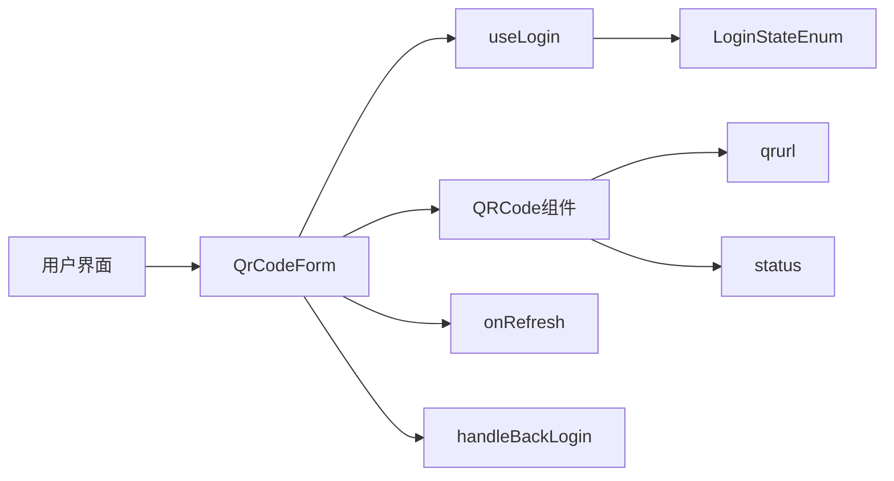
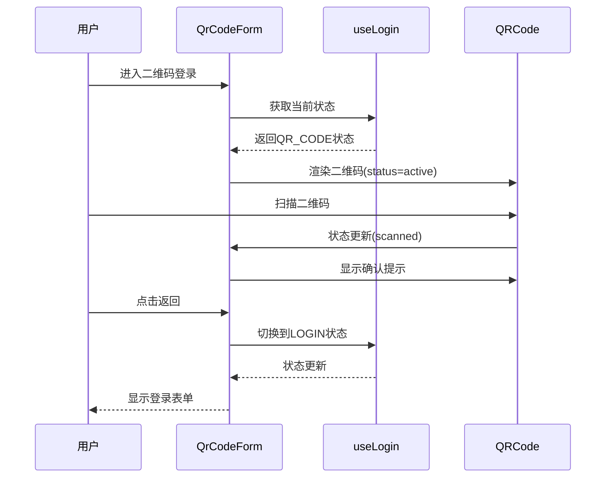
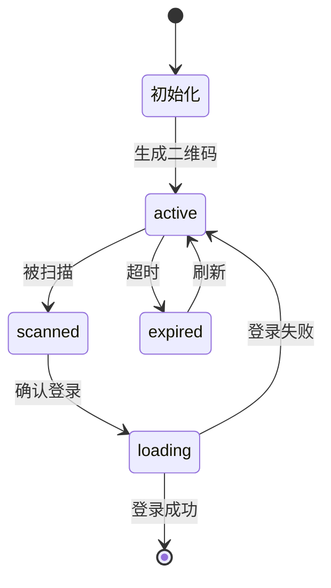
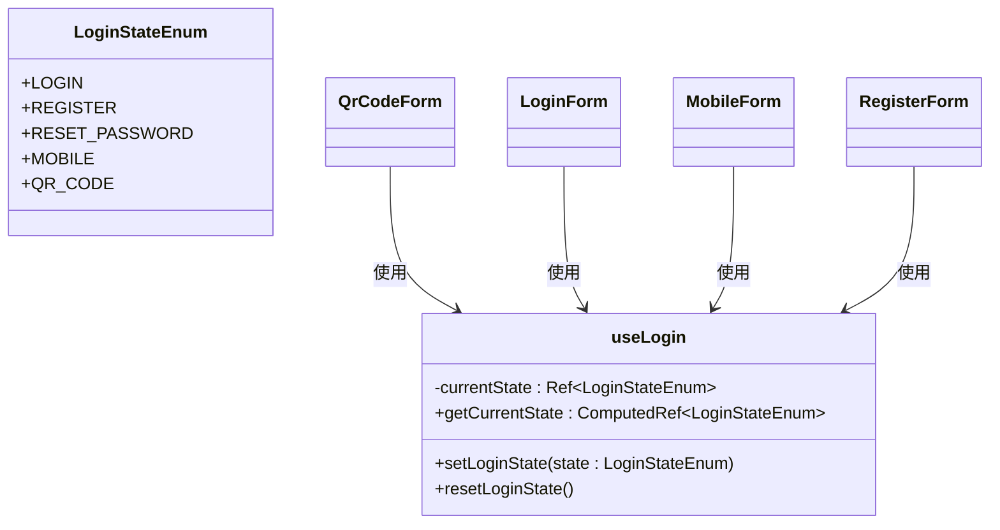
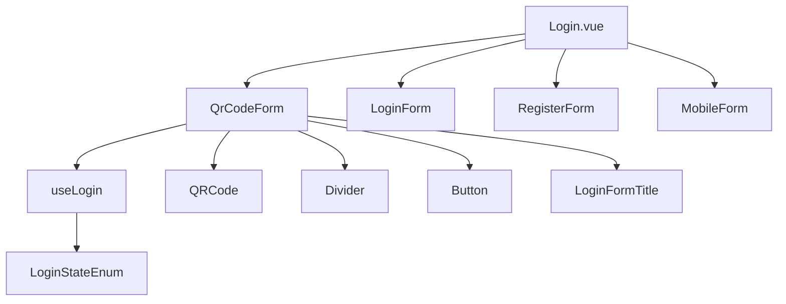

# 二维码登录表单

<cite>
**本文档中引用的文件**  
- [QrCodeForm.vue](file://src/views/system/login/components/QrCodeForm.vue)
- [useLogin.ts](file://src/views/system/login/useLogin.ts)
- [Login.vue](file://src/views/system/login/Login.vue)
- [LoginForm.vue](file://src/views/system/login/components/LoginForm.vue)
- [LoginFormTitle.vue](file://src/views/system/login/components/LoginFormTitle.vue)
</cite>

## 目录
1. [简介](#简介)
2. [项目结构](#项目结构)
3. [核心组件](#核心组件)
4. [架构概览](#架构概览)
5. [详细组件分析](#详细组件分析)
6. [依赖分析](#依赖分析)
7. [性能考虑](#性能考虑)
8. [故障排除指南](#故障排除指南)
9. [结论](#结论)

## 简介
本文档全面解析二维码登录表单（QrCodeForm）的交互流程与状态管理机制。重点阐述QRCode组件如何根据qrurl生成二维码，并通过status属性（active/loading/expired/scanned）反映扫码的不同阶段。同时说明onRefresh方法用于重新生成二维码的逻辑，以及handleBackLogin方法在返回时需要执行的清理工作（如停止轮询定时器、重置状态）。此外，还描述了Divider组件提供的用户操作指引。结合实际应用场景，指导开发者如何实现后端轮询机制以检查二维码的扫描和确认状态，并在前端更新status以提供实时反馈，最终完成登录态的切换。

## 项目结构
本项目采用基于Vue 3的组合式API架构，使用TypeScript进行类型定义。登录功能模块位于`src/views/system/login/`目录下，采用组件化设计模式，将不同登录方式拆分为独立组件，并通过`useLogin`统一管理状态。

**Diagram sources**
- [Login.vue](file://src/views/system/login/Login.vue)
- [QrCodeForm.vue](file://src/views/system/login/components/QrCodeForm.vue)
- [LoginForm.vue](file://src/views/system/login/components/LoginForm.vue)

**Section sources**
- [Login.vue](file://src/views/system/login/Login.vue)
- [QrCodeForm.vue](file://src/views/system/login/components/QrCodeForm.vue)

## 核心组件
二维码登录表单的核心组件包括QrCodeForm、QRCode（来自ant-design-vue）、LoginFormTitle和useLogin状态管理器。QrCodeForm负责渲染二维码界面，通过绑定qrurl和status属性与QRCode组件通信，实现二维码的动态生成和状态展示。LoginFormTitle提供统一的表单标题，useLogin则作为多个登录组件之间的状态协调中心。

**Section sources**
- [QrCodeForm.vue](file://src/views/system/login/components/QrCodeForm.vue)
- [useLogin.ts](file://src/views/system/login/useLogin.ts)

## 架构概览
系统采用分层架构设计，视图层由多个登录组件构成，状态管理层通过useLogin提供统一的状态管理接口，组件间通过LoginStateEnum枚举值进行状态切换。当用户选择二维码登录时，QrCodeForm组件被激活，开始二维码的生成和轮询检测流程。

**Diagram sources**
- [QrCodeForm.vue](file://src/views/system/login/components/QrCodeForm.vue)
- [useLogin.ts](file://src/views/system/login/useLogin.ts)

## 详细组件分析

### QrCodeForm 组件分析
QrCodeForm组件是二维码登录功能的主要实现，它通过条件渲染控制显示状态，集成QRCode组件展示二维码，并提供操作指引和返回按钮。

#### 交互流程

**Diagram sources**
- [QrCodeForm.vue](file://src/views/system/login/components/QrCodeForm.vue)
- [useLogin.ts](file://src/views/system/login/useLogin.ts)

#### 状态管理

**Diagram sources**
- [QrCodeForm.vue](file://src/views/system/login/components/QrCodeForm.vue)

**Section sources**
- [QrCodeForm.vue](file://src/views/system/login/components/QrCodeForm.vue#L1-L35)
- [useLogin.ts](file://src/views/system/login/useLogin.ts#L1-L40)

### 状态枚举分析
LoginStateEnum定义了系统中所有可用的登录状态，为组件间的导航提供了类型安全的接口。

**Diagram sources**
- [useLogin.ts](file://src/views/system/login/useLogin.ts#L10-L16)

## 依赖分析
系统组件间存在清晰的依赖关系，QrCodeForm依赖于useLogin进行状态管理，同时使用ant-design-vue提供的QRCode、Divider和Button组件。所有登录组件共享useLogin状态管理器，确保状态切换的一致性。

**Diagram sources**
- [QrCodeForm.vue](file://src/views/system/login/components/QrCodeForm.vue)
- [useLogin.ts](file://src/views/system/login/useLogin.ts)
- [Login.vue](file://src/views/system/login/Login.vue)

**Section sources**
- [QrCodeForm.vue](file://src/views/system/login/components/QrCodeForm.vue)
- [useLogin.ts](file://src/views/system/login/useLogin.ts)

## 性能考虑
当前实现中，二维码轮询机制尚未完全实现（TODO注释），这可能影响用户体验。建议实现定时轮询后端接口检查二维码状态，同时设置合理的超时时间避免资源浪费。QRCode组件的渲染性能良好，256px大小的二维码在现代设备上渲染流畅。

## 故障排除指南
常见问题包括二维码无法生成、状态更新不及时、返回按钮未清理定时器等。检查要点：
- 确保qrurl为有效URL
- 验证status值在允许范围内（active/loading/expired/scanned）
- 实现onRefresh方法重新获取二维码
- 在handleBackLogin中清理可能存在的轮询定时器

**Section sources**
- [QrCodeForm.vue](file://src/views/system/login/components/QrCodeForm.vue#L30-L34)

## 结论
QrCodeForm组件实现了基本的二维码登录界面，但轮询机制和状态管理仍需完善。通过useLogin统一管理登录状态，实现了组件间的解耦。建议补充完整的轮询逻辑，处理各种边界情况，提升用户体验。