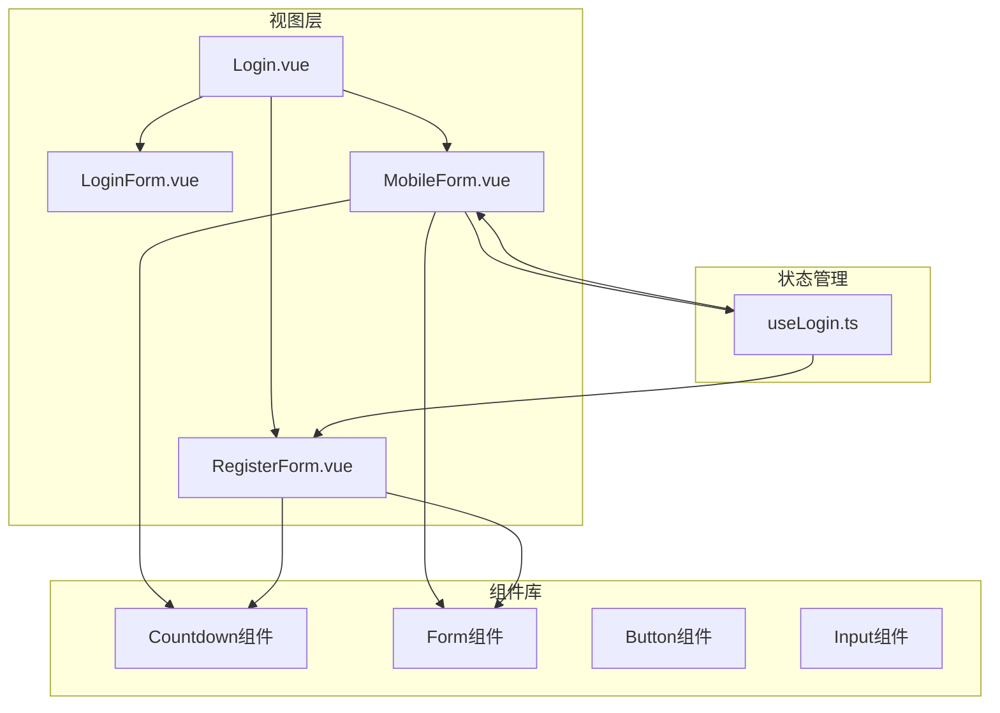
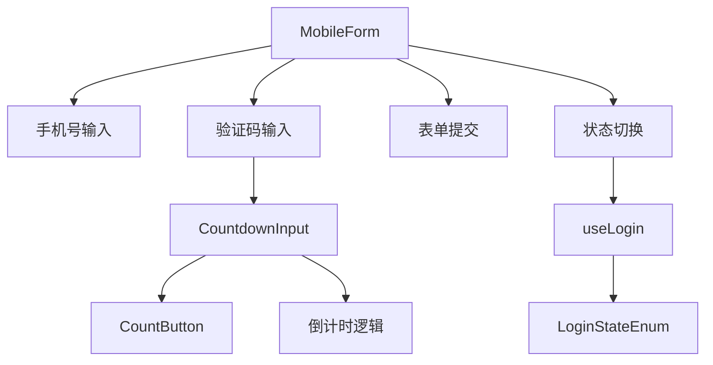
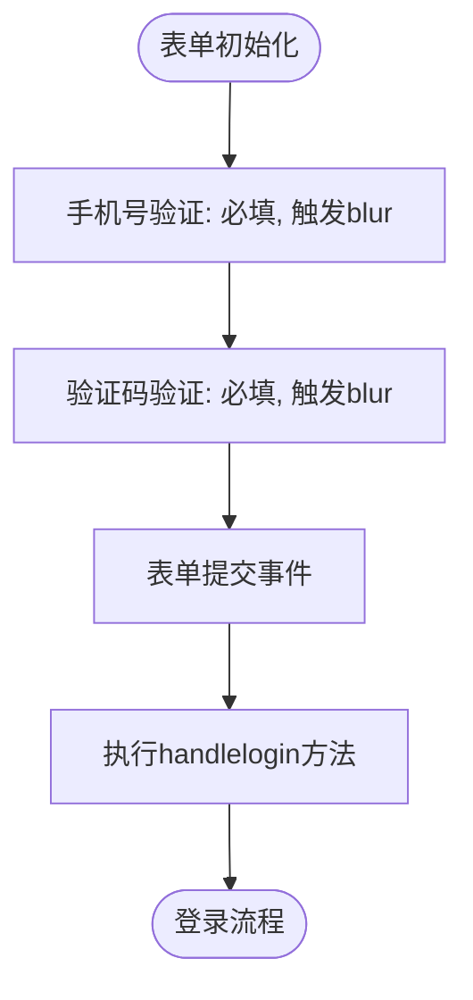
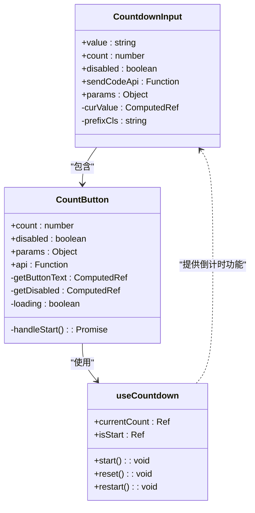
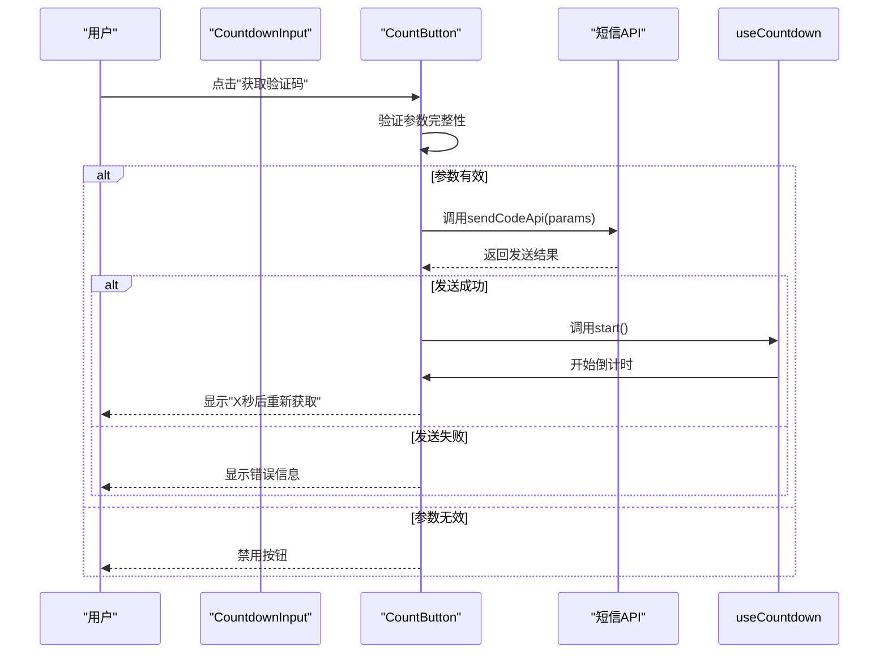
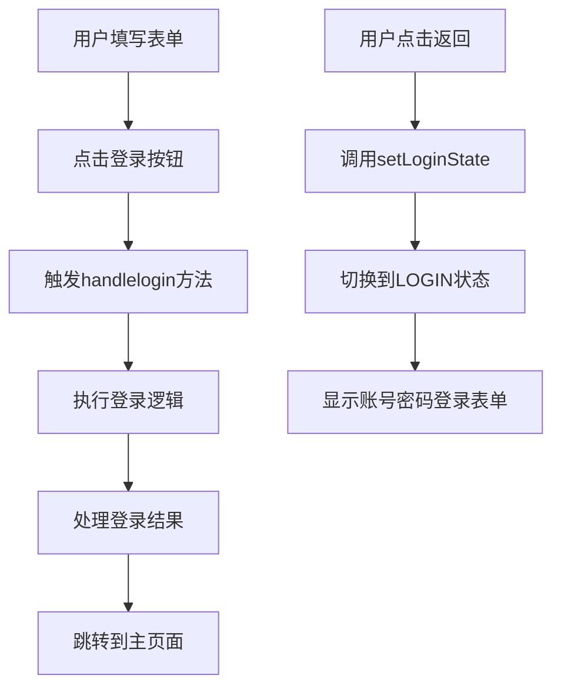
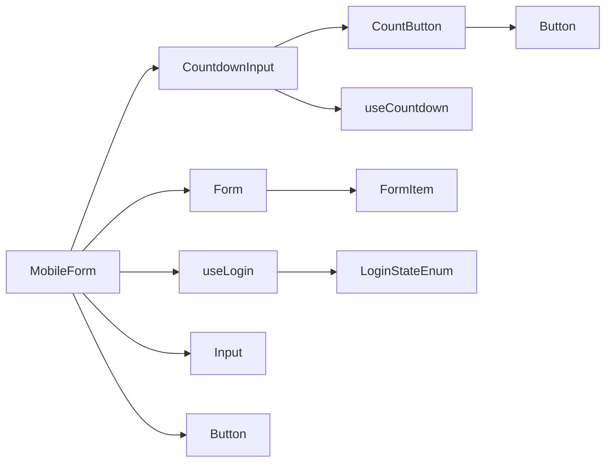

# 手机验证码登录表单

<cite>
**本文档引用的文件**  
- [MobileForm.vue](file://src/views/system/login/components/MobileForm.vue)
- [CountdownInput.vue](file://src/components/Countdown/src/CountdownInput.vue)
- [CountButton.vue](file://src/components/Countdown/src/CountButton.vue)
- [useCountdown.ts](file://src/components/Countdown/src/useCountdown.ts)
- [useLogin.ts](file://src/views/system/login/useLogin.ts)
- [LoginForm.vue](file://src/views/system/login/components/LoginForm.vue)
- [RegisterForm.vue](file://src/views/system/login/components/RegisterForm.vue)
</cite>

## 目录
1. [简介](#简介)
2. [项目结构](#项目结构)
3. [核心组件](#核心组件)
4. [架构概览](#架构概览)
5. [详细组件分析](#详细组件分析)
6. [依赖分析](#依赖分析)
7. [性能考虑](#性能考虑)
8. [故障排除指南](#故障排除指南)
9. [结论](#结论)

## 简介
本文档详细阐述了手机验证码登录表单（MobileForm）的工作机制。重点分析手机号输入框的格式校验规则配置，解析验证码输入框如何集成自定义的CountdownInput组件实现倒计时与短信发送功能。说明getParams计算属性如何动态生成请求参数（包含手机号），以便CountdownInput在倒计时结束后触发短信发送API调用。描述表单提交流程（handlelogin方法待实现）及返回登录页的交互逻辑。结合代码示例，说明如何在CountdownInput的params变化时自动重置倒计时，并指导开发者如何对接后端短信服务接口，处理发送频率限制和错误反馈。

## 项目结构
本项目采用模块化Vue组件架构，主要结构包括公共组件库（components）、视图层（views）、状态管理（stores）和工具函数（utils）。手机验证码登录功能位于`src/views/system/login/components/`目录下，通过`useLogin`统一管理登录状态切换。



**Diagram sources**
- [Login.vue](file://src/views/system/login/Login.vue)
- [MobileForm.vue](file://src/views/system/login/components/MobileForm.vue)
- [RegisterForm.vue](file://src/views/system/login/components/RegisterForm.vue)
- [useLogin.ts](file://src/views/system/login/useLogin.ts)

**Section sources**
- [Login.vue](file://src/views/system/login/Login.vue)
- [MobileForm.vue](file://src/views/system/login/components/MobileForm.vue)

## 核心组件
手机验证码登录表单（MobileForm）是系统登录模块的重要组成部分，实现了基于手机号和验证码的无密码登录机制。该组件通过集成CountdownInput组件，提供了完整的短信验证码发送与倒计时功能。

**Section sources**
- [MobileForm.vue](file://src/views/system/login/components/MobileForm.vue)
- [CountdownInput.vue](file://src/components/Countdown/src/CountdownInput.vue)

## 架构概览
手机验证码登录功能采用分层架构设计，由表单组件、倒计时组件和状态管理三部分构成。MobileForm作为容器组件，负责管理表单数据和状态；CountdownInput作为复合输入组件，封装了验证码输入和发送逻辑；useLogin提供全局登录状态管理。



**Diagram sources**
- [MobileForm.vue](file://src/views/system/login/components/MobileForm.vue)
- [CountdownInput.vue](file://src/components/Countdown/src/CountdownInput.vue)
- [useLogin.ts](file://src/views/system/login/useLogin.ts)

## 详细组件分析

### MobileForm 组件分析
MobileForm组件实现了手机验证码登录界面，包含手机号输入框、验证码输入框、登录按钮和返回按钮。组件通过计算属性getShow控制显示状态，与全局登录状态同步。

#### 表单验证机制


**Diagram sources**
- [MobileForm.vue](file://src/views/system/login/components/MobileForm.vue#L37-L40)

#### 手机号输入框校验规则
手机号输入框配置了基本的必填校验规则，要求用户必须输入手机号码才能提交表单。校验在blur事件触发时执行，提供即时反馈。

**Section sources**
- [MobileForm.vue](file://src/views/system/login/components/MobileForm.vue#L37-L39)

### CountdownInput 组件分析
CountdownInput组件是实现短信验证码功能的核心，它将输入框与倒计时按钮集成在一个复合组件中，提供了简洁的API供表单使用。

#### 组件结构与依赖关系


**Diagram sources**
- [CountdownInput.vue](file://src/components/Countdown/src/CountdownInput.vue)
- [CountButton.vue](file://src/components/Countdown/src/CountButton.vue)
- [useCountdown.ts](file://src/components/Countdown/src/useCountdown.ts)

#### 倒计时与短信发送流程


**Diagram sources**
- [CountdownInput.vue](file://src/components/Countdown/src/CountdownInput.vue#L4-L5)
- [CountButton.vue](file://src/components/Countdown/src/CountButton.vue#L40-L52)

#### getParams计算属性工作机制
getParams计算属性动态生成短信发送所需的参数对象。当手机号输入框内容变化时，自动更新params参数，触发CountdownInput组件的参数监听器。

```mermaid
flowchart TD
A[formData.mobile变化] --> B[getParams重新计算]
B --> C{手机号存在?}
C --> |是| D[返回{mobile: 手机号}]
C --> |否| E[返回null]
D --> F[触发CountButton的watch监听]
E --> G[调用reset()重置倒计时]
F --> H[启用获取验证码按钮]
G --> I[禁用获取验证码按钮]
```

**Diagram sources**
- [MobileForm.vue](file://src/views/system/login/components/MobileForm.vue#L33-L35)
- [CountButton.vue](file://src/components/Countdown/src/CountButton.vue#L30-L38)

**Section sources**
- [MobileForm.vue](file://src/views/system/login/components/MobileForm.vue#L33-L35)
- [CountButton.vue](file://src/components/Countdown/src/CountButton.vue#L30-L38)

### 表单提交与交互逻辑
#### 登录流程与状态切换


**Diagram sources**
- [MobileForm.vue](file://src/views/system/login/components/MobileForm.vue#L11-L12)
- [useLogin.ts](file://src/views/system/login/useLogin.ts)

**Section sources**
- [MobileForm.vue](file://src/views/system/login/components/MobileForm.vue#L11-L12)
- [useLogin.ts](file://src/views/system/login/useLogin.ts)

## 依赖分析
手机验证码登录功能依赖多个核心组件和工具模块，形成了清晰的依赖链。



**Diagram sources**
- [MobileForm.vue](file://src/views/system/login/components/MobileForm.vue)
- [CountdownInput.vue](file://src/components/Countdown/src/CountdownInput.vue)
- [useLogin.ts](file://src/views/system/login/useLogin.ts)

**Section sources**
- [MobileForm.vue](file://src/views/system/login/components/MobileForm.vue)
- [CountdownInput.vue](file://src/components/Countdown/src/CountdownInput.vue)
- [useLogin.ts](file://src/views/system/login/useLogin.ts)

## 性能考虑
CountdownInput组件通过计算属性和监听器实现了高效的参数更新机制。getParams计算属性仅在formData.mobile变化时重新计算，避免了不必要的性能开销。CountButton组件使用watch监听params变化，及时重置倒计时状态，确保用户体验一致性。

## 故障排除指南
### 常见问题与解决方案
| 问题现象 | 可能原因 | 解决方案 |
|--------|--------|--------|
| 获取验证码按钮始终禁用 | 手机号未输入或格式错误 | 确保手机号输入框有有效值 |
| 倒计时不自动重置 | params参数未正确传递 | 检查getParams计算属性返回值 |
| 短信发送失败 | sendCodeApi未正确配置 | 确认api属性已绑定有效函数 |
| 倒计时结束后无法重新获取 | 后端接口返回false | 检查后端短信服务状态 |

**Section sources**
- [CountButton.vue](file://src/components/Countdown/src/CountButton.vue#L40-L52)
- [MobileForm.vue](file://src/views/system/login/components/MobileForm.vue#L33-L35)

## 结论
手机验证码登录表单通过精心设计的组件架构，实现了高效、可靠的无密码登录体验。CountdownInput组件的封装降低了使用复杂度，getParams计算属性确保了参数的动态更新。开发者在对接后端短信服务时，只需实现sendCodeApi函数，并处理可能的错误情况，即可完成完整的短信登录功能集成。