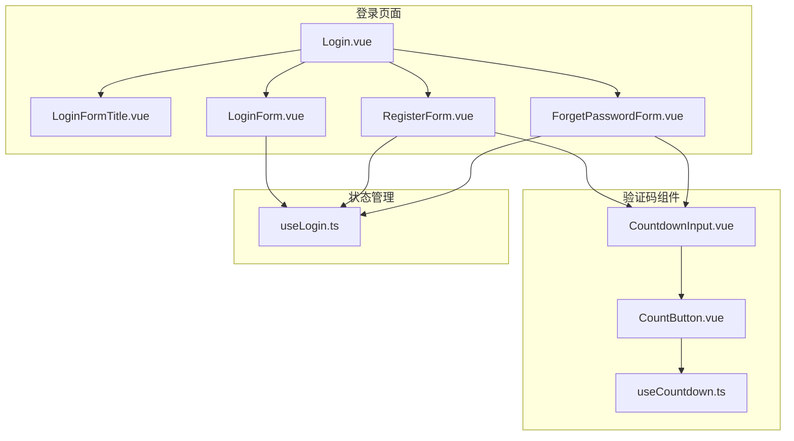
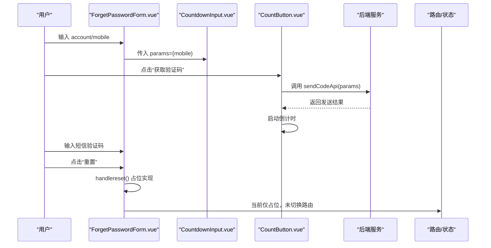
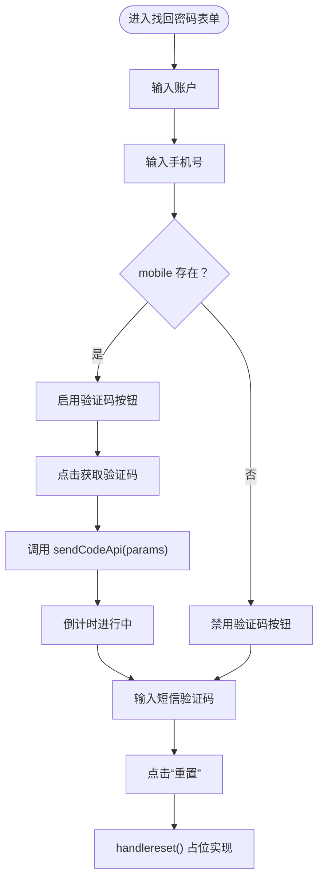
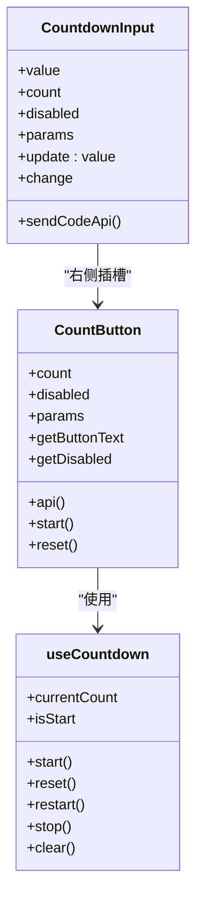
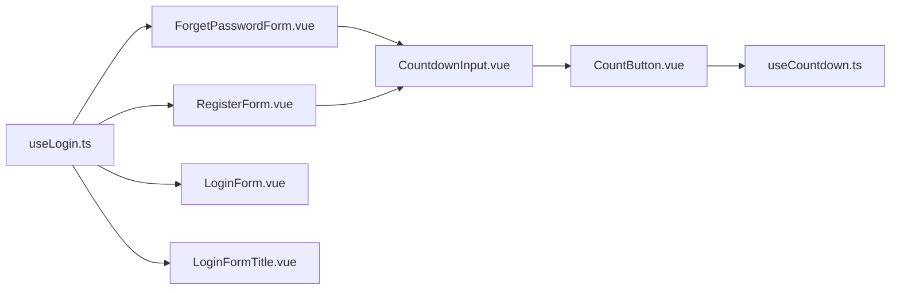

# 找回密码表单

<cite>
**本文引用的文件列表**
- [ForgetPasswordForm.vue](file://src/views/system/login/components/ForgetPasswordForm.vue)
- [RegisterForm.vue](file://src/views/system/login/components/RegisterForm.vue)
- [LoginForm.vue](file://src/views/system/login/components/LoginForm.vue)
- [LoginFormTitle.vue](file://src/views/system/login/components/LoginFormTitle.vue)
- [useLogin.ts](file://src/views/system/login/useLogin.ts)
- [Login.vue](file://src/views/system/login/Login.vue)
- [CountdownInput.vue](file://src/components/Countdown/src/CountdownInput.vue)
- [CountButton.vue](file://src/components/Countdown/src/CountButton.vue)
- [useCountdown.ts](file://src/components/Countdown/src/useCountdown.ts)
</cite>

## 目录
1. [简介](#简介)
2. [项目结构](#项目结构)
3. [核心组件](#核心组件)
4. [架构总览](#架构总览)
5. [组件详细分析](#组件详细分析)
6. [依赖关系分析](#依赖关系分析)
7. [性能与可用性考量](#性能与可用性考量)
8. [故障排查指南](#故障排查指南)
9. [结论](#结论)
10. [附录：从零到完整流程的实施建议](#附录从零到完整流程的实施建议)

## 简介
本文件聚焦“找回密码表单（ForgetPasswordForm）”的两步验证流程实现，系统性说明：
- 表单如何收集用户账户与手机号信息，并通过 CountdownInput 组件获取短信验证码；
- 表单验证规则（account、mobile、sms 均为必填）的配置方式；
- handlereset 方法的预期行为（重置密码），并指出其当前为占位实现；
- 与注册表单在验证码组件使用上的共性；
- 在此基础上构建完整密码重置流程的步骤与安全要点（如验证码时效性）。

## 项目结构
找回密码相关代码位于登录视图模块中，采用“多表单切换”的布局设计：登录页包含多个表单组件，通过 useLogin 的状态枚举控制显示与隐藏。

图表来源
- [Login.vue](file://src/views/system/login/Login.vue#L1-L60)
- [LoginFormTitle.vue](file://src/views/system/login/components/LoginFormTitle.vue#L1-L20)
- [ForgetPasswordForm.vue](file://src/views/system/login/components/ForgetPasswordForm.vue#L1-L48)
- [RegisterForm.vue](file://src/views/system/login/components/RegisterForm.vue#L1-L67)
- [LoginForm.vue](file://src/views/system/login/components/LoginForm.vue#L1-L81)
- [CountdownInput.vue](file://src/components/Countdown/src/CountdownInput.vue#L1-L57)
- [CountButton.vue](file://src/components/Countdown/src/CountButton.vue#L1-L55)
- [useCountdown.ts](file://src/components/Countdown/src/useCountdown.ts#L1-L55)
- [useLogin.ts](file://src/views/system/login/useLogin.ts#L1-L41)

章节来源
- [Login.vue](file://src/views/system/login/Login.vue#L1-L60)
- [useLogin.ts](file://src/views/system/login/useLogin.ts#L1-L41)

## 核心组件
- 忘回密码表单（ForgetPasswordForm.vue）
  - 收集字段：account、mobile、sms
  - 验证规则：account、mobile、sms 均为必填
  - 触发提交：@finish 绑定 handlereset
  - 验证码组件：CountdownInput，参数由 getParams 提供
- 验证码组件（CountdownInput.vue）
  - 内嵌 CountButton，负责倒计时与调用 sendCodeApi
  - 通过 props.params 传递发送验证码所需的参数（如手机号）
- 状态管理（useLogin.ts）
  - 枚举 LoginStateEnum：包含 RESET_PASSWORD 等状态
  - 提供 setLoginState/getCurrentState/resetLoginState

章节来源
- [ForgetPasswordForm.vue](file://src/views/system/login/components/ForgetPasswordForm.vue#L1-L48)
- [CountdownInput.vue](file://src/components/Countdown/src/CountdownInput.vue#L1-L57)
- [useLogin.ts](file://src/views/system/login/useLogin.ts#L1-L41)

## 架构总览
找回密码流程的关键交互如下：

图表来源
- [ForgetPasswordForm.vue](file://src/views/system/login/components/ForgetPasswordForm.vue#L1-L48)
- [CountdownInput.vue](file://src/components/Countdown/src/CountdownInput.vue#L1-L57)
- [CountButton.vue](file://src/components/Countdown/src/CountButton.vue#L1-L55)
- [LoginForm.vue](file://src/views/system/login/components/LoginForm.vue#L1-L81)

## 组件详细分析

### 忘回密码表单（ForgetPasswordForm.vue）
- 字段与布局
  - account：登录账户
  - mobile：手机号码
  - sms：短信验证码
- 验证规则
  - account、mobile、sms 均为必填，触发时机为 blur
- 验证码组件绑定
  - CountdownInput 通过 v-model:value 绑定 formData.sms
  - :params 来自 getParams，当存在 mobile 时才启用验证码按钮
- 提交处理
  - @finish 绑定 handlereset，当前为占位实现（仅打印日志）

图表来源
- [ForgetPasswordForm.vue](file://src/views/system/login/components/ForgetPasswordForm.vue#L1-L48)
- [CountdownInput.vue](file://src/components/Countdown/src/CountdownInput.vue#L1-L57)
- [CountButton.vue](file://src/components/Countdown/src/CountButton.vue#L1-L55)

章节来源
- [ForgetPasswordForm.vue](file://src/views/system/login/components/ForgetPasswordForm.vue#L1-L48)

### 验证码组件（CountdownInput.vue 与 CountButton.vue）
- CountdownInput
  - 作为 Input 的包装，右侧插槽放置 CountButton
  - 接收 props：value、count、disabled、sendCodeApi、params
  - 通过 v-model:value 双向绑定验证码值
- CountButton
  - 根据 isStart/currentCount 控制按钮文案与禁用态
  - 当存在 api 且为函数时，调用 api(params) 并在成功后启动倒计时
  - 参数 params 为空或无效时，自动 reset 倒计时
- useCountdown
  - 提供 start/reset/restart/stop/clear 等能力
  - 默认倒计时长度为 60 秒

图表来源
- [CountdownInput.vue](file://src/components/Countdown/src/CountdownInput.vue#L1-L57)
- [CountButton.vue](file://src/components/Countdown/src/CountButton.vue#L1-L55)
- [useCountdown.ts](file://src/components/Countdown/src/useCountdown.ts#L1-L55)

章节来源
- [CountdownInput.vue](file://src/components/Countdown/src/CountdownInput.vue#L1-L57)
- [CountButton.vue](file://src/components/Countdown/src/CountButton.vue#L1-L55)
- [useCountdown.ts](file://src/components/Countdown/src/useCountdown.ts#L1-L55)

### 与注册表单的共性
- 验证码组件使用方式一致：均通过 CountdownInput 绑定 sms 字段，并以 computed 的 params 传参
- 验证规则一致：account、mobile、sms 均为必填
- 表单切换：均由 useLogin 的状态枚举控制显示

章节来源
- [RegisterForm.vue](file://src/views/system/login/components/RegisterForm.vue#L1-L67)
- [ForgetPasswordForm.vue](file://src/views/system/login/components/ForgetPasswordForm.vue#L1-L48)
- [useLogin.ts](file://src/views/system/login/useLogin.ts#L1-L41)

### handlereset 方法的预期与现状
- 预期行为
  - 校验 account、mobile、sms
  - 调用后端接口验证短信验证码
  - 验证通过后，跳转至“设置新密码”界面（例如通过 setLoginState 切换到对应状态）
  - 完成密码重置流程
- 现状
  - 当前为占位实现，仅打印日志，未做任何业务处理

章节来源
- [ForgetPasswordForm.vue](file://src/views/system/login/components/ForgetPasswordForm.vue#L1-L48)

## 依赖关系分析
- 表单层依赖
  - ForgetPasswordForm 依赖 CountdownInput 用于短信验证码输入与发送
  - 两者共同依赖 CountButton 与 useCountdown 实现倒计时与发送逻辑
- 状态层依赖
  - useLogin 提供 LoginStateEnum，控制各表单的显示与隐藏
  - LoginFormTitle 根据当前状态动态展示标题
- 页面层依赖
  - Login.vue 汇聚多个表单组件，统一渲染与切换

图表来源
- [useLogin.ts](file://src/views/system/login/useLogin.ts#L1-L41)
- [ForgetPasswordForm.vue](file://src/views/system/login/components/ForgetPasswordForm.vue#L1-L48)
- [RegisterForm.vue](file://src/views/system/login/components/RegisterForm.vue#L1-L67)
- [LoginForm.vue](file://src/views/system/login/components/LoginForm.vue#L1-L81)
- [LoginFormTitle.vue](file://src/views/system/login/components/LoginFormTitle.vue#L1-L20)
- [CountdownInput.vue](file://src/components/Countdown/src/CountdownInput.vue#L1-L57)
- [CountButton.vue](file://src/components/Countdown/src/CountButton.vue#L1-L55)
- [useCountdown.ts](file://src/components/Countdown/src/useCountdown.ts#L1-L55)

章节来源
- [Login.vue](file://src/views/system/login/Login.vue#L1-L60)
- [useLogin.ts](file://src/views/system/login/useLogin.ts#L1-L41)

## 性能与可用性考量
- 验证码按钮禁用策略
  - 当 params 为空或无效时，按钮应禁用；当倒计时进行中也应禁用
  - CountdownInput 与 CountButton 已内置禁用逻辑，确保用户体验一致
- 倒计时生命周期
  - useCountdown 提供 reset/restart/stop/clear，组件卸载时自动清理
  - 建议在表单切换或参数变更时主动 reset，避免状态残留
- 表单提交与加载
  - 提交按钮支持 loading 状态，避免重复提交
  - handlereset 应在异步校验与跳转前开启 loading，在完成后关闭

章节来源
- [CountdownInput.vue](file://src/components/Countdown/src/CountdownInput.vue#L1-L57)
- [CountButton.vue](file://src/components/Countdown/src/CountButton.vue#L1-L55)
- [useCountdown.ts](file://src/components/Countdown/src/useCountdown.ts#L1-L55)
- [ForgetPasswordForm.vue](file://src/views/system/login/components/ForgetPasswordForm.vue#L1-L48)

## 故障排查指南
- 验证码按钮不可用
  - 检查 mobile 是否已填写，params 是否正确传入
  - 若 params 为空，按钮会被禁用；需先填写手机号再点击获取验证码
- 倒计时不启动
  - 确认 sendCodeApi 是否为函数且返回成功
  - 若未传入 api，按钮会直接启动倒计时（无网络请求）
- handlereset 未生效
  - 当前为占位实现，不会触发任何业务逻辑
  - 需补充：校验短信验证码、调用后端接口、成功后跳转新密码设置界面
- 表单标题与显示异常
  - 确认 useLogin 的当前状态是否为 RESET_PASSWORD
  - 确保 Login.vue 中的组件渲染顺序与条件满足

章节来源
- [CountdownInput.vue](file://src/components/Countdown/src/CountdownInput.vue#L1-L57)
- [CountButton.vue](file://src/components/Countdown/src/CountButton.vue#L1-L55)
- [useLogin.ts](file://src/views/system/login/useLogin.ts#L1-L41)
- [LoginFormTitle.vue](file://src/views/system/login/components/LoginFormTitle.vue#L1-L20)
- [ForgetPasswordForm.vue](file://src/views/system/login/components/ForgetPasswordForm.vue#L1-L48)

## 结论
- ForgetPasswordForm 已具备两步验证的基础形态：账户+手机号+短信验证码，验证码通过 CountdownInput/CountButton 实现倒计时与发送
- handlereset 当前为占位实现，尚未接入后端接口与路由跳转
- 与 RegisterForm 在验证码组件使用上高度一致，便于复用与维护
- 建议在现有基础上补齐 handlereset 的业务逻辑与路由跳转，并完善错误处理与安全控制

## 附录：从零到完整流程的实施建议
- 步骤一：补齐 handlereset
  - 校验 account、mobile、sms
  - 调用后端接口验证短信验证码
  - 成功后，调用 setLoginState 切换到“设置新密码”状态（可参考 LoginForm 的状态切换）
- 步骤二：新增“设置新密码”表单
  - 新增组件 NewPasswordForm.vue，包含新密码与确认密码字段
  - 使用与注册表单类似的规则（密码强度、确认一致性等）
- 步骤三：完善路由与状态
  - 在 useLogin.ts 中增加新状态（如 SET_NEW_PASSWORD）
  - 在 Login.vue 中渲染新表单并根据状态切换显示
- 步骤四：安全与体验
  - 验证码时效性：后端返回验证码有效期，前端倒计时结束后按钮禁用
  - 防刷策略：限制同一手机号的发送频率与次数
  - 错误提示：对短信验证码错误、过期、网络异常等情况给出明确提示
  - 加载态：提交按钮开启 loading，防止重复提交
- 步骤五：测试与回归
  - 覆盖场景：手机号为空、验证码为空、验证码错误、验证码过期、网络异常
  - 回归验证：与注册表单、手机登录、二维码登录的验证码组件保持一致体验

章节来源
- [LoginForm.vue](file://src/views/system/login/components/LoginForm.vue#L1-L81)
- [useLogin.ts](file://src/views/system/login/useLogin.ts#L1-L41)
- [Login.vue](file://src/views/system/login/Login.vue#L1-L60)