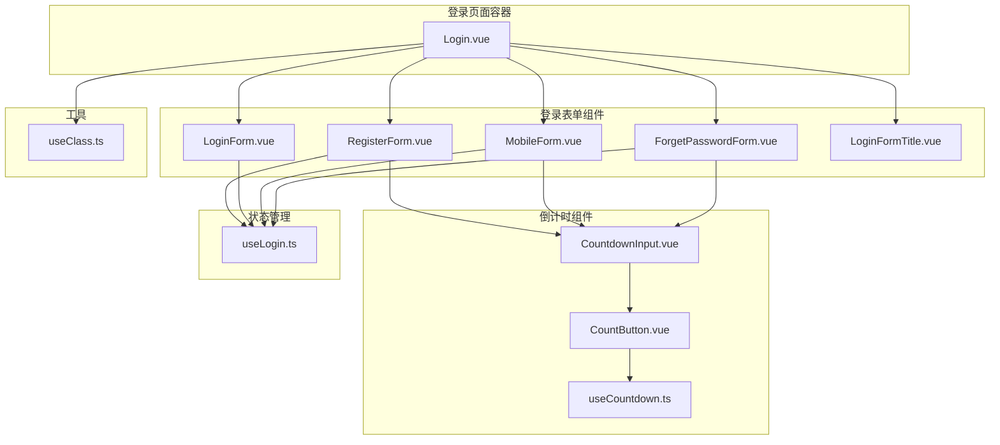
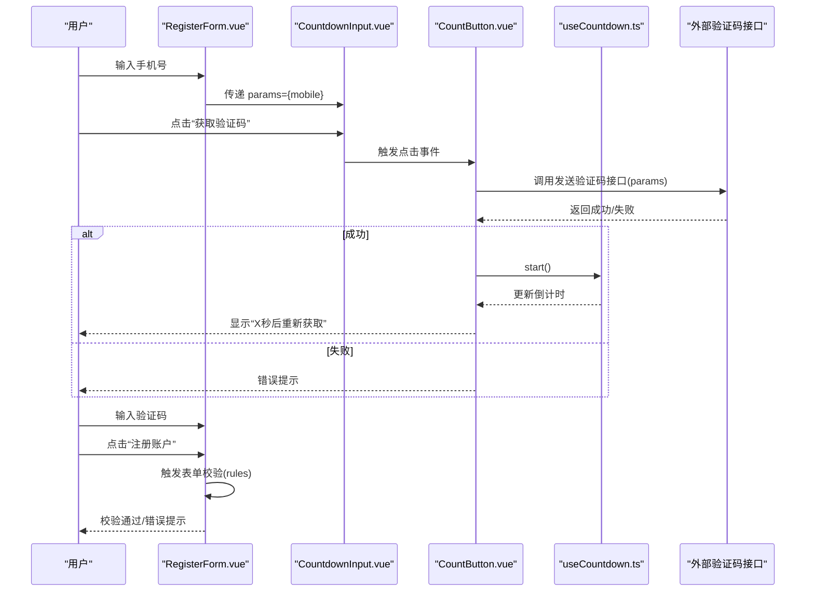
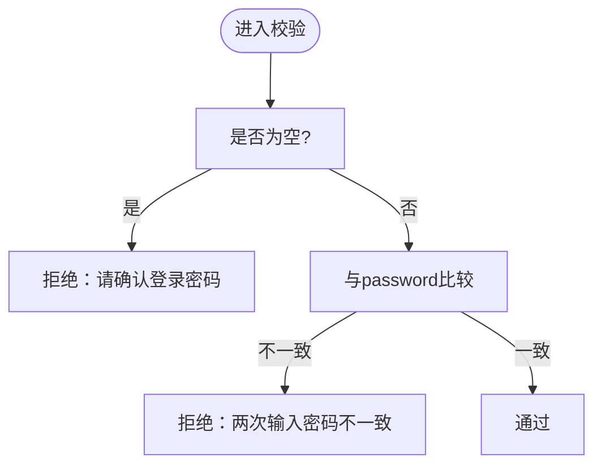
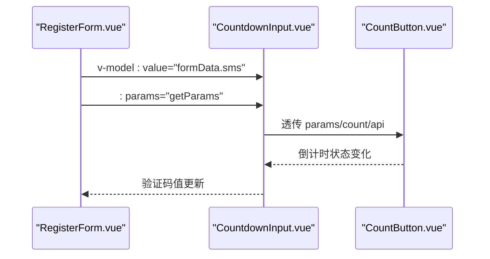
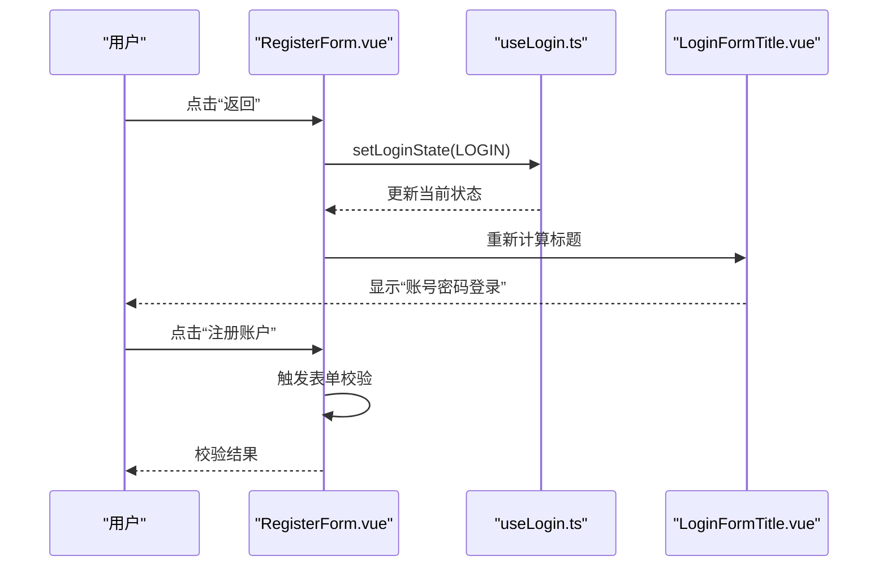
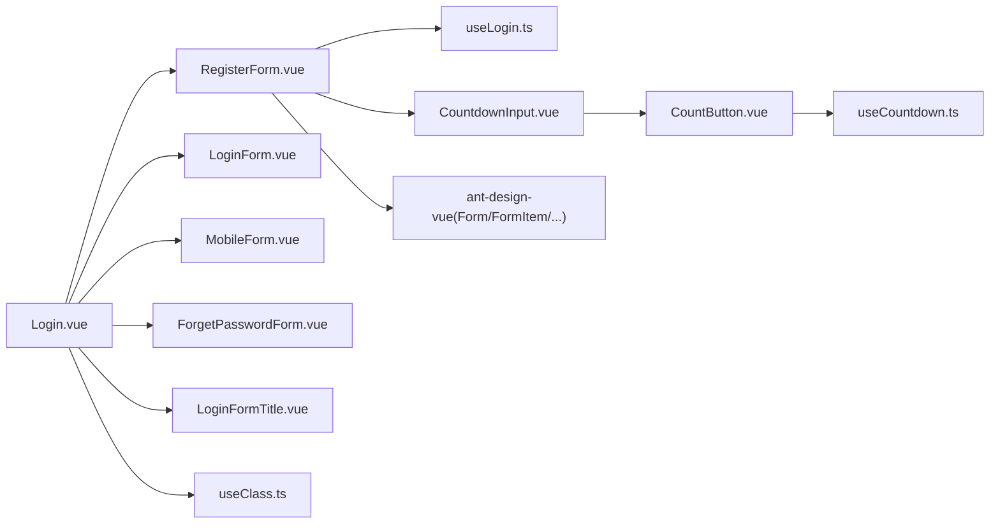

# 用户注册表单

<cite>
**本文引用的文件列表**
- [RegisterForm.vue](file://src/views/system/login/components/RegisterForm.vue)
- [useLogin.ts](file://src/views/system/login/useLogin.ts)
- [CountdownInput.vue](file://src/components/Countdown/src/CountdownInput.vue)
- [CountButton.vue](file://src/components/Countdown/src/CountButton.vue)
- [useCountdown.ts](file://src/components/Countdown/src/useCountdown.ts)
- [LoginForm.vue](file://src/views/system/login/components/LoginForm.vue)
- [MobileForm.vue](file://src/views/system/login/components/MobileForm.vue)
- [ForgetPasswordForm.vue](file://src/views/system/login/components/ForgetPasswordForm.vue)
- [LoginFormTitle.vue](file://src/views/system/login/components/LoginFormTitle.vue)
- [Login.vue](file://src/views/system/login/Login.vue)
- [useClass.ts](file://src/hooks/useClass.ts)
</cite>

## 目录
1. [简介](#简介)
2. [项目结构](#项目结构)
3. [核心组件](#核心组件)
4. [架构总览](#架构总览)
5. [详细组件分析](#详细组件分析)
6. [依赖关系分析](#依赖关系分析)
7. [性能考量](#性能考量)
8. [故障排查指南](#故障排查指南)
9. [结论](#结论)
10. [附录](#附录)

## 简介
本文件围绕用户注册表单(RegisterForm)展开，系统性剖析其字段构成、验证规则与交互设计，并重点说明：
- 字段与验证规则：账号、手机号、验证码、密码、确认密码、隐私协议
- 自定义校验器：confirmPassword与password的一致性校验；policy强制勾选
- CountdownInput组件在注册场景的应用及与手机登录表单的共享逻辑
- 提交流程与返回登录页的控制流
- 最佳实践建议：密码强度实时校验、手机号唯一性异步校验

## 项目结构
注册表单位于登录页面的多态表单体系中，通过状态枚举切换不同视图。Login.vue作为容器，动态渲染各子表单组件；RegisterForm.vue负责注册流程；CountdownInput及其按钮组件提供短信验证码发送与倒计时能力；useLogin.ts提供全局状态管理。

图表来源
- [Login.vue](file://src/views/system/login/Login.vue#L1-L122)
- [LoginForm.vue](file://src/views/system/login/components/LoginForm.vue#L1-L81)
- [RegisterForm.vue](file://src/views/system/login/components/RegisterForm.vue#L1-L68)
- [MobileForm.vue](file://src/views/system/login/components/MobileForm.vue#L1-L44)
- [ForgetPasswordForm.vue](file://src/views/system/login/components/ForgetPasswordForm.vue#L1-L48)
- [LoginFormTitle.vue](file://src/views/system/login/components/LoginFormTitle.vue#L1-L20)
- [CountdownInput.vue](file://src/components/Countdown/src/CountdownInput.vue#L1-L57)
- [CountButton.vue](file://src/components/Countdown/src/CountButton.vue#L1-L55)
- [useCountdown.ts](file://src/components/Countdown/src/useCountdown.ts#L1-L55)
- [useLogin.ts](file://src/views/system/login/useLogin.ts#L1-L41)
- [useClass.ts](file://src/hooks/useClass.ts#L1-L110)

章节来源
- [Login.vue](file://src/views/system/login/Login.vue#L1-L122)
- [useLogin.ts](file://src/views/system/login/useLogin.ts#L1-L41)

## 核心组件
- RegisterForm.vue：注册表单主体，包含账号、手机号、验证码、密码、确认密码、隐私协议六个字段，内置规则与提交入口
- CountdownInput.vue：带“获取验证码”按钮的输入框，复用倒计时逻辑
- CountButton.vue：倒计时按钮，封装发送验证码与倒计时启动
- useCountdown.ts：倒计时状态与生命周期管理
- useLogin.ts：登录/注册等多态表单的状态切换
- LoginFormTitle.vue：根据当前状态显示标题文案
- Login.vue：容器组件，动态加载各表单组件

章节来源
- [RegisterForm.vue](file://src/views/system/login/components/RegisterForm.vue#L1-L68)
- [CountdownInput.vue](file://src/components/Countdown/src/CountdownInput.vue#L1-L57)
- [CountButton.vue](file://src/components/Countdown/src/CountButton.vue#L1-L55)
- [useCountdown.ts](file://src/components/Countdown/src/useCountdown.ts#L1-L55)
- [useLogin.ts](file://src/views/system/login/useLogin.ts#L1-L41)
- [LoginFormTitle.vue](file://src/views/system/login/components/LoginFormTitle.vue#L1-L20)
- [Login.vue](file://src/views/system/login/Login.vue#L1-L122)

## 架构总览
注册表单采用“表单+倒计时组件”的组合模式：
- 表单层：基于 ant-design-vue 的 Form/FormItem/输入控件，配合自定义规则
- 倒计时层：CountdownInput 作为输入框，CountButton 作为触发器，useCountdown 提供倒计时状态
- 状态层：useLogin 管理当前显示的表单视图，支持从注册返回登录

图表来源
- [RegisterForm.vue](file://src/views/system/login/components/RegisterForm.vue#L1-L68)
- [CountdownInput.vue](file://src/components/Countdown/src/CountdownInput.vue#L1-L57)
- [CountButton.vue](file://src/components/Countdown/src/CountButton.vue#L1-L55)
- [useCountdown.ts](file://src/components/Countdown/src/useCountdown.ts#L1-L55)

## 详细组件分析

### 字段与验证规则
- 账号(account)
  - 必填，失焦触发
- 手机号(mobile)
  - 必填，失焦触发
  - 注册表单限制最大长度为13（便于手机号输入）
- 验证码(sms)
  - 必填，失焦触发
  - 与手机号联动，仅当手机号有效时才允许填写
- 密码(password)
  - 必填，失焦触发
- 确认密码(confirmPassword)
  - 必填，失焦触发
  - 自定义校验器：与password字段值一致性校验
- 隐私协议(policy)
  - 必须勾选，支持blur与change触发

章节来源
- [RegisterForm.vue](file://src/views/system/login/components/RegisterForm.vue#L44-L66)

### 自定义校验器：confirmPassword 与 policy
- confirmPassword
  - 使用异步校验器，若为空或与password不一致则拒绝
  - 触发时机为“失焦”，避免频繁校验
- policy
  - 使用异步校验器，未勾选则拒绝，支持“失焦/变更”两种触发

图表来源
- [RegisterForm.vue](file://src/views/system/login/components/RegisterForm.vue#L53-L62)

章节来源
- [RegisterForm.vue](file://src/views/system/login/components/RegisterForm.vue#L53-L66)

### CountdownInput 在注册场景的应用
- 作用：将“获取验证码”按钮嵌入到输入框的后缀区域
- 参数绑定：v-model:value 绑定验证码值；:params 传递手机号参数
- 与手机登录共享逻辑：MobileForm.vue 和 ForgetPasswordForm.vue 同样使用 CountdownInput，参数来源一致

图表来源
- [RegisterForm.vue](file://src/views/system/login/components/RegisterForm.vue#L11-L13)
- [CountdownInput.vue](file://src/components/Countdown/src/CountdownInput.vue#L1-L57)
- [CountButton.vue](file://src/components/Countdown/src/CountButton.vue#L1-L55)

章节来源
- [RegisterForm.vue](file://src/views/system/login/components/RegisterForm.vue#L11-L13)
- [CountdownInput.vue](file://src/components/Countdown/src/CountdownInput.vue#L1-L57)
- [CountButton.vue](file://src/components/Countdown/src/CountButton.vue#L1-L55)
- [MobileForm.vue](file://src/views/system/login/components/MobileForm.vue#L1-L44)
- [ForgetPasswordForm.vue](file://src/views/system/login/components/ForgetPasswordForm.vue#L1-L48)

### 表单提交与返回登录页
- 提交入口：Form 的 finish 事件绑定到 handleRegister 方法（当前为空）
- 返回登录页：点击“返回”按钮调用 setLoginState(LoginStateEnum.LOGIN)，由 useLogin 切换到登录视图
- 标题文案：LoginFormTitle 根据当前状态动态显示

图表来源
- [RegisterForm.vue](file://src/views/system/login/components/RegisterForm.vue#L23-L25)
- [useLogin.ts](file://src/views/system/login/useLogin.ts#L1-L41)
- [LoginFormTitle.vue](file://src/views/system/login/components/LoginFormTitle.vue#L1-L20)

章节来源
- [RegisterForm.vue](file://src/views/system/login/components/RegisterForm.vue#L23-L25)
- [useLogin.ts](file://src/views/system/login/useLogin.ts#L1-L41)
- [LoginFormTitle.vue](file://src/views/system/login/components/LoginFormTitle.vue#L1-L20)

### 与手机登录表单的共享逻辑
- 三者均使用 CountdownInput，参数来源均为手机号字段
- 三者均通过 useLogin 的状态枚举进行切换
- 三者均采用 ant-design-vue 的 Form/FormItem 进行统一的校验与交互

章节来源
- [MobileForm.vue](file://src/views/system/login/components/MobileForm.vue#L1-L44)
- [ForgetPasswordForm.vue](file://src/views/system/login/components/ForgetPasswordForm.vue#L1-L48)
- [useLogin.ts](file://src/views/system/login/useLogin.ts#L1-L41)

## 依赖关系分析
- RegisterForm 依赖：
  - useLogin：状态切换
  - CountdownInput：验证码输入与倒计时
  - ant-design-vue：Form/FormItem/Input/InputPassword/Checkbox/Button
- CountdownInput 依赖：
  - CountButton：按钮行为
  - useCountdown：倒计时状态
- Login.vue 依赖：
  - 动态加载各表单组件
  - useClass：构建组件前缀类名

图表来源
- [RegisterForm.vue](file://src/views/system/login/components/RegisterForm.vue#L1-L68)
- [useLogin.ts](file://src/views/system/login/useLogin.ts#L1-L41)
- [CountdownInput.vue](file://src/components/Countdown/src/CountdownInput.vue#L1-L57)
- [CountButton.vue](file://src/components/Countdown/src/CountButton.vue#L1-L55)
- [useCountdown.ts](file://src/components/Countdown/src/useCountdown.ts#L1-L55)
- [LoginForm.vue](file://src/views/system/login/components/LoginForm.vue#L1-L81)
- [MobileForm.vue](file://src/views/system/login/components/MobileForm.vue#L1-L44)
- [ForgetPasswordForm.vue](file://src/views/system/login/components/ForgetPasswordForm.vue#L1-L48)
- [LoginFormTitle.vue](file://src/views/system/login/components/LoginFormTitle.vue#L1-L20)
- [Login.vue](file://src/views/system/login/Login.vue#L1-L122)
- [useClass.ts](file://src/hooks/useClass.ts#L1-L110)

## 性能考量
- 验证器触发策略
  - confirmPassword 与 policy 仅在 blur/change 触发，减少不必要的校验开销
- 倒计时组件
  - useCountdown 使用 setInterval 管理计时，组件卸载时自动清理，避免内存泄漏
- 表单渲染
  - 通过 computed 控制显示状态，避免无关组件重复渲染
- 异步校验
  - 建议在实际业务中对手机号唯一性、密码强度等异步校验增加防抖与缓存策略

[本节为通用指导，无需列出具体文件来源]

## 故障排查指南
- 验证码按钮不可用
  - 检查 CountdownInput 的 :params 是否有效（手机号非空）
  - 检查 CountButton 的 disabled 状态与倒计时状态
- 倒计时不结束
  - 确认 useCountdown 的 start/reset 流程是否被正确调用
  - 检查组件卸载时是否调用了 reset
- 提交无响应
  - 确认 handleRegister 已实现并绑定到 Form.finish
  - 检查 rules 中各字段的触发时机与消息文案
- 返回登录页无效
  - 确认 setLoginState 被调用且当前状态为 REGISTER

章节来源
- [CountdownInput.vue](file://src/components/Countdown/src/CountdownInput.vue#L1-L57)
- [CountButton.vue](file://src/components/Countdown/src/CountButton.vue#L1-L55)
- [useCountdown.ts](file://src/components/Countdown/src/useCountdown.ts#L1-L55)
- [RegisterForm.vue](file://src/views/system/login/components/RegisterForm.vue#L23-L25)

## 结论
RegisterForm 以清晰的字段划分与严格的验证规则为基础，结合 CountdownInput 的倒计时能力，实现了注册流程中的关键交互。通过 useLogin 的状态管理，可与登录、手机登录、重置密码等表单协同工作。建议在后续迭代中补充 handleRegister 的业务逻辑与异步校验细节，进一步提升用户体验与安全性。

[本节为总结性内容，无需列出具体文件来源]

## 附录

### 字段与验证规则一览
- 账号(account)
  - 必填，失焦触发
- 手机号(mobile)
  - 必填，失焦触发；限制最大长度为13
- 验证码(sms)
  - 必填，失焦触发；依赖手机号参数
- 密码(password)
  - 必填，失焦触发
- 确认密码(confirmPassword)
  - 必填，失焦触发；与password值一致
- 隐私协议(policy)
  - 必须勾选，支持blur与change触发

章节来源
- [RegisterForm.vue](file://src/views/system/login/components/RegisterForm.vue#L44-L66)

### 最佳实践建议
- 密码强度实时校验
  - 在输入过程中对密码长度、字符类型进行即时反馈
  - 通过异步校验器对接后端策略，避免弱密码
- 手机号唯一性检查
  - 在 blur 或短延迟后发起唯一性校验请求
  - 对网络异常进行友好提示与重试机制
- 倒计时优化
  - 在组件卸载时重置倒计时，避免残留定时器
  - 对按钮禁用状态与文案进行统一管理

[本节为通用指导，无需列出具体文件来源]