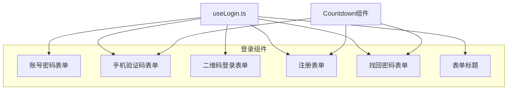
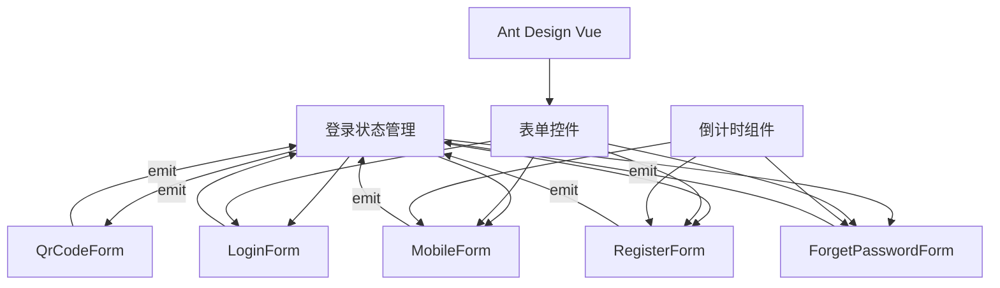
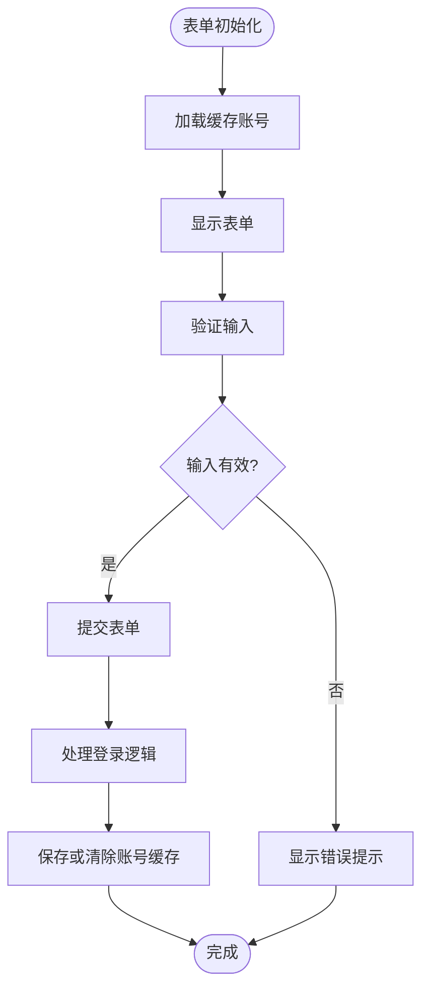
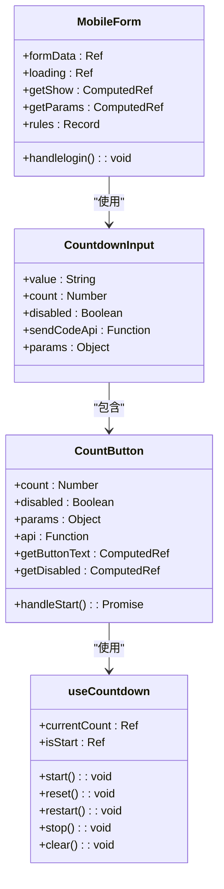
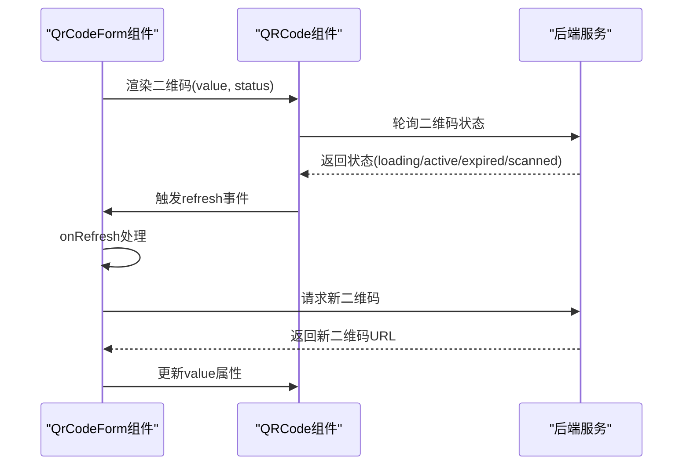
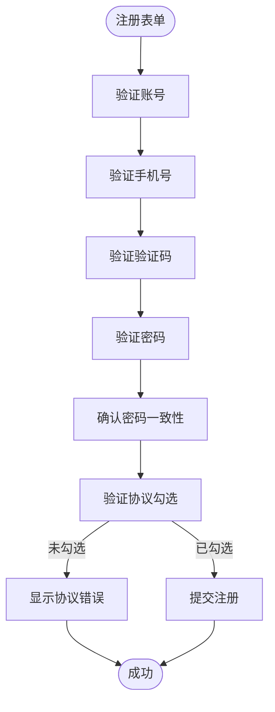
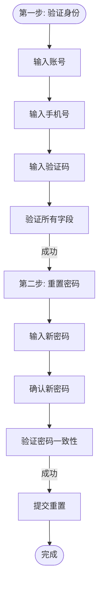
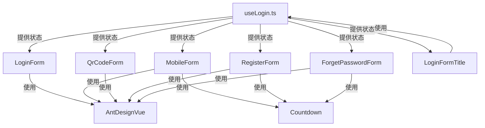

# 登录表单组件

<cite>
**本文档引用的文件**   
- [LoginForm.vue](file://src/views/system/login/components/LoginForm.vue)
- [MobileForm.vue](file://src/views/system/login/components/MobileForm.vue)
- [QrCodeForm.vue](file://src/views/system/login/components/QrCodeForm.vue)
- [RegisterForm.vue](file://src/views/system/login/components/RegisterForm.vue)
- [ForgetPasswordForm.vue](file://src/views/system/login/components/ForgetPasswordForm.vue)
- [useLogin.ts](file://src/views/system/login/useLogin.ts)
- [LoginFormTitle.vue](file://src/views/system/login/components/LoginFormTitle.vue)
- [CountdownInput.vue](file://src/components/Countdown/src/CountdownInput.vue)
- [CountButton.vue](file://src/components/Countdown/src/CountButton.vue)
- [useCountdown.ts](file://src/components/Countdown/src/useCountdown.ts)
</cite>

## 目录
1. [项目结构](#项目结构)
2. [核心组件分析](#核心组件分析)
3. [架构概览](#架构概览)
4. [详细组件分析](#详细组件分析)
5. [依赖分析](#依赖分析)
6. [性能考虑](#性能考虑)
7. [故障排除指南](#故障排除指南)
8. [结论](#结论)

## 项目结构
登录表单组件位于`src/views/system/login/components/`目录下，包含多个子组件和共享逻辑。这些组件通过`useLogin`组合式函数进行状态管理，并复用Ant Design Vue的表单控件。

**Diagram sources**
- [LoginForm.vue](file://src/views/system/login/components/LoginForm.vue)
- [MobileForm.vue](file://src/views/system/login/components/MobileForm.vue)
- [QrCodeForm.vue](file://src/views/system/login/components/QrCodeForm.vue)
- [RegisterForm.vue](file://src/views/system/login/components/RegisterForm.vue)
- [ForgetPasswordForm.vue](file://src/views/system/login/components/ForgetPasswordForm.vue)
- [useLogin.ts](file://src/views/system/login/useLogin.ts)

**Section sources**
- [LoginForm.vue](file://src/views/system/login/components/LoginForm.vue)
- [MobileForm.vue](file://src/views/system/login/components/MobileForm.vue)
- [QrCodeForm.vue](file://src/views/system/login/components/QrCodeForm.vue)
- [RegisterForm.vue](file://src/views/system/login/components/RegisterForm.vue)
- [ForgetPasswordForm.vue](file://src/views/system/login/components/ForgetPasswordForm.vue)

## 核心组件分析
登录系统由多个表单组件组成，每个组件负责不同的登录方式。这些组件通过`useLogin`组合式函数共享状态，并使用Ant Design Vue的表单控件实现统一的UI风格。

**Section sources**
- [LoginForm.vue](file://src/views/system/login/components/LoginForm.vue#L1-L81)
- [MobileForm.vue](file://src/views/system/login/components/MobileForm.vue#L1-L44)
- [QrCodeForm.vue](file://src/views/system/login/components/QrCodeForm.vue#L1-L36)
- [RegisterForm.vue](file://src/views/system/login/components/RegisterForm.vue#L1-L68)
- [ForgetPasswordForm.vue](file://src/views/system/login/components/ForgetPasswordForm.vue#L1-L49)

## 架构概览
登录系统的架构基于组合式API设计模式，通过`useLogin`函数管理全局登录状态，各个表单组件根据当前状态决定是否显示。

**Diagram sources**
- [useLogin.ts](file://src/views/system/login/useLogin.ts#L1-L41)
- [LoginForm.vue](file://src/views/system/login/components/LoginForm.vue#L1-L81)

## 详细组件分析
### 账号密码表单分析
账号密码表单（LoginForm）实现了基本的账号密码登录功能，包含字段验证和密码可见性切换。

**Diagram sources**
- [LoginForm.vue](file://src/views/system/login/components/LoginForm.vue#L1-L81)

**Section sources**
- [LoginForm.vue](file://src/views/system/login/components/LoginForm.vue#L1-L81)

### 手机验证码表单分析
手机验证码表单（MobileForm）实现了手机号格式校验与短信发送逻辑，通过倒计时组件管理验证码发送间隔。

**Diagram sources**
- [MobileForm.vue](file://src/views/system/login/components/MobileForm.vue#L1-L44)
- [CountdownInput.vue](file://src/components/Countdown/src/CountdownInput.vue#L1-L57)
- [CountButton.vue](file://src/components/Countdown/src/CountButton.vue#L1-L55)
- [useCountdown.ts](file://src/components/Countdown/src/useCountdown.ts#L1-L55)

**Section sources**
- [MobileForm.vue](file://src/views/system/login/components/MobileForm.vue#L1-L44)

### 二维码登录表单分析
二维码登录表单（QrCodeForm）实现了轮询机制与状态更新，通过QRCode组件显示二维码并处理刷新逻辑。

**Diagram sources**
- [QrCodeForm.vue](file://src/views/system/login/components/QrCodeForm.vue#L1-L36)

**Section sources**
- [QrCodeForm.vue](file://src/views/system/login/components/QrCodeForm.vue#L1-L36)

### 注册表单分析
注册表单（RegisterForm）实现了密码强度校验与协议勾选功能，确保用户注册时满足安全要求。

**Diagram sources**
- [RegisterForm.vue](file://src/views/system/login/components/RegisterForm.vue#L1-L68)

**Section sources**
- [RegisterForm.vue](file://src/views/system/login/components/RegisterForm.vue#L1-L68)

### 找回密码表单分析
找回密码表单（ForgetPasswordForm）实现了两步验证流程，通过手机号和验证码验证用户身份。

**Diagram sources**
- [ForgetPasswordForm.vue](file://src/views/system/login/components/ForgetPasswordForm.vue#L1-L49)

**Section sources**
- [ForgetPasswordForm.vue](file://src/views/system/login/components/ForgetPasswordForm.vue#L1-L49)

## 依赖分析
登录表单组件之间通过`useLogin`函数共享状态，同时依赖Ant Design Vue的UI组件和自定义的倒计时组件。

**Diagram sources**
- [useLogin.ts](file://src/views/system/login/useLogin.ts#L1-L41)
- [LoginForm.vue](file://src/views/system/login/components/LoginForm.vue#L1-L81)
- [MobileForm.vue](file://src/views/system/login/components/MobileForm.vue#L1-L44)
- [QrCodeForm.vue](file://src/views/system/login/components/QrCodeForm.vue#L1-L36)
- [RegisterForm.vue](file://src/views/system/login/components/RegisterForm.vue#L1-L68)
- [ForgetPasswordForm.vue](file://src/views/system/login/components/ForgetPasswordForm.vue#L1-L49)

**Section sources**
- [useLogin.ts](file://src/views/system/login/useLogin.ts#L1-L41)

## 性能考虑
登录表单组件采用了异步组件加载策略，仅在需要时加载特定表单组件，减少初始加载时间。

**Section sources**
- [Login.vue](file://src/views/system/login/Login.vue#L41-L54)

## 故障排除指南
当遇到登录表单相关问题时，可以检查以下常见问题：

1. **表单不显示**：检查`useLogin`中的当前状态是否与目标表单匹配
2. **验证码按钮不可点击**：检查手机号字段是否已填写，这是倒计时按钮的启用条件
3. **表单验证不工作**：确保表单字段的`name`属性与验证规则中的键名一致
4. **状态切换失效**：确认`setLoginState`函数是否正确导入和调用

**Section sources**
- [LoginForm.vue](file://src/views/system/login/components/LoginForm.vue#L38-L44)
- [MobileForm.vue](file://src/views/system/login/components/MobileForm.vue#L21-L25)
- [useLogin.ts](file://src/views/system/login/useLogin.ts#L24-L40)

## 结论
登录表单组件系统通过组合式API实现了良好的代码复用和状态管理。各表单组件复用Ant Design Vue的表单控件，确保了统一的UI风格和错误提示样式。通过`useLogin`函数集中管理登录状态，简化了组件间的通信。倒计时组件的封装提高了代码的可重用性，减少了重复代码。整体架构清晰，易于维护和扩展。