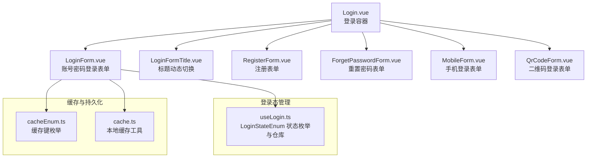
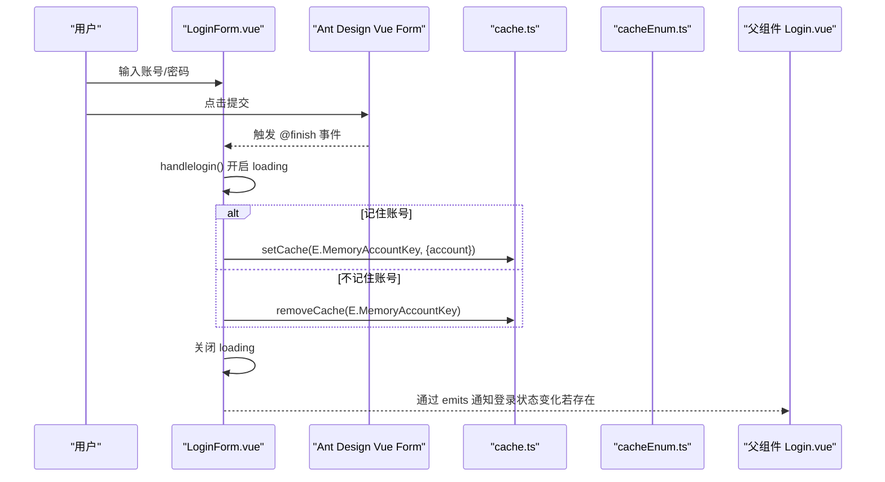
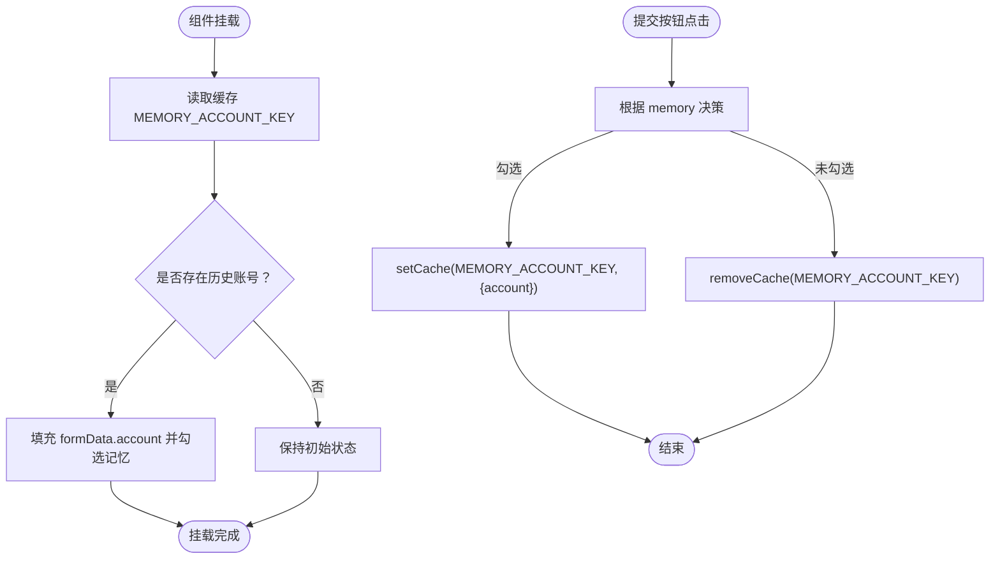
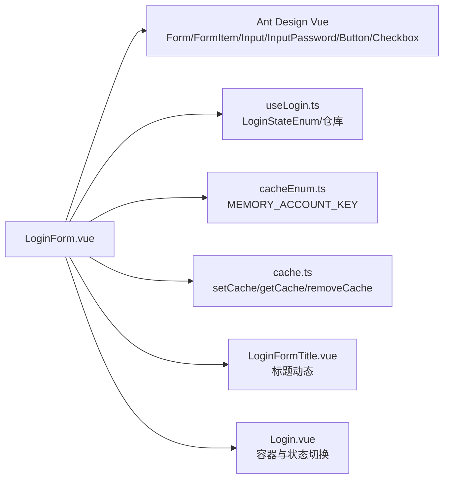

# 账号密码登录表单

<cite>
**本文引用的文件**
- [LoginForm.vue](file://src/views/system/login/components/LoginForm.vue)
- [useLogin.ts](file://src/views/system/login/useLogin.ts)
- [cacheEnum.ts](file://src/enums/cacheEnum.ts)
- [cache.ts](file://src/utils/cache.ts)
- [Login.vue](file://src/views/system/login/Login.vue)
- [LoginFormTitle.vue](file://src/views/system/login/components/LoginFormTitle.vue)
- [BasicForm.vue](file://src/components/Form/src/BasicForm.vue)
- [FormItem.vue](file://src/components/Form/src/components/FormItem.vue)
- [index.ts](file://src/components/Form/src/types/index.ts)
- [props.ts](file://src/components/Form/src/types/props.ts)
- [props.ts](file://src/components/Form/src/props.ts)
</cite>

## 目录
1. [简介](#简介)
2. [项目结构](#项目结构)
3. [核心组件](#核心组件)
4. [架构总览](#架构总览)
5. [详细组件分析](#详细组件分析)
6. [依赖关系分析](#依赖关系分析)
7. [性能考量](#性能考量)
8. [故障排查指南](#故障排查指南)
9. [结论](#结论)
10. [附录](#附录)

## 简介
本文件围绕账号密码登录表单（LoginForm）进行深入解析，重点覆盖：
- 表单结构如何基于 Ant Design Vue 的 Form、FormItem 构建；
- 字段验证规则（account 与 password 的必填校验）的定义方式；
- 密码可见性切换通过 InputPassword 的 visibility-toggle 属性实现；
- 表单数据绑定（formData）与状态响应式管理；
- “记住账号”功能通过 localStorage（CacheTypeEnum.MEMORY_ACCOUNT_KEY）实现持久化存储，并在组件挂载时自动填充历史账号；
- 表单提交逻辑通过 @finish 事件触发 handlelogin 方法，结合 loading 状态控制按钮加载效果；
- 通过 emits 与父组件通信登录状态变化；
- 提供扩展自定义验证规则或集成第三方认证服务的实践路径。

## 项目结构
LoginForm 所属的登录页面由 Login.vue 统一承载，内部包含多个登录态组件（含 LoginForm），并通过 useLogin 管理当前显示态。

图示来源
- [Login.vue](file://src/views/system/login/Login.vue#L1-L60)
- [LoginForm.vue](file://src/views/system/login/components/LoginForm.vue#L1-L31)
- [LoginFormTitle.vue](file://src/views/system/login/components/LoginFormTitle.vue#L1-L20)
- [useLogin.ts](file://src/views/system/login/useLogin.ts#L1-L41)
- [cacheEnum.ts](file://src/enums/cacheEnum.ts#L1-L17)
- [cache.ts](file://src/utils/cache.ts#L1-L138)

章节来源
- [Login.vue](file://src/views/system/login/Login.vue#L1-L60)
- [LoginForm.vue](file://src/views/system/login/components/LoginForm.vue#L1-L31)
- [useLogin.ts](file://src/views/system/login/useLogin.ts#L1-L41)

## 核心组件
- LoginForm：负责账号密码登录表单的渲染、字段校验、提交处理与“记住账号”的持久化。
- useLogin：提供登录态枚举与全局状态仓库，用于控制各登录态组件的显示与切换。
- cacheEnum：定义缓存键常量，包括 MEMORY_ACCOUNT_KEY。
- cache：封装本地缓存工具，统一 setCache/getCache/removeCache 接口，支持 localStorage/sessionStorage。

章节来源
- [LoginForm.vue](file://src/views/system/login/components/LoginForm.vue#L34-L80)
- [useLogin.ts](file://src/views/system/login/useLogin.ts#L1-L41)
- [cacheEnum.ts](file://src/enums/cacheEnum.ts#L1-L17)
- [cache.ts](file://src/utils/cache.ts#L1-L138)

## 架构总览
LoginForm 的关键交互链路如下：
- 视图层：Form/FormItem/Input/InputPassword/Checkbox/Button 组成表单 UI；
- 数据层：formData 响应式对象承载 account/password；memory 控制“记住账号”；loading 控制按钮加载态；
- 业务层：@finish 事件触发 handlelogin；根据 memory 决定 setCache 或 removeCache；
- 持久化层：通过 CacheTypeEnum.MEMORY_ACCOUNT_KEY 读取/写入历史账号；
- 状态层：useLogin 提供 LoginStateEnum.LOGIN 显示控制与 setLoginState 切换。

图示来源
- [LoginForm.vue](file://src/views/system/login/components/LoginForm.vue#L34-L80)
- [cache.ts](file://src/utils/cache.ts#L52-L71)
- [cacheEnum.ts](file://src/enums/cacheEnum.ts#L1-L17)
- [Login.vue](file://src/views/system/login/Login.vue#L1-L60)

## 详细组件分析

### 表单结构与字段绑定
- 表单容器：使用 Ant Design Vue 的 Form 组件，绑定 :model="formData" 与 :rules="rules"，并通过 @finish="handlelogin" 监听提交事件。
- 字段布局：FormItem 包裹 Input 与 InputPassword，分别绑定到 formData.account 与 formData.password。
- 字段验证：rules 中为 account 与 password 定义 required 规则，trigger 设为 blur，确保失焦时触发校验。
- 密码可见性：InputPassword 使用 visibility-toggle 属性开启密码可见性切换。

章节来源
- [LoginForm.vue](file://src/views/system/login/components/LoginForm.vue#L1-L31)
- [LoginForm.vue](file://src/views/system/login/components/LoginForm.vue#L51-L54)

### 响应式数据与状态管理
- formData：包含 account 与 password 两个字段，通过 v-model:value 双向绑定。
- memory：布尔值，决定是否保存账号至缓存。
- loading：布尔值，控制提交按钮的加载态。
- getShow：computed 基于 useLogin.getCurrentState 判断当前是否处于 Login 态，从而决定表单是否渲染。

章节来源
- [LoginForm.vue](file://src/views/system/login/components/LoginForm.vue#L46-L49)
- [LoginForm.vue](file://src/views/system/login/components/LoginForm.vue#L69-L80)
- [useLogin.ts](file://src/views/system/login/useLogin.ts#L18-L39)

### “记住账号”与持久化存储
- 挂载时读取：onMounted 生命周期中从缓存读取 MEMORY_ACCOUNT_KEY，若存在则填充到 formData 并勾选“记住账号”。
- 提交时写入/清除：handlelogin 中根据 memory 的值选择 setCache 或 removeCache，实现账号的保存或删除。
- 缓存工具：cache.ts 提供 setCache/getCache/removeCache 接口，内部以项目前缀+版本号生成统一缓存键，避免冲突。

图示来源
- [LoginForm.vue](file://src/views/system/login/components/LoginForm.vue#L56-L67)
- [LoginForm.vue](file://src/views/system/login/components/LoginForm.vue#L69-L79)
- [cacheEnum.ts](file://src/enums/cacheEnum.ts#L1-L17)
- [cache.ts](file://src/utils/cache.ts#L52-L71)

章节来源
- [LoginForm.vue](file://src/views/system/login/components/LoginForm.vue#L56-L67)
- [LoginForm.vue](file://src/views/system/login/components/LoginForm.vue#L69-L79)
- [cacheEnum.ts](file://src/enums/cacheEnum.ts#L1-L17)
- [cache.ts](file://src/utils/cache.ts#L52-L71)

### 表单提交与按钮加载
- 提交事件：Form 的 @finish 事件触发 handlelogin，内部先设置 loading=true，再执行业务逻辑，最后在 finally 中恢复 loading=false。
- 加载态：Button 的 :loading="loading" 实时反映提交状态，提升用户体验。

章节来源
- [LoginForm.vue](file://src/views/system/login/components/LoginForm.vue#L2-L3)
- [LoginForm.vue](file://src/views/system/login/components/LoginForm.vue#L69-L79)

### 登录态切换与标题联动
- 登录态：useLogin 提供 LoginStateEnum 枚举与仓库，LoginForm 通过 computed 读取当前状态，仅在 LOGIN 态显示。
- 标题联动：LoginFormTitle 根据当前状态动态显示不同标题文案，体现多态登录场景的一致性。

章节来源
- [LoginForm.vue](file://src/views/system/login/components/LoginForm.vue#L46-L49)
- [LoginFormTitle.vue](file://src/views/system/login/components/LoginFormTitle.vue#L1-L20)
- [useLogin.ts](file://src/views/system/login/useLogin.ts#L1-L41)

### 验证规则与扩展点
- 必填规则：account 与 password 的 required 规则已内置，trigger 为 blur。
- 自定义验证：可参考 RegisterForm 的 confirm 密码一致性校验与 policy 同意条款校验，采用 validator 异步函数返回 Promise 的方式，实现复杂规则与跨字段校验。
- 复杂规则示例路径：
  - [RegisterForm.vue](file://src/views/system/login/components/RegisterForm.vue#L48-L64)
  - [FormItem.vue](file://src/components/Form/src/components/FormItem.vue#L1-L17)
  - [props.ts（SchemaProps）](file://src/components/Form/src/types/props.ts#L62-L108)
  - [index.ts（AntdComponentProps）](file://src/components/Form/src/types/index.ts#L1-L22)

章节来源
- [LoginForm.vue](file://src/views/system/login/components/LoginForm.vue#L51-L54)
- [RegisterForm.vue](file://src/views/system/login/components/RegisterForm.vue#L48-L64)
- [FormItem.vue](file://src/components/Form/src/components/FormItem.vue#L1-L17)
- [props.ts](file://src/components/Form/src/types/props.ts#L62-L108)
- [index.ts](file://src/components/Form/src/types/index.ts#L1-L22)

### 与父组件通信
- 当前 LoginForm 未直接定义 emits，但 Login.vue 作为容器，可通过 useLogin 的 setLoginState 在各登录态之间切换，间接实现登录状态变化的传播。
- 若需直接通信，可在 LoginForm 中通过 defineEmits 声明事件并在 handlelogin 中触发，父组件监听后执行登录流程。

章节来源
- [LoginForm.vue](file://src/views/system/login/components/LoginForm.vue#L34-L43)
- [Login.vue](file://src/views/system/login/Login.vue#L1-L60)
- [useLogin.ts](file://src/views/system/login/useLogin.ts#L24-L40)

## 依赖关系分析
LoginForm 的关键依赖关系如下：

图示来源
- [LoginForm.vue](file://src/views/system/login/components/LoginForm.vue#L34-L80)
- [useLogin.ts](file://src/views/system/login/useLogin.ts#L1-L41)
- [cacheEnum.ts](file://src/enums/cacheEnum.ts#L1-L17)
- [cache.ts](file://src/utils/cache.ts#L1-L138)
- [LoginFormTitle.vue](file://src/views/system/login/components/LoginFormTitle.vue#L1-L20)
- [Login.vue](file://src/views/system/login/Login.vue#L1-L60)

章节来源
- [LoginForm.vue](file://src/views/system/login/components/LoginForm.vue#L34-L80)
- [useLogin.ts](file://src/views/system/login/useLogin.ts#L1-L41)
- [cacheEnum.ts](file://src/enums/cacheEnum.ts#L1-L17)
- [cache.ts](file://src/utils/cache.ts#L1-L138)
- [LoginFormTitle.vue](file://src/views/system/login/components/LoginFormTitle.vue#L1-L20)
- [Login.vue](file://src/views/system/login/Login.vue#L1-L60)

## 性能考量
- 表单渲染：LoginForm 仅在 Login 态显示，避免不必要的 DOM 渲染。
- 缓存访问：getCache/setCache/removeCache 为 O(1) 操作，且通过统一键空间避免冲突，性能稳定。
- 校验策略：required 规则简单高效，blur 触发减少无效校验次数。
- 按钮加载：loading 状态仅影响按钮，不影响其他交互，降低阻塞感。

## 故障排查指南
- 表单不显示
  - 检查 useLogin.getCurrentState 是否为 Login 态。
  - 参考路径：[LoginForm.vue](file://src/views/system/login/components/LoginForm.vue#L46-L49)，[useLogin.ts](file://src/views/system/login/useLogin.ts#L24-L39)
- 验证不生效
  - 确认 Form 已绑定 :rules 且字段 name 与 rules 键一致。
  - 参考路径：[LoginForm.vue](file://src/views/system/login/components/LoginForm.vue#L2-L3)，[LoginForm.vue](file://src/views/system/login/components/LoginForm.vue#L51-L54)
- 密码不可见
  - 确认 InputPassword 已启用 visibility-toggle。
  - 参考路径：[LoginForm.vue](file://src/views/system/login/components/LoginForm.vue#L7-L9)
- “记住账号”无效
  - 检查 MEMORY_ACCOUNT_KEY 是否正确传入 setCache/removeCache。
  - 参考路径：[LoginForm.vue](file://src/views/system/login/components/LoginForm.vue#L69-L79)，[cacheEnum.ts](file://src/enums/cacheEnum.ts#L1-L17)，[cache.ts](file://src/utils/cache.ts#L52-L71)
- 提交按钮无加载态
  - 确认 loading 状态在 handlelogin 中被正确设置与恢复。
  - 参考路径：[LoginForm.vue](file://src/views/system/login/components/LoginForm.vue#L69-L79)

章节来源
- [LoginForm.vue](file://src/views/system/login/components/LoginForm.vue#L46-L79)
- [useLogin.ts](file://src/views/system/login/useLogin.ts#L24-L39)
- [cacheEnum.ts](file://src/enums/cacheEnum.ts#L1-L17)
- [cache.ts](file://src/utils/cache.ts#L52-L71)

## 结论
LoginForm 以 Ant Design Vue 表单体系为基础，结合 useLogin 的状态管理与 cache 的持久化能力，实现了简洁而健壮的账号密码登录体验。其关键优势在于：
- 明确的表单结构与字段绑定；
- 简洁的必填校验与密码可见性切换；
- 响应式状态与加载态控制；
- 基于内存键的账号持久化与自动填充；
- 可扩展的自定义验证与登录态切换机制。

## 附录

### 如何扩展自定义验证规则
- 参考 RegisterForm 的 confirm 密码一致性与 policy 同意条款校验，采用 validator 异步函数返回 Promise 的方式，实现跨字段与复杂规则校验。
- 示例路径：
  - [RegisterForm.vue](file://src/views/system/login/components/RegisterForm.vue#L48-L64)
  - [FormItem.vue](file://src/components/Form/src/components/FormItem.vue#L1-L17)
  - [props.ts（SchemaProps）](file://src/components/Form/src/types/props.ts#L62-L108)
  - [index.ts（AntdComponentProps）](file://src/components/Form/src/types/index.ts#L1-L22)

### 如何集成第三方认证服务
- 在 handlelogin 中替换为调用第三方登录接口（如 OAuth、SAML 等），成功后更新登录态并持久化用户信息。
- 参考路径：
  - [LoginForm.vue](file://src/views/system/login/components/LoginForm.vue#L69-L79)
  - [useLogin.ts](file://src/views/system/login/useLogin.ts#L24-L40)
  - [cache.ts](file://src/utils/cache.ts#L52-L71)