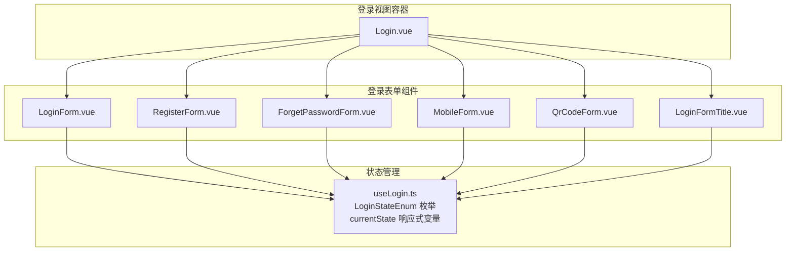
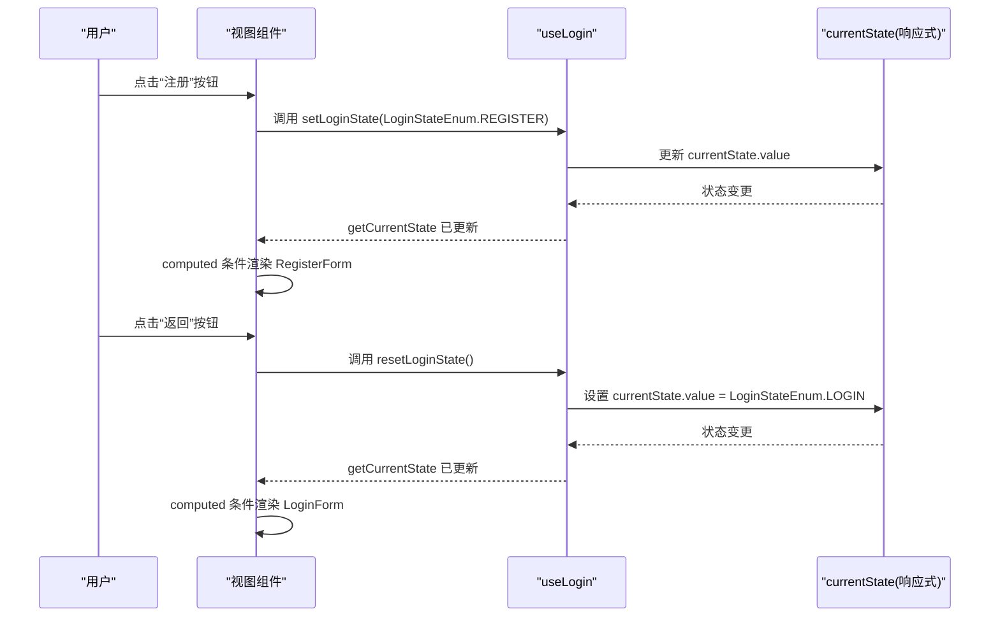
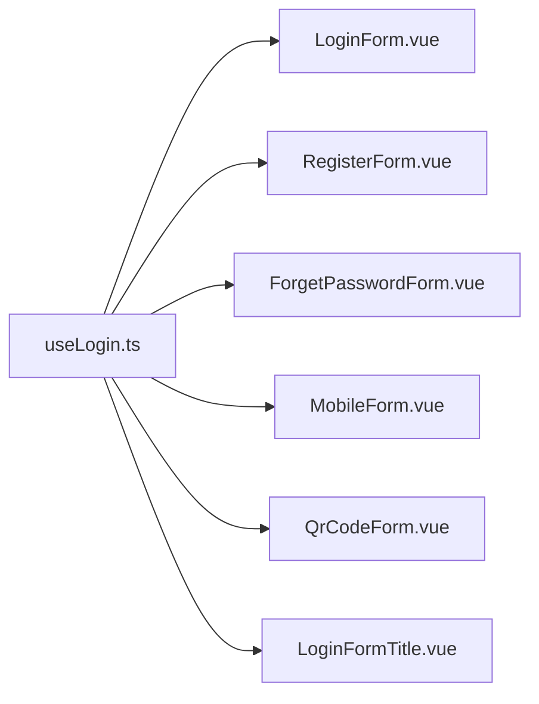

# 登录状态管理

<cite>
**本文引用的文件**
- [useLogin.ts](file://src/views/system/login/useLogin.ts)
- [Login.vue](file://src/views/system/login/Login.vue)
- [LoginForm.vue](file://src/views/system/login/components/LoginForm.vue)
- [RegisterForm.vue](file://src/views/system/login/components/RegisterForm.vue)
- [ForgetPasswordForm.vue](file://src/views/system/login/components/ForgetPasswordForm.vue)
- [QrCodeForm.vue](file://src/views/system/login/components/QrCodeForm.vue)
- [LoginFormTitle.vue](file://src/views/system/login/components/LoginFormTitle.vue)
</cite>

## 目录
1. [简介](#简介)
2. [项目结构](#项目结构)
3. [核心组件](#核心组件)
4. [架构总览](#架构总览)
5. [详细组件分析](#详细组件分析)
6. [依赖关系分析](#依赖关系分析)
7. [性能考虑](#性能考虑)
8. [故障排查指南](#故障排查指南)
9. [结论](#结论)

## 简介
本文件围绕系统登录模块中的登录状态管理进行深入解析，重点说明 useLogin 组合式函数如何通过 LoginStateEnum 枚举类型管理“登录、注册、重置密码、手机登录、二维码登录”五种登录模式，并阐述：
- currentState 响应式变量的设计原理与作用
- setLoginState、getCurrentState、resetLoginState 三个核心方法的工作流程
- 视图组件如何基于 computed 包装器实现状态响应性
- 状态重置时的默认值设定逻辑
- 避免状态污染的最佳实践

## 项目结构
登录状态管理位于系统登录页面目录下，采用“视图容器 + 多表单组件 + 组合式状态”的分层设计：
- 视图容器负责渲染多个登录表单组件
- 各表单组件根据当前状态决定是否展示
- useLogin 提供统一的状态读取与切换能力

图表来源
- [Login.vue](file://src/views/system/login/Login.vue#L1-L122)
- [LoginForm.vue](file://src/views/system/login/components/LoginForm.vue#L1-L81)
- [RegisterForm.vue](file://src/views/system/login/components/RegisterForm.vue#L1-L68)
- [ForgetPasswordForm.vue](file://src/views/system/login/components/ForgetPasswordForm.vue#L1-L49)
- [QrCodeForm.vue](file://src/views/system/login/components/QrCodeForm.vue#L1-L36)
- [LoginFormTitle.vue](file://src/views/system/login/components/LoginFormTitle.vue#L1-L20)
- [useLogin.ts](file://src/views/system/login/useLogin.ts#L1-L41)

章节来源
- [Login.vue](file://src/views/system/login/Login.vue#L1-L122)

## 核心组件
- LoginStateEnum：定义五种登录模式，作为状态常量字面值，用于表单组件的条件渲染与标题映射。
- useLogin 组合式函数：
  - 提供 setLoginState(state) 切换当前状态
  - 提供 getCurrentState 作为只读计算属性，供各表单组件订阅
  - 提供 resetLoginState() 将状态重置为登录模式（默认值）

章节来源
- [useLogin.ts](file://src/views/system/login/useLogin.ts#L1-L41)

## 架构总览
登录状态管理采用“单一事实源 + 计算属性订阅”的响应式架构：
- 单一事实源：currentState（ref）保存当前登录状态
- 计算属性订阅：各表单组件通过 computed(getCurrentState) 订阅状态变化
- 状态变更：用户点击按钮触发 setLoginState 切换到目标状态
- 默认回退：resetLoginState 将状态重置为登录模式

图表来源
- [LoginForm.vue](file://src/views/system/login/components/LoginForm.vue#L1-L81)
- [RegisterForm.vue](file://src/views/system/login/components/RegisterForm.vue#L1-L68)
- [useLogin.ts](file://src/views/system/login/useLogin.ts#L1-L41)

## 详细组件分析

### useLogin 组合式函数
- 设计要点
  - LoginStateEnum 作为状态常量集合，保证状态值的可读性与一致性
  - currentState 使用 ref 创建响应式变量，便于跨组件共享与修改
  - getCurrentState 使用 computed 包装，确保外部组件以只读方式订阅状态
  - resetLoginState 将 currentState 重置为 LoginStateEnum.LOGIN，作为默认回退值

- 方法工作流程
  - setLoginState：接收枚举值，直接赋给 currentState.value
  - getCurrentState：返回一个只读的计算属性，内部读取 currentState.value
  - resetLoginState：将 currentState.value 设为 LoginStateEnum.LOGIN

- 复杂度与性能
  - 状态读写均为 O(1)，计算属性依赖单一响应式源，更新成本低
  - computed 的缓存特性避免重复计算

章节来源
- [useLogin.ts](file://src/views/system/login/useLogin.ts#L1-L41)

### LoginStateEnum 枚举与业务场景
- 登录（LOGIN）
  - 场景：标准账号密码登录
  - 典型交互：填写账号、密码，提交登录；可跳转至手机登录或二维码登录
- 注册（REGISTER）
  - 场景：新用户创建账号，需填写手机号、短信验证码、密码等
  - 典型交互：提交注册表单，成功后通常回到登录页
- 重置密码（RESET_PASSWORD）
  - 场景：忘记密码，通过账号+手机+验证码重置
  - 典型交互：提交后返回登录页
- 手机登录（MOBILE）
  - 场景：通过短信验证码快速登录
  - 典型交互：输入手机号获取验证码，提交后返回登录页
- 二维码登录（QR_CODE）
  - 场景：移动端扫码授权登录
  - 典型交互：展示二维码，扫码后返回登录页

章节来源
- [useLogin.ts](file://src/views/system/login/useLogin.ts#L1-L41)
- [LoginForm.vue](file://src/views/system/login/components/LoginForm.vue#L1-L81)
- [RegisterForm.vue](file://src/views/system/login/components/RegisterForm.vue#L1-L68)
- [ForgetPasswordForm.vue](file://src/views/system/login/components/ForgetPasswordForm.vue#L1-L49)
- [QrCodeForm.vue](file://src/views/system/login/components/QrCodeForm.vue#L1-L36)

### 视图组件中的状态响应性
- computed 包装器的作用
  - 各表单组件通过 computed(() => unref(getCurrentState) === LoginStateEnum.XXX) 决定是否渲染
  - computed 依赖 getCurrentState，当 useLogin 中的状态变更时，自动触发重新计算与组件更新
- 无状态污染实践
  - 每个表单仅关心自身状态匹配与否，不持有全局状态
  - 通过 setLoginState 显式切换，避免隐式状态耦合
  - resetLoginState 提供统一回退点，减少分支逻辑散落

- 实际代码示例（路径引用）
  - 登录表单条件渲染：[LoginForm.vue](file://src/views/system/login/components/LoginForm.vue#L1-L81)
  - 注册表单条件渲染：[RegisterForm.vue](file://src/views/system/login/components/RegisterForm.vue#L1-L68)
  - 忘记密码表单条件渲染：[ForgetPasswordForm.vue](file://src/views/system/login/components/ForgetPasswordForm.vue#L1-L49)
  - 二维码表单条件渲染：[QrCodeForm.vue](file://src/views/system/login/components/QrCodeForm.vue#L1-L36)
  - 标题动态显示：[LoginFormTitle.vue](file://src/views/system/login/components/LoginFormTitle.vue#L1-L20)

章节来源
- [LoginForm.vue](file://src/views/system/login/components/LoginForm.vue#L1-L81)
- [RegisterForm.vue](file://src/views/system/login/components/RegisterForm.vue#L1-L68)
- [ForgetPasswordForm.vue](file://src/views/system/login/components/ForgetPasswordForm.vue#L1-L49)
- [QrCodeForm.vue](file://src/views/system/login/components/QrCodeForm.vue#L1-L36)
- [LoginFormTitle.vue](file://src/views/system/login/components/LoginFormTitle.vue#L1-L20)

### 状态重置与默认值
- 默认值设定
  - resetLoginState 将 currentState.value 设为 LoginStateEnum.LOGIN
  - 这意味着所有“返回”或“取消”操作都会回到登录模式，形成一致的用户体验
- 最佳实践
  - 在任何需要回到登录页的场景调用 resetLoginState
  - 避免在 resetLoginState 之外手动设置其他状态值，防止状态漂移
  - 对于临时状态（如二维码登录），在离开时统一调用 resetLoginState

章节来源
- [useLogin.ts](file://src/views/system/login/useLogin.ts#L1-L41)
- [QrCodeForm.vue](file://src/views/system/login/components/QrCodeForm.vue#L1-L36)

### 登录视图容器与多表单协作
- Login.vue 将多个表单组件并列渲染，但仅有一个处于可见状态
- 各表单组件通过 useLogin 的状态判断决定是否显示
- 容器不直接管理状态，仅承载组件布局

章节来源
- [Login.vue](file://src/views/system/login/Login.vue#L1-L122)
- [LoginForm.vue](file://src/views/system/login/components/LoginForm.vue#L1-L81)
- [RegisterForm.vue](file://src/views/system/login/components/RegisterForm.vue#L1-L68)
- [ForgetPasswordForm.vue](file://src/views/system/login/components/ForgetPasswordForm.vue#L1-L49)
- [QrCodeForm.vue](file://src/views/system/login/components/QrCodeForm.vue#L1-L36)

## 依赖关系分析
- 组件间依赖
  - 各表单组件依赖 useLogin 提供的状态与方法
  - LoginFormTitle 依赖 useLogin 获取当前状态并映射标题文本
- 状态流向
  - 用户交互 -> 表单组件 -> useLogin.setLoginState -> currentState -> 各表单组件 computed 重新计算 -> UI 更新
- 可能的循环依赖
  - 当前结构为单向依赖（组件 -> useLogin），未发现循环依赖风险

图表来源
- [useLogin.ts](file://src/views/system/login/useLogin.ts#L1-L41)
- [LoginForm.vue](file://src/views/system/login/components/LoginForm.vue#L1-L81)
- [RegisterForm.vue](file://src/views/system/login/components/RegisterForm.vue#L1-L68)
- [ForgetPasswordForm.vue](file://src/views/system/login/components/ForgetPasswordForm.vue#L1-L49)
- [QrCodeForm.vue](file://src/views/system/login/components/QrCodeForm.vue#L1-L36)
- [LoginFormTitle.vue](file://src/views/system/login/components/LoginFormTitle.vue#L1-L20)

## 性能考虑
- 计算属性缓存：computed 依赖单一响应式源，更新时仅触发订阅组件的重新渲染
- 状态粒度：单一 currentState 管理五种模式，避免多处状态分散导致的重复渲染
- 渲染控制：各表单组件通过条件渲染减少 DOM 数量，提升首屏与切换性能

## 故障排查指南
- 症状：点击按钮后界面不切换
  - 排查：确认是否正确调用 setLoginState 并传入 LoginStateEnum 枚举值
  - 参考：[LoginForm.vue](file://src/views/system/login/components/LoginForm.vue#L1-L81)
- 症状：标题未随状态变化
  - 排查：确认 LoginFormTitle 是否正确订阅 getCurrentState
  - 参考：[LoginFormTitle.vue](file://src/views/system/login/components/LoginFormTitle.vue#L1-L20)
- 症状：返回后仍停留在非登录态
  - 排查：确认是否调用了 resetLoginState
  - 参考：[useLogin.ts](file://src/views/system/login/useLogin.ts#L1-L41)
- 症状：二维码登录后无法回到登录页
  - 排查：确认在返回按钮中调用 setLoginState(LoginStateEnum.LOGIN)
  - 参考：[QrCodeForm.vue](file://src/views/system/login/components/QrCodeForm.vue#L1-L36)

章节来源
- [LoginForm.vue](file://src/views/system/login/components/LoginForm.vue#L1-L81)
- [LoginFormTitle.vue](file://src/views/system/login/components/LoginFormTitle.vue#L1-L20)
- [useLogin.ts](file://src/views/system/login/useLogin.ts#L1-L41)
- [QrCodeForm.vue](file://src/views/system/login/components/QrCodeForm.vue#L1-L36)

## 结论
useLogin 通过 LoginStateEnum 枚举与单一响应式状态 currentState，实现了登录模式的清晰划分与高效切换。各表单组件通过 computed 订阅 getCurrentState，确保了状态响应性与渲染可控性。resetLoginState 提供统一的默认回退点，有助于避免状态污染与用户体验不一致。整体设计简洁、解耦良好，适合扩展更多登录模式或集成第三方登录方式。