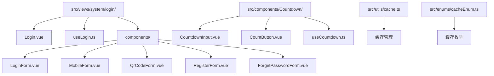
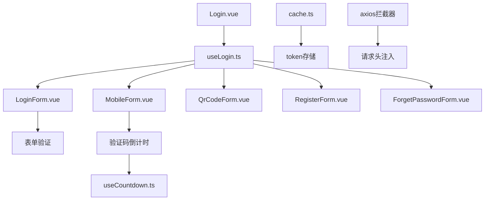
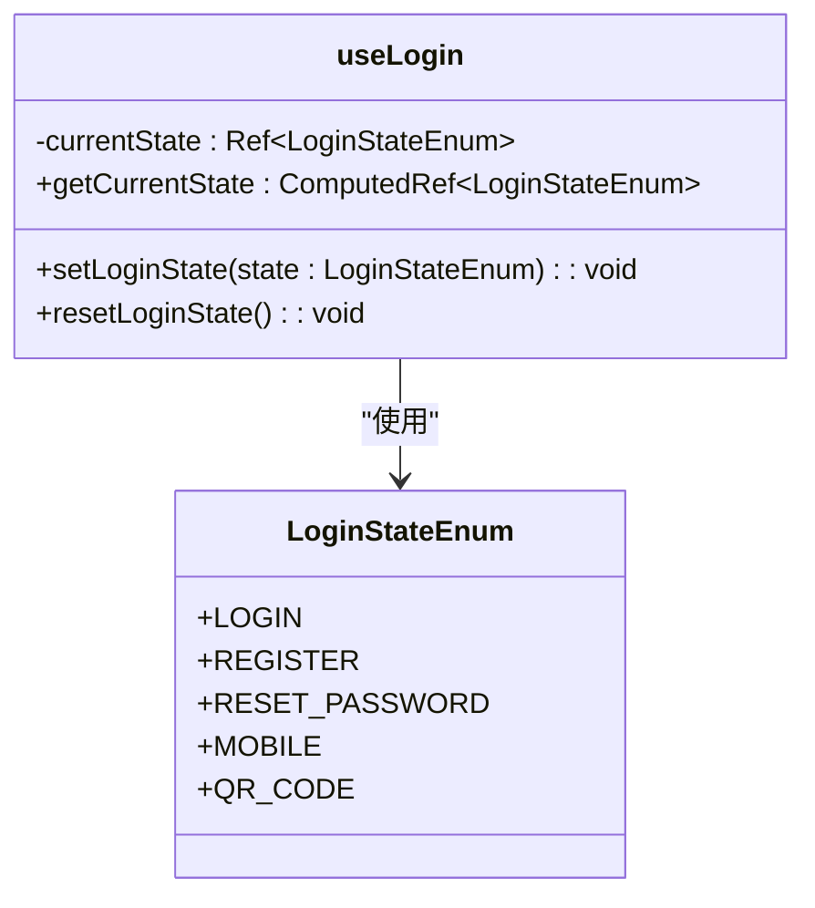
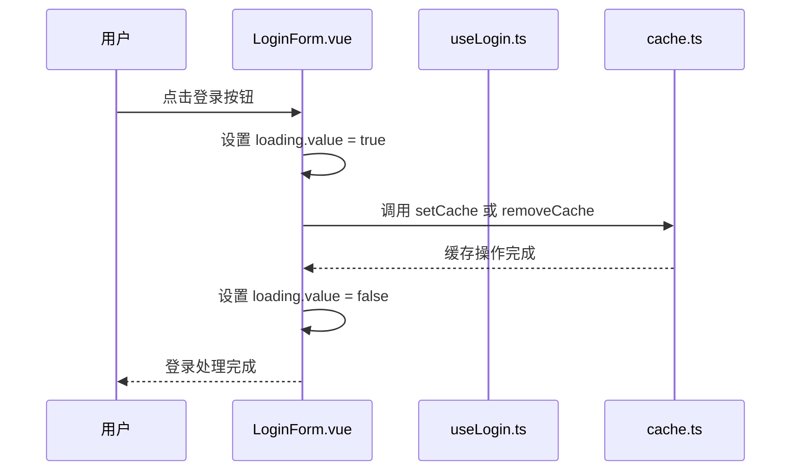
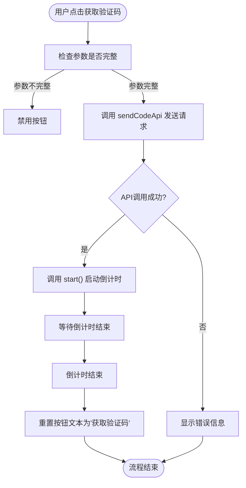
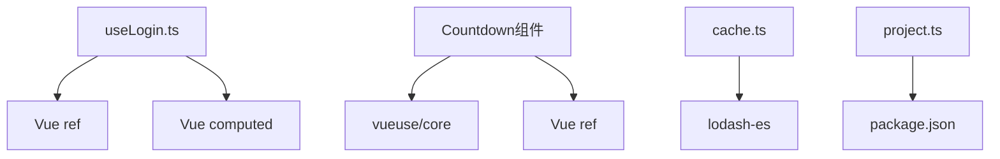

# 登录逻辑组合函数

<cite>
**本文档引用的文件**
- [useLogin.ts](file://src/views/system/login/useLogin.ts)
- [LoginForm.vue](file://src/views/system/login/components/LoginForm.vue)
- [MobileForm.vue](file://src/views/system/login/components/MobileForm.vue)
- [CountdownInput.vue](file://src/components/Countdown/src/CountdownInput.vue)
- [CountButton.vue](file://src/components/Countdown/src/CountButton.vue)
- [useCountdown.ts](file://src/components/Countdown/src/useCountdown.ts)
- [cache.ts](file://src/utils/cache.ts)
- [cacheEnum.ts](file://src/enums/cacheEnum.ts)
- [project.ts](file://src/config/project.ts)
- [user.ts](file://src/stores/modules/user.ts)
</cite>

## 目录
1. [简介](#简介)
2. [项目结构](#项目结构)
3. [核心组件](#核心组件)
4. [架构概览](#架构概览)
5. [详细组件分析](#详细组件分析)
6. [依赖分析](#依赖分析)
7. [性能考虑](#性能考虑)
8. [故障排除指南](#故障排除指南)
9. [结论](#结论)

## 简介
本文档全面解析 `useLogin.ts` 组合式函数的内部实现，涵盖登录状态管理、表单数据响应式对象的定义与重置逻辑。详细说明 `handleLogin` 方法如何根据当前表单类型调用对应 API 接口，并处理 token 存储及 axios 拦截器注入。解释验证码倒计时逻辑（结合 `useCountdown`）与防重复提交机制。提供如何扩展自定义认证逻辑（如生物识别）的指导，并列举常见问题如异步状态不同步、Token 刷新失败的调试方法。

## 项目结构
本项目采用典型的 Vue 3 + Vite 架构，结合 Pinia 进行状态管理。登录功能主要集中在 `src/views/system/login/` 目录下，包含多个登录方式的组件和一个核心的组合式函数 `useLogin.ts`。验证码功能由独立的 `Countdown` 组件库提供，支持倒计时和防重复提交。

**图示来源**
- [useLogin.ts](file://src/views/system/login/useLogin.ts)
- [LoginForm.vue](file://src/views/system/login/components/LoginForm.vue)
- [MobileForm.vue](file://src/views/system/login/components/MobileForm.vue)
- [CountdownInput.vue](file://src/components/Countdown/src/CountdownInput.vue)
- [CountButton.vue](file://src/components/Countdown/src/CountButton.vue)
- [useCountdown.ts](file://src/components/Countdown/src/useCountdown.ts)

**章节来源**
- [useLogin.ts](file://src/views/system/login/useLogin.ts)
- [LoginForm.vue](file://src/views/system/login/components/LoginForm.vue)
- [MobileForm.vue](file://src/views/system/login/components/MobileForm.vue)

## 核心组件
`useLogin.ts` 是登录功能的核心组合式函数，负责管理登录状态的切换和重置。它通过 `ref` 和 `computed` 实现响应式状态管理，暴露 `setLoginState`、`getCurrentState` 和 `resetLoginState` 三个方法供各个登录表单组件使用。

**章节来源**
- [useLogin.ts](file://src/views/system/login/useLogin.ts#L1-L40)

## 架构概览
整个登录系统的架构围绕 `useLogin.ts` 组合式函数展开，通过状态管理实现不同登录方式（账号密码、手机验证码、二维码、注册、忘记密码）之间的无缝切换。表单数据通过 `ref` 进行响应式绑定，验证码功能通过 `Countdown` 组件库实现，token 存储通过 `cache.ts` 工具函数完成。

**图示来源**
- [useLogin.ts](file://src/views/system/login/useLogin.ts)
- [LoginForm.vue](file://src/views/system/login/components/LoginForm.vue)
- [MobileForm.vue](file://src/views/system/login/components/MobileForm.vue)
- [CountdownInput.vue](file://src/components/Countdown/src/CountdownInput.vue)
- [CountButton.vue](file://src/components/Countdown/src/CountButton.vue)
- [useCountdown.ts](file://src/components/Countdown/src/useCountdown.ts)
- [cache.ts](file://src/utils/cache.ts)

## 详细组件分析
### useLogin.ts 分析
`useLogin.ts` 定义了 `LoginStateEnum` 枚举，包含五种登录状态：`LOGIN`、`REGISTER`、`RESET_PASSWORD`、`MOBILE`、`QR_CODE`。通过 `currentState` 响应式变量管理当前状态，`setLoginState` 方法用于切换状态，`getCurrentState` 返回计算属性以响应状态变化，`resetLoginState` 方法将状态重置为默认的 `LOGIN` 状态。

#### 状态管理类图

**图示来源**
- [useLogin.ts](file://src/views/system/login/useLogin.ts#L10-L16)

**章节来源**
- [useLogin.ts](file://src/views/system/login/useLogin.ts#L1-L40)

### LoginForm.vue 分析
`LoginForm.vue` 是账号密码登录表单组件，通过 `v-if="getShow"` 控制显示，`getShow` 计算属性依赖于 `useLogin` 的 `getCurrentState`。表单包含账号、密码输入框，以及记住账号的复选框。`handlelogin` 方法处理登录逻辑，包括设置加载状态、存储账号信息到缓存。

#### 登录流程序列图

**图示来源**
- [LoginForm.vue](file://src/views/system/login/components/LoginForm.vue#L69-L78)
- [useLogin.ts](file://src/views/system/login/useLogin.ts)
- [cache.ts](file://src/utils/cache.ts)

**章节来源**
- [LoginForm.vue](file://src/views/system/login/components/LoginForm.vue#L1-L80)

### MobileForm.vue 与验证码逻辑分析
`MobileForm.vue` 是手机验证码登录表单，使用 `CountdownInput` 组件实现验证码输入和发送功能。`CountdownInput` 组件通过 `params` 属性传递手机号，`sendCodeApi` 属性接收发送验证码的 API 函数。

`CountButton.vue` 组件使用 `useCountdown` 组合式函数管理倒计时状态。`handleStart` 方法在点击"获取验证码"按钮时触发，调用 `api` 函数发送请求，成功后调用 `start` 方法启动倒计时。

#### 验证码倒计时流程图

**图示来源**
- [MobileForm.vue](file://src/views/system/login/components/MobileForm.vue)
- [CountdownInput.vue](file://src/components/Countdown/src/CountdownInput.vue)
- [CountButton.vue](file://src/components/Countdown/src/CountButton.vue)
- [useCountdown.ts](file://src/components/Countdown/src/useCountdown.ts)

**章节来源**
- [MobileForm.vue](file://src/views/system/login/components/MobileForm.vue#L1-L43)
- [CountdownInput.vue](file://src/components/Countdown/src/CountdownInput.vue#L1-L56)
- [CountButton.vue](file://src/components/Countdown/src/CountButton.vue#L1-L54)

## 依赖分析
登录功能依赖多个核心模块：
- `useLogin.ts` 依赖 Vue 的 `ref` 和 `computed` 实现响应式状态管理。
- `Countdown` 组件库依赖 `vueuse/core` 的 `tryOnUnmounted` 钩子和 Vue 的 `ref`。
- 缓存功能依赖 `lodash-es` 的 `isNull` 和 `isUndefined` 函数进行类型判断。
- 项目配置通过 `package.json` 和 `project.ts` 统一管理缓存位置和版本信息。

**图示来源**
- [useLogin.ts](file://src/views/system/login/useLogin.ts#L7)
- [useCountdown.ts](file://src/components/Countdown/src/useCountdown.ts#L1-L2)
- [cache.ts](file://src/utils/cache.ts#L10)
- [project.ts](file://src/config/project.ts#L8)

**章节来源**
- [useLogin.ts](file://src/views/system/login/useLogin.ts)
- [useCountdown.ts](file://src/components/Countdown/src/useCountdown.ts)
- [cache.ts](file://src/utils/cache.ts)
- [project.ts](file://src/config/project.ts)

## 性能考虑
- **响应式优化**：使用 `ref` 和 `computed` 精确控制响应式数据，避免不必要的渲染。
- **缓存策略**：通过 `CACHE_LOCATION` 配置项灵活选择 `localStorage` 或 `sessionStorage`，平衡数据持久性和安全性。
- **防重复提交**：`CountButton.vue` 通过 `isStart` 状态和倒计时机制有效防止用户重复点击发送验证码。
- **资源懒加载**：非主要登录表单（注册、忘记密码等）使用 `createAsyncComponent` 进行异步加载，减少首屏加载时间。

## 故障排除指南
### 异步状态不同步问题
当 `loading` 状态未正确更新时，检查 `try...catch...finally` 块是否完整，确保 `finally` 中重置 `loading.value = false`。

**章节来源**
- [LoginForm.vue](file://src/views/system/login/components/LoginForm.vue#L71-L77)

### Token 刷新失败
检查 `cache.ts` 中的 `generateCaheKey` 函数生成的键名是否与 `cacheEnum.ts` 中定义的 `TOKEN_KEY` 一致，确保缓存读写操作针对正确的键。

**章节来源**
- [cache.ts](file://src/utils/cache.ts#L20-L26)
- [cacheEnum.ts](file://src/enums/cacheEnum.ts#L5)

### 验证码倒计时不启动
检查 `CountButton.vue` 的 `api` 属性是否正确传递了发送验证码的函数，以及 `params` 是否包含必要的参数（如手机号）。

**章节来源**
- [CountButton.vue](file://src/components/Countdown/src/CountButton.vue#L40-L44)

## 结论
`useLogin.ts` 组合式函数及其相关组件构成了一个完整、可扩展的登录系统。通过清晰的状态管理、响应式数据绑定和模块化设计，实现了多种登录方式的无缝切换。验证码功能通过独立的 `Countdown` 组件库实现，具有良好的复用性。缓存机制灵活可配置，支持 `localStorage` 和 `sessionStorage` 两种存储方式。整体架构清晰，易于维护和扩展，为后续添加生物识别等新型认证方式提供了良好的基础。