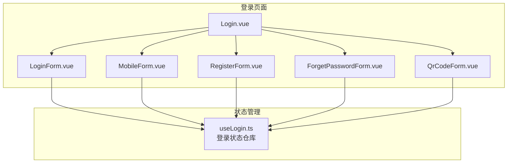
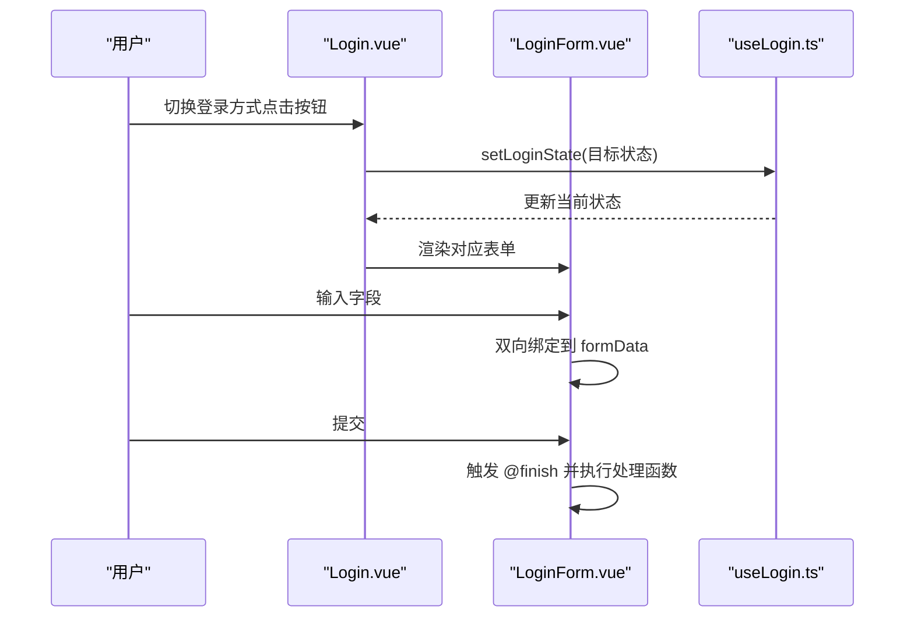
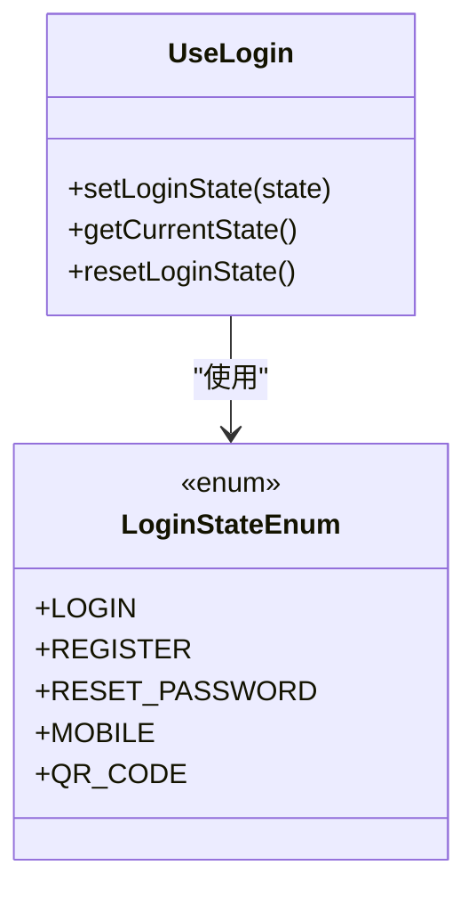
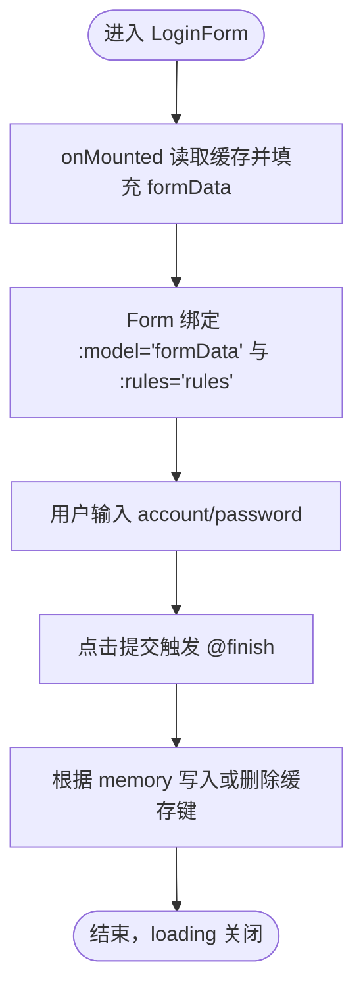
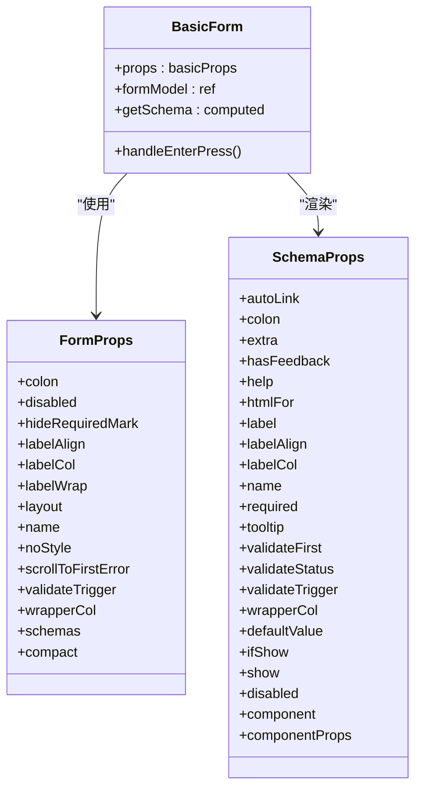
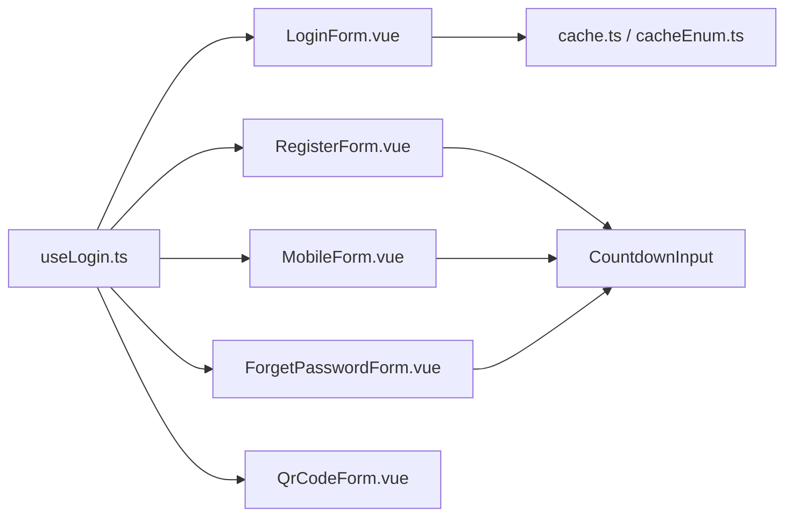

# 表单数据处理

<cite>
**本文引用的文件列表**
- [useLogin.ts](file://src/views/system/login/useLogin.ts)
- [Login.vue](file://src/views/system/login/Login.vue)
- [LoginForm.vue](file://src/views/system/login/components/LoginForm.vue)
- [MobileForm.vue](file://src/views/system/login/components/MobileForm.vue)
- [RegisterForm.vue](file://src/views/system/login/components/RegisterForm.vue)
- [ForgetPasswordForm.vue](file://src/views/system/login/components/ForgetPasswordForm.vue)
- [QrCodeForm.vue](file://src/views/system/login/components/QrCodeForm.vue)
- [BasicForm.vue](file://src/components/Form/src/BasicForm.vue)
- [useForm.ts](file://src/components/Form/src/hooks/useForm.ts)
- [FormItem.vue](file://src/components/Form/src/components/FormItem.vue)
- [props.ts（Form类型）](file://src/components/Form/src/types/props.ts)
- [cache.ts](file://src/utils/cache.ts)
- [cacheEnum.ts](file://src/enums/cacheEnum.ts)
</cite>

## 目录
1. [引言](#引言)
2. [项目结构](#项目结构)
3. [核心组件](#核心组件)
4. [架构总览](#架构总览)
5. [详细组件分析](#详细组件分析)
6. [依赖关系分析](#依赖关系分析)
7. [性能考量](#性能考量)
8. [故障排查指南](#故障排查指南)
9. [结论](#结论)
10. [附录：最佳实践与扩展指南](#附录最佳实践与扩展指南)

## 引言
本文件聚焦于登录模块中的表单数据对象（如 loginForm、mobileForm 等）的响应式定义方式、验证规则绑定机制、数据重置与初始化策略，以及与 useLogin 状态管理的协同工作方式。文档还提供处理输入、清除、校验失败等场景的最佳实践，并说明如何扩展自定义字段与验证逻辑。

## 项目结构
登录模块采用“多表单切换 + 状态管理”的设计：
- 登录页容器负责渲染多个表单组件（账号密码、手机短信、注册、重置密码、二维码），通过 useLogin 控制当前显示的表单。
- 各表单组件内部以 ref 定义响应式数据对象（如 formData），并通过 ant-design-vue 的 Form/FormItem 绑定模型与规则，实现双向绑定与校验。
- 通用表单组件 BasicForm 提供基于 schema 的声明式表单能力，但当前登录页直接使用原生 Form/FormItem。

图表来源
- [Login.vue](file://src/views/system/login/Login.vue#L1-L122)
- [LoginForm.vue](file://src/views/system/login/components/LoginForm.vue#L1-L81)
- [MobileForm.vue](file://src/views/system/login/components/MobileForm.vue#L1-L44)
- [RegisterForm.vue](file://src/views/system/login/components/RegisterForm.vue#L1-L68)
- [ForgetPasswordForm.vue](file://src/views/system/login/components/ForgetPasswordForm.vue#L1-L49)
- [QrCodeForm.vue](file://src/views/system/login/components/QrCodeForm.vue#L1-L36)
- [useLogin.ts](file://src/views/system/login/useLogin.ts#L1-L41)

章节来源
- [Login.vue](file://src/views/system/login/Login.vue#L1-L122)
- [useLogin.ts](file://src/views/system/login/useLogin.ts#L1-L41)

## 核心组件
- 登录状态仓库 useLogin：集中管理当前表单状态（枚举 LoginStateEnum），提供设置、读取与重置方法。
- 多表单组件：LoginForm、MobileForm、RegisterForm、ForgetPasswordForm、QrCodeForm，每个组件维护自己的 formData 与 rules。
- 通用表单 BasicForm：基于 schema 的声明式表单，当前登录页未直接使用该组件。

章节来源
- [useLogin.ts](file://src/views/system/login/useLogin.ts#L1-L41)
- [LoginForm.vue](file://src/views/system/login/components/LoginForm.vue#L1-L81)
- [MobileForm.vue](file://src/views/system/login/components/MobileForm.vue#L1-L44)
- [RegisterForm.vue](file://src/views/system/login/components/RegisterForm.vue#L1-L68)
- [ForgetPasswordForm.vue](file://src/views/system/login/components/ForgetPasswordForm.vue#L1-L49)
- [QrCodeForm.vue](file://src/views/system/login/components/QrCodeForm.vue#L1-L36)
- [BasicForm.vue](file://src/components/Form/src/BasicForm.vue#L1-L54)

## 架构总览
登录页通过 useLogin 的 getCurrentState 决定显示哪个表单；各表单组件内部以 ref 定义响应式数据对象（如 formData），并通过 Form/FormItem 的 :model 与 :rules 进行双向绑定与校验。提交时通过 @finish 触发对应处理函数（如 handlelogin、handleRegister 等）。

图表来源
- [Login.vue](file://src/views/system/login/Login.vue#L1-L122)
- [LoginForm.vue](file://src/views/system/login/components/LoginForm.vue#L1-L81)
- [useLogin.ts](file://src/views/system/login/useLogin.ts#L1-L41)

## 详细组件分析

### 登录状态仓库 useLogin
- 状态枚举 LoginStateEnum：包含 LOGIN、REGISTER、RESET_PASSWORD、MOBILE、QR_CODE。
- 数据与方法：
  - currentState：ref 存储当前状态
  - setLoginState(state)：设置当前状态
  - getCurrentState：computed 返回当前状态
  - resetLoginState()：重置为默认登录态

图表来源
- [useLogin.ts](file://src/views/system/login/useLogin.ts#L1-L41)

章节来源
- [useLogin.ts](file://src/views/system/login/useLogin.ts#L1-L41)

### 账号密码登录表单 LoginForm
- 响应式数据：
  - formData：包含 account、password
  - memory：是否记住账号
  - loading：提交加载态
- 初始化策略：
  - onMounted 从缓存读取账号信息并填充到 formData，同时更新 memory 状态
- 验证规则：
  - 使用 rules 对 account、password 进行必填校验
- 提交处理：
  - handlelogin 中根据 memory 决定写入或删除缓存键
  - finally 中统一关闭 loading

图表来源
- [LoginForm.vue](file://src/views/system/login/components/LoginForm.vue#L1-L81)
- [cache.ts](file://src/utils/cache.ts)
- [cacheEnum.ts](file://src/enums/cacheEnum.ts)

章节来源
- [LoginForm.vue](file://src/views/system/login/components/LoginForm.vue#L1-L81)
- [cache.ts](file://src/utils/cache.ts)
- [cacheEnum.ts](file://src/enums/cacheEnum.ts)

### 手机短信登录表单 MobileForm
- 响应式数据：
  - formData：包含 mobile、sms
  - loading：提交加载态
- 显示控制：
  - getShow：仅当 getCurrentState 为 MOBILE 时显示
- 参数联动：
  - getParams：当 mobile 有值时，向 CountdownInput 传入 params，用于倒计时按钮的请求参数
- 验证规则：
  - rules 对 mobile、sms 进行必填校验

章节来源
- [MobileForm.vue](file://src/views/system/login/components/MobileForm.vue#L1-L44)

### 注册表单 RegisterForm
- 响应式数据：
  - formData：包含 account、mobile、sms、password、confirmPassword、policy
  - loading：提交加载态
- 参数联动：
  - getParams：当 mobile 有值时，向 CountdownInput 传入 params
- 验证规则：
  - account、mobile、sms、password 必填
  - confirmPassword 使用自定义异步校验，要求与 password 一致
  - policy 使用自定义异步校验，要求勾选同意隐私政策
- 提交处理：
  - handleRegister 留空，可在此处接入注册接口调用

章节来源
- [RegisterForm.vue](file://src/views/system/login/components/RegisterForm.vue#L1-L68)

### 忘记密码表单 ForgetPasswordForm
- 响应式数据：
  - formData：包含 account、mobile、sms
  - loading：提交加载态
- 参数联动：
  - getParams：当 mobile 有值时，向 CountdownInput 传入 params
- 验证规则：
  - account、mobile、sms 必填
- 提交处理：
  - handlereset 留空，可在此处接入重置密码接口调用

章节来源
- [ForgetPasswordForm.vue](file://src/views/system/login/components/ForgetPasswordForm.vue#L1-L49)

### 二维码登录表单 QrCodeForm
- 响应式数据：
  - qrurl：二维码链接
  - status：二维码状态（active/loading/expired/scanned）
- 交互：
  - onRefresh：刷新二维码
  - handleBackLogin：返回登录态并重置状态（注释提示需停止定时器与重置状态）

章节来源
- [QrCodeForm.vue](file://src/views/system/login/components/QrCodeForm.vue#L1-L36)

### 通用表单 BasicForm 与表单类型
- BasicForm：基于 schema 的声明式表单，支持 schemas、compact 等属性，内部将 schema 渲染为 FormItem。
- 表单类型 props.ts：定义了 FormProps 与 SchemaProps，包括布局、标签对齐、校验时机、字段显隐、组件类型与默认值等。

图表来源
- [BasicForm.vue](file://src/components/Form/src/BasicForm.vue#L1-L54)
- [props.ts（Form类型）](file://src/components/Form/src/types/props.ts#L1-L109)

章节来源
- [BasicForm.vue](file://src/components/Form/src/BasicForm.vue#L1-L54)
- [props.ts（Form类型）](file://src/components/Form/src/types/props.ts#L1-L109)

### useForm 钩子
- useForm.ts：当前文件导出空钩子，未提供具体表单状态封装能力。登录页各表单组件均采用各自组件内的 ref 管理数据与校验，未复用该钩子。

章节来源
- [useForm.ts](file://src/components/Form/src/hooks/useForm.ts#L1-L2)

## 依赖关系分析
- 组件耦合：
  - 各表单组件通过 useLogin 的 getCurrentState 与 setLoginState 进行状态切换，耦合度低，职责清晰。
  - LoginForm 依赖缓存工具与缓存键枚举，用于记忆账号功能。
- 外部依赖：
  - ant-design-vue 的 Form/FormItem/Input/Button 等组件用于表单渲染与交互。
  - CountdownInput 用于短信验证码倒计时按钮。
- 潜在循环依赖：
  - 登录页组件之间无直接循环依赖，状态通过 useLogin 单点管理，避免循环引用。

图表来源
- [useLogin.ts](file://src/views/system/login/useLogin.ts#L1-L41)
- [LoginForm.vue](file://src/views/system/login/components/LoginForm.vue#L1-L81)
- [MobileForm.vue](file://src/views/system/login/components/MobileForm.vue#L1-L44)
- [RegisterForm.vue](file://src/views/system/login/components/RegisterForm.vue#L1-L68)
- [ForgetPasswordForm.vue](file://src/views/system/login/components/ForgetPasswordForm.vue#L1-L49)
- [cache.ts](file://src/utils/cache.ts)
- [cacheEnum.ts](file://src/enums/cacheEnum.ts)

章节来源
- [useLogin.ts](file://src/views/system/login/useLogin.ts#L1-L41)
- [LoginForm.vue](file://src/views/system/login/components/LoginForm.vue#L1-L81)
- [MobileForm.vue](file://src/views/system/login/components/MobileForm.vue#L1-L44)
- [RegisterForm.vue](file://src/views/system/login/components/RegisterForm.vue#L1-L68)
- [ForgetPasswordForm.vue](file://src/views/system/login/components/ForgetPasswordForm.vue#L1-L49)
- [cache.ts](file://src/utils/cache.ts)
- [cacheEnum.ts](file://src/enums/cacheEnum.ts)

## 性能考量
- 表单渲染优化：
  - 各表单组件通过 v-if 控制显示，避免同时渲染多个表单导致的 DOM 压力。
  - 使用 computed 控制 getShow，减少不必要的重新计算。
- 校验开销：
  - 将 validateTrigger 设为 blur/change，避免频繁触发校验造成抖动。
  - 自定义校验使用异步 Promise，避免阻塞主线程。
- 缓存访问：
  - 仅在 mounted 时读取缓存，避免每次输入都触发缓存 IO。

[本节为通用指导，无需特定文件引用]

## 故障排查指南
- 表单未显示或切换异常：
  - 检查 useLogin 的 setLoginState 是否被正确调用，以及 getCurrentState 的值是否符合预期。
- 输入框无响应：
  - 确认 Form 绑定了 :model="formData"，且 FormItem 的 name 与 formData 字段名一致。
- 校验不生效：
  - 确认 rules 中的字段名与 FormItem 的 name 匹配，trigger 设置是否合理。
- 记忆账号无效：
  - 检查缓存键与缓存工具是否正确使用，确保在提交时根据 memory 决定写入或删除。
- 短信倒计时不触发：
  - 确认 getParams 已根据 mobile 动态生成，且 CountdownInput 接收 params。

章节来源
- [useLogin.ts](file://src/views/system/login/useLogin.ts#L1-L41)
- [LoginForm.vue](file://src/views/system/login/components/LoginForm.vue#L1-L81)
- [MobileForm.vue](file://src/views/system/login/components/MobileForm.vue#L1-L44)
- [RegisterForm.vue](file://src/views/system/login/components/RegisterForm.vue#L1-L68)
- [ForgetPasswordForm.vue](file://src/views/system/login/components/ForgetPasswordForm.vue#L1-L49)

## 结论
登录模块通过 useLogin 实现多表单状态切换，各表单组件以 ref 定义响应式数据对象并绑定到 Form/FormItem，实现了清晰的数据流与良好的可维护性。验证规则通过 rules 与自定义校验结合，满足不同场景需求。初始化策略利用缓存读取与 computed 控制显示，整体结构简洁、职责明确。

[本节为总结，无需特定文件引用]

## 附录：最佳实践与扩展指南

### 表单数据对象的响应式定义与初始化
- 使用 ref 定义 formData，字段名与 FormItem 的 name 保持一致，便于双向绑定与校验。
- 在 onMounted 中从缓存读取初始值，提升用户体验。
- 对于需要联动的参数（如短信验证码），使用 computed 生成 params，避免冗余状态。

章节来源
- [LoginForm.vue](file://src/views/system/login/components/LoginForm.vue#L1-L81)
- [RegisterForm.vue](file://src/views/system/login/components/RegisterForm.vue#L1-L68)
- [ForgetPasswordForm.vue](file://src/views/system/login/components/ForgetPasswordForm.vue#L1-L49)
- [MobileForm.vue](file://src/views/system/login/components/MobileForm.vue#L1-L44)

### 验证规则绑定机制
- 必填规则：通过 rules 为字段添加 required 规则与提示消息。
- 自定义校验：使用 validator 回调，返回 Promise 成功或失败，支持异步校验（如密码一致性、隐私政策勾选）。
- 触发时机：根据业务选择 blur/change/submit，平衡体验与性能。

章节来源
- [RegisterForm.vue](file://src/views/system/login/components/RegisterForm.vue#L1-L68)
- [LoginForm.vue](file://src/views/system/login/components/LoginForm.vue#L1-L81)

### 数据重置逻辑
- 表单重置：在切换状态或提交失败后，可通过重置 formData 字段或调用表单实例的 resetFields 方法（若使用 BasicForm 的高级能力）。
- 缓存清理：在退出登录或切换账号时，清理缓存键，避免数据污染。

章节来源
- [LoginForm.vue](file://src/views/system/login/components/LoginForm.vue#L1-L81)
- [cache.ts](file://src/utils/cache.ts)
- [cacheEnum.ts](file://src/enums/cacheEnum.ts)

### 与 useLogin 的协同工作
- 通过 setLoginState 切换表单，通过 getCurrentState 控制显示，形成“状态驱动视图”的模式。
- 在提交处理函数中，根据业务需要调用 setLoginState 切换到其他表单（如从注册跳转到登录）。

章节来源
- [useLogin.ts](file://src/views/system/login/useLogin.ts#L1-L41)
- [RegisterForm.vue](file://src/views/system/login/components/RegisterForm.vue#L1-L68)
- [QrCodeForm.vue](file://src/views/system/login/components/QrCodeForm.vue#L1-L36)

### 处理输入、清除、校验失败的最佳实践
- 输入处理：使用 v-model:value 绑定字段，避免直接修改原始对象，保持响应式更新。
- 清除逻辑：提供“清空”按钮，将对应字段设为空字符串；必要时调用 resetFields。
- 校验失败：使用 ant-design-vue 的校验反馈与错误提示，结合 scrollToFirstError 自动定位首个错误字段。

章节来源
- [LoginForm.vue](file://src/views/system/login/components/LoginForm.vue#L1-L81)
- [RegisterForm.vue](file://src/views/system/login/components/RegisterForm.vue#L1-L68)
- [props.ts（Form类型）](file://src/components/Form/src/types/props.ts#L1-L109)

### 扩展自定义字段与验证逻辑
- 新增字段：在对应表单的 formData 中添加新字段，并在 FormItem 中声明 name。
- 新增验证：在 rules 中为新字段添加规则；如需复杂逻辑，使用 validator 回调。
- 参数联动：通过 computed 生成 params，传递给依赖参数的子组件（如 CountdownInput）。
- 通用表单：如需更复杂的 schema 驱动表单，可参考 BasicForm 的 SchemaProps 定义，逐步迁移。

章节来源
- [props.ts（Form类型）](file://src/components/Form/src/types/props.ts#L1-L109)
- [BasicForm.vue](file://src/components/Form/src/BasicForm.vue#L1-L54)
- [FormItem.vue](file://src/components/Form/src/components/FormItem.vue#L1-L18)