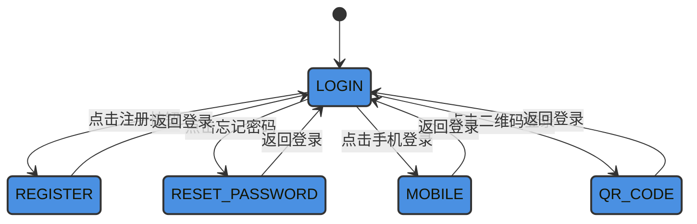
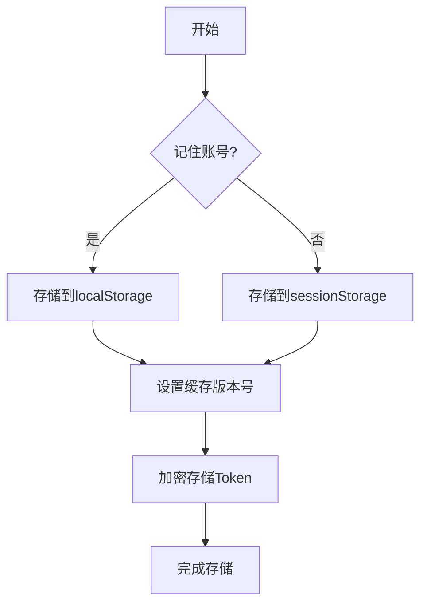
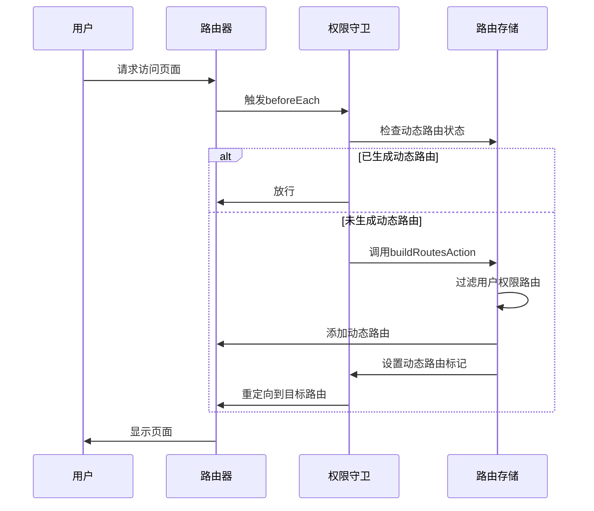
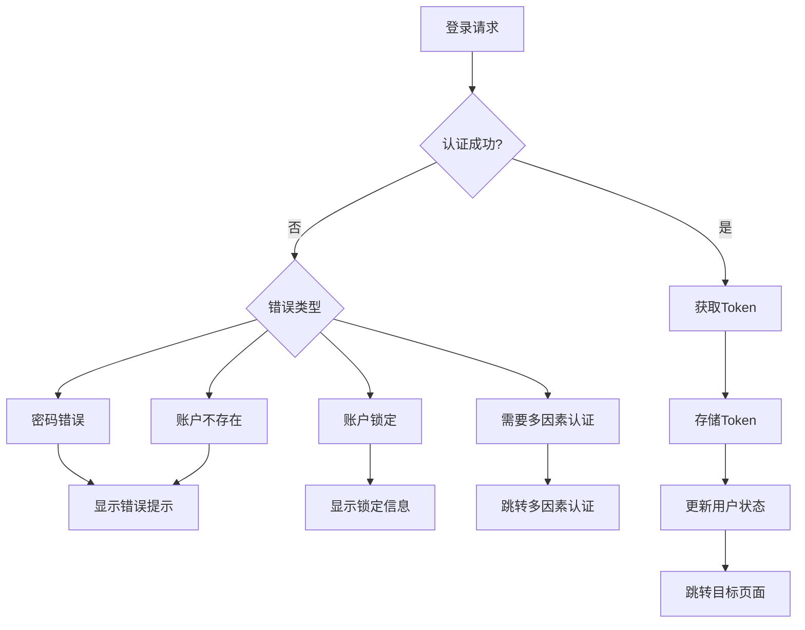

# 认证流程控制

<cite>
**本文档引用文件**  
- [LoginForm.vue](file://src/views/system/login/components/LoginForm.vue)
- [useLogin.ts](file://src/views/system/login/useLogin.ts)
- [cache.ts](file://src/utils/cache.ts)
- [cacheEnum.ts](file://src/enums/cacheEnum.ts)
- [permissionGuard.ts](file://src/router/guard/permissionGuard.ts)
- [project.ts](file://src/config/project.ts)
- [user.ts](file://src/stores/modules/user.ts)
- [permission.ts](file://src/stores/modules/permission.ts)
- [Login.vue](file://src/views/system/login/Login.vue)
</cite>

## 目录
1. [认证流程概述](#认证流程概述)
2. [登录状态管理机制](#登录状态管理机制)
3. [Token存储策略](#token存储策略)
4. [路由权限控制](#路由权限控制)
5. [异常处理与扩展方案](#异常处理与扩展方案)
6. [常见问题与调试方法](#常见问题与调试方法)

## 认证流程概述

本系统采用多模式登录认证机制，支持账号密码、手机验证码、二维码等多种登录方式。核心认证流程由`handleLogin`方法驱动，通过条件判断调用对应API接口完成认证。登录成功后，系统会更新用户状态、存储认证信息并进行路由跳转。

认证流程始于登录表单组件，用户输入凭证后触发`handleLogin`方法。该方法首先验证输入数据的完整性，然后根据当前登录状态调用相应的认证接口。认证成功后，系统获取Token并将其存储在浏览器的存储空间中，同时更新应用的权限状态。

**Section sources**
- [LoginForm.vue](file://src/views/system/login/components/LoginForm.vue#L69-L79)
- [Login.vue](file://src/views/system/login/Login.vue#L1-L121)

## 登录状态管理机制

系统通过`useLogin`组合式函数管理登录状态，使用`LoginStateEnum`枚举定义了五种登录状态：账号密码登录、注册、重置密码、手机登录和二维码登录。状态管理采用响应式数据模式，通过`ref`创建当前状态的响应式引用。

登录界面根据当前状态动态显示相应的表单组件。当用户点击不同登录方式的按钮时，`setLoginState`方法会被调用，更新当前状态，从而触发界面重新渲染，显示对应的登录表单。这种状态驱动的UI更新机制确保了界面与状态的一致性。

**Diagram sources**
- [useLogin.ts](file://src/views/system/login/useLogin.ts#L10-L16)
- [LoginForm.vue](file://src/views/system/login/components/LoginForm.vue#L22-L23)

**Section sources**
- [useLogin.ts](file://src/views/system/login/useLogin.ts#L18-L40)
- [LoginForm.vue](file://src/views/system/login/components/LoginForm.vue#L44-L49)

## Token存储策略

系统采用灵活的Token存储策略，通过配置决定Token的存储位置。存储机制由`cache.ts`工具模块实现，支持`localStorage`和`sessionStorage`两种存储方式。默认情况下，Token存储在`localStorage`中，确保用户关闭浏览器后仍能保持登录状态。

Token存储遵循统一的命名规范，使用`TOKEN_KEY`作为缓存键，避免命名冲突。缓存系统还实现了版本控制机制，当应用版本更新时，旧版本的缓存将被自动清理，防止因数据结构变化导致的兼容性问题。

**Diagram sources**
- [cache.ts](file://src/utils/cache.ts#L52-L71)
- [cacheEnum.ts](file://src/enums/cacheEnum.ts#L5)
- [project.ts](file://src/config/project.ts#L24)

**Section sources**
- [cache.ts](file://src/utils/cache.ts#L1-L138)
- [cacheEnum.ts](file://src/enums/cacheEnum.ts#L1-L17)
- [project.ts](file://src/config/project.ts#L1-L39)

## 路由权限控制

系统通过Vue Router的导航守卫实现路由权限控制。`permissionGuard.ts`文件中的`createPermissionGuard`函数注册了全局前置守卫，拦截所有路由跳转请求。守卫逻辑首先检查用户是否已登录，若未登录则重定向到登录页面。

权限验证采用动态路由生成机制。用户登录成功后，系统根据用户权限从后端获取可访问的路由列表，动态构建路由表并添加到路由器中。这种按需加载的权限控制方式既保证了安全性，又优化了应用性能。

**Diagram sources**
- [permissionGuard.ts](file://src/router/guard/permissionGuard.ts#L12-L58)
- [permission.ts](file://src/stores/modules/permission.ts#L34-L60)

**Section sources**
- [permissionGuard.ts](file://src/router/guard/permissionGuard.ts#L1-L60)
- [permission.ts](file://src/stores/modules/permission.ts#L1-L67)

## 异常处理与扩展方案

系统设计了完善的异常处理机制，能够应对登录失败、账户锁定、多因素认证等复杂场景。当登录失败时，系统会根据错误类型返回相应的错误码，前端根据错误码显示具体的错误信息，如"密码错误"、"账户不存在"或"账户已被锁定"。

对于多因素认证场景，系统支持扩展认证方式。当检测到需要额外验证时，前端会自动切换到相应的验证界面，如短信验证码、邮箱验证或生物识别验证。这种可扩展的认证架构为未来添加新的认证方式提供了便利。

**Diagram sources**
- [LoginForm.vue](file://src/views/system/login/components/LoginForm.vue#L70-L78)
- [user.ts](file://src/stores/modules/user.ts#L20-L24)

**Section sources**
- [LoginForm.vue](file://src/views/system/login/components/LoginForm.vue#L69-L79)
- [user.ts](file://src/stores/modules/user.ts#L1-L29)

## 常见问题与调试方法

### Token过期处理
当Token过期时，系统会收到401未授权响应。前端应捕获此错误，清除本地存储的认证信息，并重定向到登录页面。建议实现Token刷新机制，在Token即将过期时自动请求新的Token，提升用户体验。

### 拦截器未生效问题
若发现认证头未正确注入，首先检查HTTP客户端是否正确注册了请求拦截器。确保拦截器在应用初始化时被正确调用，并且拦截器逻辑中正确读取了存储的Token。可通过浏览器开发者工具的Network面板验证请求头是否包含Authorization字段。

### 缓存清理策略
系统实现了自动缓存清理机制，当应用版本更新时，旧版本的缓存将被自动清除。开发者可通过`clearObsoleteStorage`函数手动触发缓存清理，或在`initAppConfig.ts`中配置自定义的缓存过期策略。

**Section sources**
- [cache.ts](file://src/utils/cache.ts#L73-L81)
- [initAppConfig.ts](file://src/logics/initAppConfig.ts#L29-L53)
- [permissionGuard.ts](file://src/router/guard/permissionGuard.ts#L19-L21)