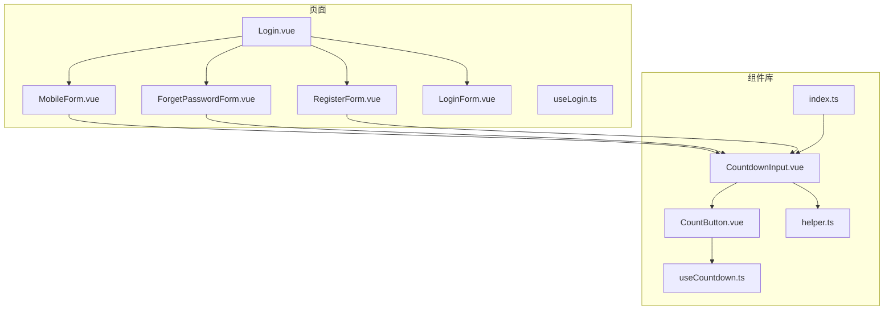
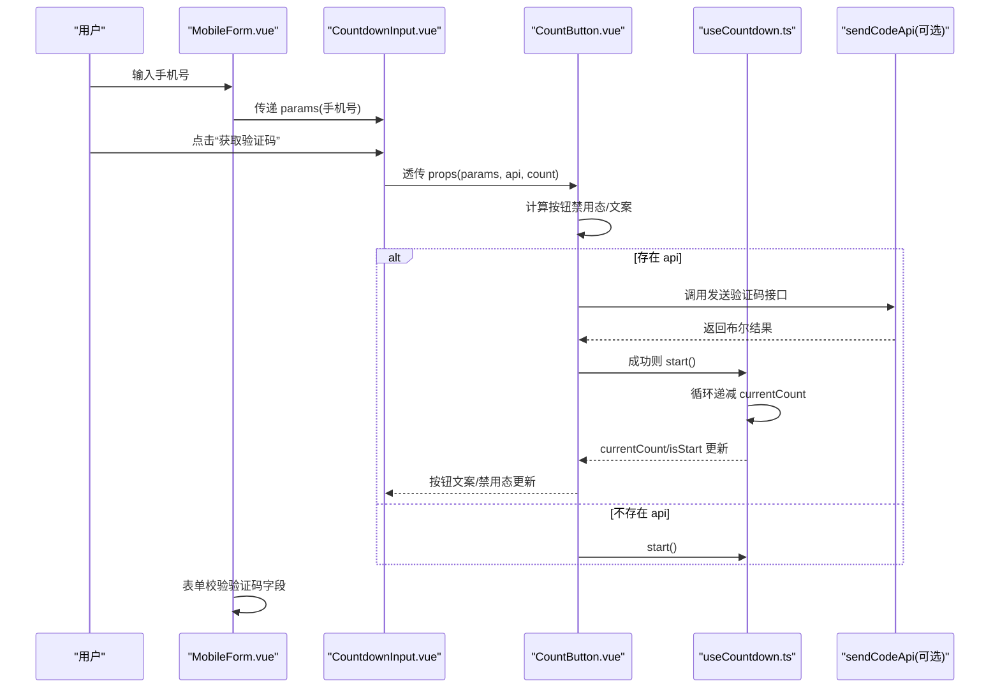
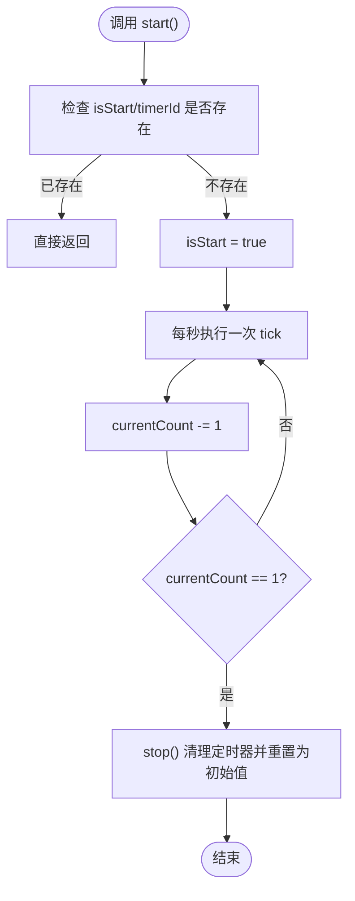
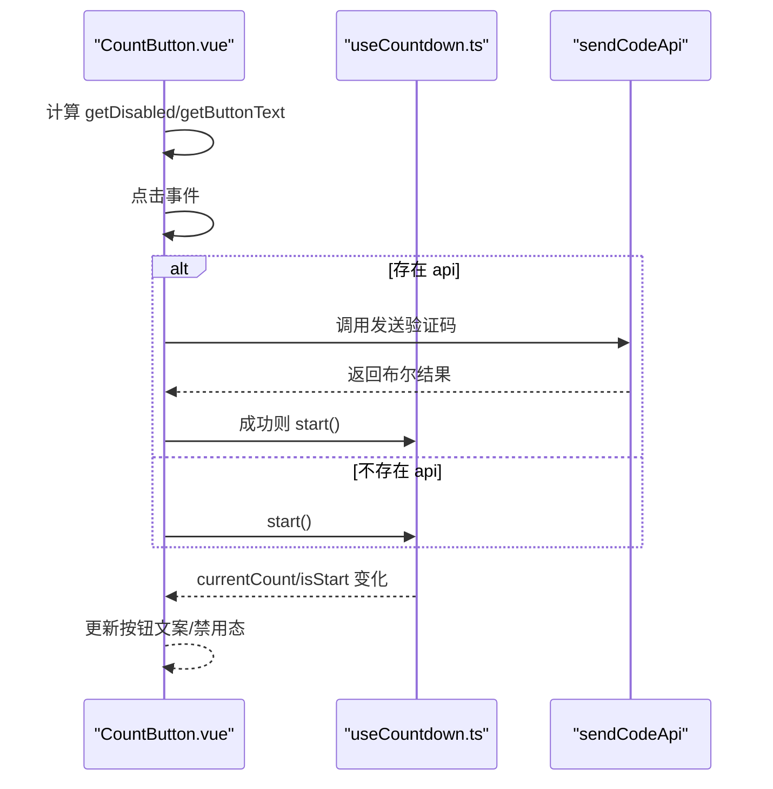
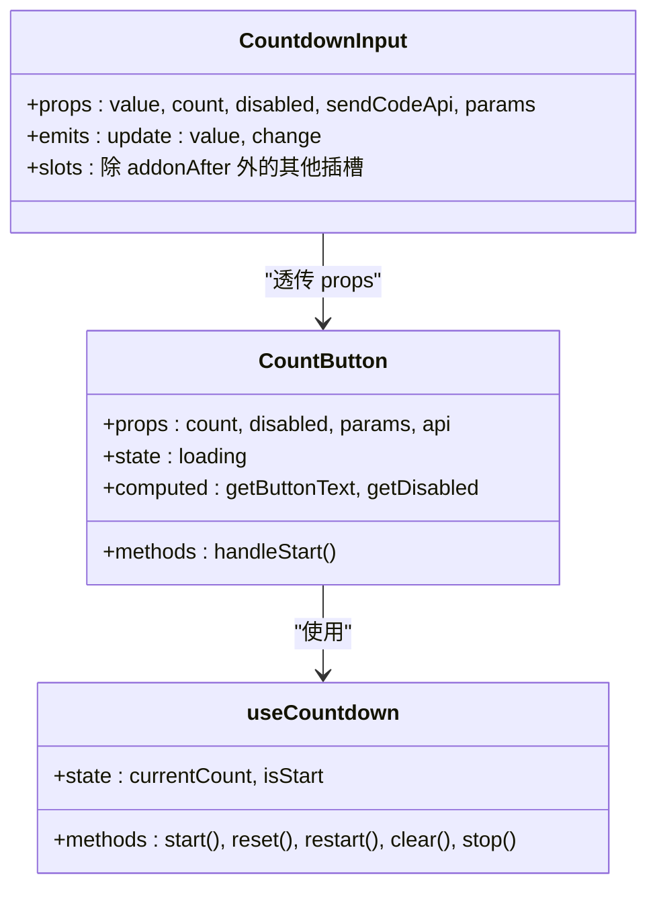
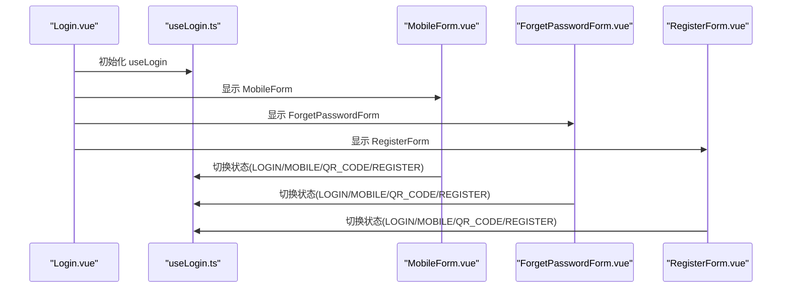
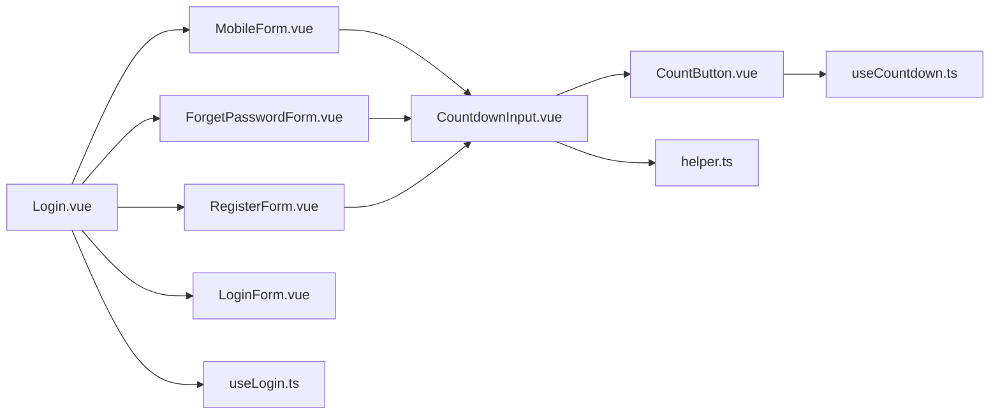

# 验证码与提交防护

<cite>
**本文引用的文件**
- [useCountdown.ts](file://src/components/Countdown/src/useCountdown.ts)
- [CountButton.vue](file://src/components/Countdown/src/CountButton.vue)
- [CountdownInput.vue](file://src/components/Countdown/src/CountdownInput.vue)
- [helper.ts](file://src/components/Countdown/src/helper.ts)
- [index.ts](file://src/components/Countdown/index.ts)
- [MobileForm.vue](file://src/views/system/login/components/MobileForm.vue)
- [ForgetPasswordForm.vue](file://src/views/system/login/components/ForgetPasswordForm.vue)
- [RegisterForm.vue](file://src/views/system/login/components/RegisterForm.vue)
- [LoginForm.vue](file://src/views/system/login/components/LoginForm.vue)
- [Login.vue](file://src/views/system/login/Login.vue)
- [useLogin.ts](file://src/views/system/login/useLogin.ts)
</cite>

## 目录
1. [简介](#简介)
2. [项目结构](#项目结构)
3. [核心组件](#核心组件)
4. [架构总览](#架构总览)
5. [详细组件分析](#详细组件分析)
6. [依赖关系分析](#依赖关系分析)
7. [性能考量](#性能考量)
8. [故障排查指南](#故障排查指南)
9. [结论](#结论)

## 简介
本文件围绕验证码倒计时功能的集成实现进行系统性解析，重点说明如何通过 useCountdown 组合式函数控制短信验证码的发送间隔与禁用状态；分析防重复提交机制（按钮 loading 状态同步、请求锁控制与异步操作节流策略）；展示倒计时组件与登录表单的交互逻辑及用户重新获取验证码的触发条件；并提供处理网络延迟导致倒计时错乱、频繁请求被拦截等场景的解决方案与性能优化建议。

## 项目结构
验证码倒计时能力位于 Countdown 组件库中，登录页多处表单复用该能力：
- 组件层：CountdownInput、CountButton、useCountdown、helper 工具
- 页面层：MobileForm、ForgetPasswordForm、RegisterForm、LoginForm、Login、useLogin

图表来源
- [CountdownInput.vue](file://src/components/Countdown/src/CountdownInput.vue#L1-L57)
- [CountButton.vue](file://src/components/Countdown/src/CountButton.vue#L1-L55)
- [useCountdown.ts](file://src/components/Countdown/src/useCountdown.ts#L1-L55)
- [helper.ts](file://src/components/Countdown/src/helper.ts#L1-L106)
- [index.ts](file://src/components/Countdown/index.ts#L1-L4)
- [MobileForm.vue](file://src/views/system/login/components/MobileForm.vue#L1-L44)
- [ForgetPasswordForm.vue](file://src/views/system/login/components/ForgetPasswordForm.vue#L1-L48)
- [RegisterForm.vue](file://src/views/system/login/components/RegisterForm.vue#L1-L67)
- [LoginForm.vue](file://src/views/system/login/components/LoginForm.vue#L1-L81)
- [Login.vue](file://src/views/system/login/Login.vue#L1-L122)
- [useLogin.ts](file://src/views/system/login/useLogin.ts#L1-L41)

章节来源
- [CountdownInput.vue](file://src/components/Countdown/src/CountdownInput.vue#L1-L57)
- [CountButton.vue](file://src/components/Countdown/src/CountButton.vue#L1-L55)
- [useCountdown.ts](file://src/components/Countdown/src/useCountdown.ts#L1-L55)
- [helper.ts](file://src/components/Countdown/src/helper.ts#L1-L106)
- [index.ts](file://src/components/Countdown/index.ts#L1-L4)
- [MobileForm.vue](file://src/views/system/login/components/MobileForm.vue#L1-L44)
- [ForgetPasswordForm.vue](file://src/views/system/login/components/ForgetPasswordForm.vue#L1-L48)
- [RegisterForm.vue](file://src/views/system/login/components/RegisterForm.vue#L1-L67)
- [LoginForm.vue](file://src/views/system/login/components/LoginForm.vue#L1-L81)
- [Login.vue](file://src/views/system/login/Login.vue#L1-L122)
- [useLogin.ts](file://src/views/system/login/useLogin.ts#L1-L41)

## 核心组件
- useCountdown：提供倒计时生命周期控制（开始、重置、停止、清除、重启），内部维护 currentCount 与 isStart，并在卸载时清理定时器。
- CountButton：封装倒计时按钮，负责按钮文案、禁用态、loading 态与点击触发的发送流程；当传入 api 时，调用 api 并在成功后启动倒计时。
- CountdownInput：封装带“获取验证码”按钮的输入框，负责将外部 params 透传给按钮，支持 v-model 双向绑定。
- helper：提供时间格式化、秒级比较、简单 tick 等工具方法，便于扩展更复杂的倒计时展示或节流策略。
- 页面表单：MobileForm、ForgetPasswordForm、RegisterForm 通过 v-model 绑定验证码字段，并将手机号参数计算为 params 传入 CountdownInput。

章节来源
- [useCountdown.ts](file://src/components/Countdown/src/useCountdown.ts#L1-L55)
- [CountButton.vue](file://src/components/Countdown/src/CountButton.vue#L1-L55)
- [CountdownInput.vue](file://src/components/Countdown/src/CountdownInput.vue#L1-L57)
- [helper.ts](file://src/components/Countdown/src/helper.ts#L1-L106)
- [MobileForm.vue](file://src/views/system/login/components/MobileForm.vue#L1-L44)
- [ForgetPasswordForm.vue](file://src/views/system/login/components/ForgetPasswordForm.vue#L1-L48)
- [RegisterForm.vue](file://src/views/system/login/components/RegisterForm.vue#L1-L67)

## 架构总览
验证码倒计时在登录页的交互链路如下：
- 用户在表单中输入手机号，触发 CountdownInput 的 params 计算
- 用户点击“获取验证码”，CountButton 调用传入的 api（可为空）
- 若 api 返回成功，CountButton 启动 useCountdown；否则仅更新按钮状态
- useCountdown 控制倒计时循环，更新 currentCount 与 isStart
- CountButton 根据 isStart 与 currentCount 更新按钮文案与禁用态
- CountdownInput 通过 v-model 与表单字段双向绑定，确保验证码输入可校验

图表来源
- [CountdownInput.vue](file://src/components/Countdown/src/CountdownInput.vue#L1-L57)
- [CountButton.vue](file://src/components/Countdown/src/CountButton.vue#L1-L55)
- [useCountdown.ts](file://src/components/Countdown/src/useCountdown.ts#L1-L55)
- [MobileForm.vue](file://src/views/system/login/components/MobileForm.vue#L1-L44)
- [ForgetPasswordForm.vue](file://src/views/system/login/components/ForgetPasswordForm.vue#L1-L48)
- [RegisterForm.vue](file://src/views/system/login/components/RegisterForm.vue#L1-L67)

## 详细组件分析

### useCountdown 组合式函数
- 设计要点
  - 使用 ref 维护 currentCount 与 isStart，避免直接暴露内部状态
  - 通过定时器每秒递减 currentCount，到达 1 秒时停止并重置为初始值
  - 提供 start/reset/restart/clear/stop 接口，统一生命周期管理
  - 在卸载时 reset，防止内存泄漏与定时器残留
- 复杂度与性能
  - 时间复杂度：每次 tick O(1)，总时长 T 秒内执行 T 次 tick
  - 空间复杂度：O(1)，仅维护少量状态与定时器句柄
- 错误处理
  - 重复 start 会被幂等忽略，避免重复定时器
  - stop/clear 会清理定时器，防止泄漏
- 可扩展点
  - 可结合 helper 的时间格式化能力，输出更丰富的倒计时字符串
  - 可引入节流/去抖策略，减少频繁状态变更带来的重渲染

图表来源
- [useCountdown.ts](file://src/components/Countdown/src/useCountdown.ts#L1-L55)

章节来源
- [useCountdown.ts](file://src/components/Countdown/src/useCountdown.ts#L1-L55)

### CountButton 按钮组件
- 设计要点
  - 文案：未开始显示“获取验证码”，倒计时期间显示“X秒后重新获取”
  - 禁用态：disabled、倒计时进行中、params 为空均会导致禁用
  - loading 态：异步发送验证码期间保持按钮 loading，finally 中恢复
  - 交互：点击后若传入 api，则调用并等待结果；成功则启动倒计时
  - 参数监听：watch params 变化，当参数为空时 reset 倒计时
- 防重复提交机制
  - 通过 isStart 与 timerId 的幂等判断，避免重复启动
  - 通过 loading 状态同步，防止用户在请求中重复点击
  - 通过禁用态过滤无效点击（无手机号等）
- 与 useCountdown 的协作
  - 仅在成功回调后调用 start()，确保倒计时与真实发送行为一致

图表来源
- [CountButton.vue](file://src/components/Countdown/src/CountButton.vue#L1-L55)
- [useCountdown.ts](file://src/components/Countdown/src/useCountdown.ts#L1-L55)

章节来源
- [CountButton.vue](file://src/components/Countdown/src/CountButton.vue#L1-L55)

### CountdownInput 输入框组件
- 设计要点
  - 通过插槽将 CountButton 放置于 Input 的 addonAfter 位置
  - 支持 v-model 双向绑定验证码字段，同时透传原生属性与事件
  - 将 params 与 count、api 透传给 CountButton，形成“参数-倒计时-发送”的闭环
- 与表单的交互
  - 在 MobileForm/ForgetPasswordForm/RegisterForm 中，params 来源于手机号字段的计算
  - 表单规则要求验证码必填，确保用户在倒计时结束后输入有效验证码

图表来源
- [CountdownInput.vue](file://src/components/Countdown/src/CountdownInput.vue#L1-L57)
- [CountButton.vue](file://src/components/Countdown/src/CountButton.vue#L1-L55)
- [useCountdown.ts](file://src/components/Countdown/src/useCountdown.ts#L1-L55)

章节来源
- [CountdownInput.vue](file://src/components/Countdown/src/CountdownInput.vue#L1-L57)

### 页面表单与登录状态
- MobileForm/ForgetPasswordForm/RegisterForm
  - 通过 computed 将手机号字段转换为 params，用于触发验证码发送
  - 表单规则包含验证码必填，确保倒计时结束后用户输入有效验证码
  - 登录按钮的 loading 与验证码倒计时互不影响，但都服务于提交流程
- Login.vue 与 useLogin.ts
  - Login.vue 组合多个表单组件，通过 useLogin 控制当前显示的表单状态
  - useLogin 提供 setLoginState/getCurrentState/resetLoginState，便于在不同登录模式间切换

图表来源
- [Login.vue](file://src/views/system/login/Login.vue#L1-L122)
- [useLogin.ts](file://src/views/system/login/useLogin.ts#L1-L41)
- [MobileForm.vue](file://src/views/system/login/components/MobileForm.vue#L1-L44)
- [ForgetPasswordForm.vue](file://src/views/system/login/components/ForgetPasswordForm.vue#L1-L48)
- [RegisterForm.vue](file://src/views/system/login/components/RegisterForm.vue#L1-L67)

章节来源
- [Login.vue](file://src/views/system/login/Login.vue#L1-L122)
- [useLogin.ts](file://src/views/system/login/useLogin.ts#L1-L41)
- [MobileForm.vue](file://src/views/system/login/components/MobileForm.vue#L1-L44)
- [ForgetPasswordForm.vue](file://src/views/system/login/components/ForgetPasswordForm.vue#L1-L48)
- [RegisterForm.vue](file://src/views/system/login/components/RegisterForm.vue#L1-L67)

## 依赖关系分析
- 组件耦合
  - CountdownInput 依赖 CountButton；CountButton 依赖 useCountdown
  - helper 提供时间格式化等工具，可被扩展使用
- 页面耦合
  - 多个表单共享 CountdownInput，params 由各表单的手机号字段计算
- 外部依赖
  - 使用 ant-design-vue 的 Input/Button/Checkbox 等基础组件
  - 使用 lodash-es 的类型判断工具

图表来源
- [MobileForm.vue](file://src/views/system/login/components/MobileForm.vue#L1-L44)
- [ForgetPasswordForm.vue](file://src/views/system/login/components/ForgetPasswordForm.vue#L1-L48)
- [RegisterForm.vue](file://src/views/system/login/components/RegisterForm.vue#L1-L67)
- [CountdownInput.vue](file://src/components/Countdown/src/CountdownInput.vue#L1-L57)
- [CountButton.vue](file://src/components/Countdown/src/CountButton.vue#L1-L55)
- [useCountdown.ts](file://src/components/Countdown/src/useCountdown.ts#L1-L55)
- [helper.ts](file://src/components/Countdown/src/helper.ts#L1-L106)
- [Login.vue](file://src/views/system/login/Login.vue#L1-L122)
- [LoginForm.vue](file://src/views/system/login/components/LoginForm.vue#L1-L81)
- [useLogin.ts](file://src/views/system/login/useLogin.ts#L1-L41)

章节来源
- [index.ts](file://src/components/Countdown/index.ts#L1-L4)

## 性能考量
- 倒计时性能
  - 每秒 tick 为轻量操作，开销极低；建议避免在倒计时期间进行昂贵的副作用
  - 如需更精细的 UI 更新，可在业务侧引入节流/去抖策略（例如仅在整秒更新文案）
- 防重复提交
  - 通过 isStart/timerId 幂等判断与按钮禁用态，天然避免重复点击
  - loading 状态与 finally 回收，确保 UI 与状态一致
- 内存与资源
  - 卸载时 reset，清理定时器，避免内存泄漏
  - 对于高频输入场景，建议在表单层对手机号输入做节流，减少 params 变更频率
- 网络延迟与错乱
  - 若网络延迟导致倒计时错乱，可在 finally 中统一恢复 loading，并在异常时重置倒计时
  - 对于频繁请求被拦截，建议在前端增加请求锁（例如 pending 标志位），并在 finally 中释放

[本节为通用性能建议，无需特定文件引用]

## 故障排查指南
- 倒计时不启动
  - 检查 CountButton 的 api 是否传入且返回成功；若未传入 api，需手动调用 start()
  - 确认 params 非空，否则 watch 会 reset 倒计时
- 按钮一直禁用
  - 检查 disabled 属性与 isStart 状态；确认 params 不为空
- 文案与倒计时不一致
  - 确保在 api 成功回调后才调用 start()，避免状态错配
- 网络延迟导致错乱
  - 在 finally 中统一恢复 loading，并在异常时 reset 倒计时
- 频繁请求被拦截
  - 建议在业务层增加请求锁（pending 标志位），并在 finally 中释放
  - 对手机号输入做节流，降低 params 变更频率

章节来源
- [CountButton.vue](file://src/components/Countdown/src/CountButton.vue#L1-L55)
- [useCountdown.ts](file://src/components/Countdown/src/useCountdown.ts#L1-L55)
- [CountdownInput.vue](file://src/components/Countdown/src/CountdownInput.vue#L1-L57)

## 结论
验证码倒计时功能通过 useCountdown 提供稳定的倒计时生命周期管理，CountButton 与 CountdownInput 将发送逻辑、UI 状态与参数联动整合，形成“参数-倒计时-发送”的闭环。页面表单通过 computed 将手机号转换为 params，确保倒计时与真实业务一致。整体设计具备良好的可扩展性与可维护性，可通过引入请求锁与节流策略进一步提升用户体验与稳定性。