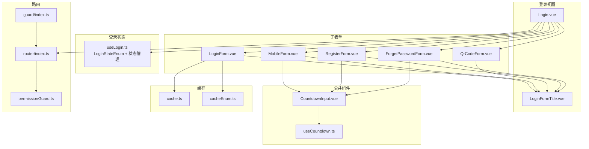
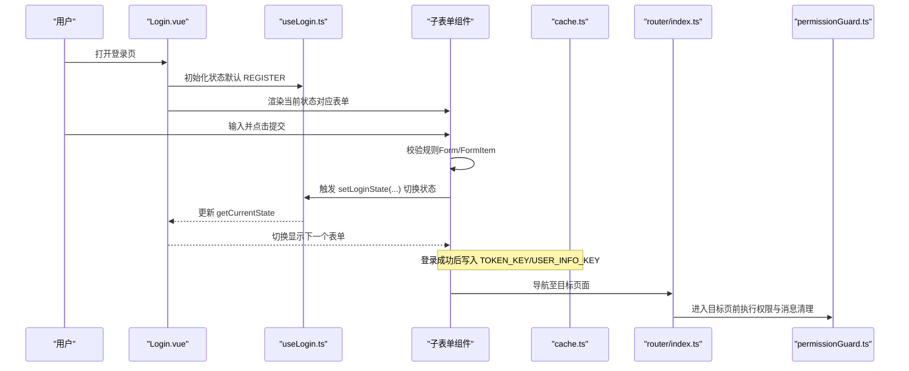
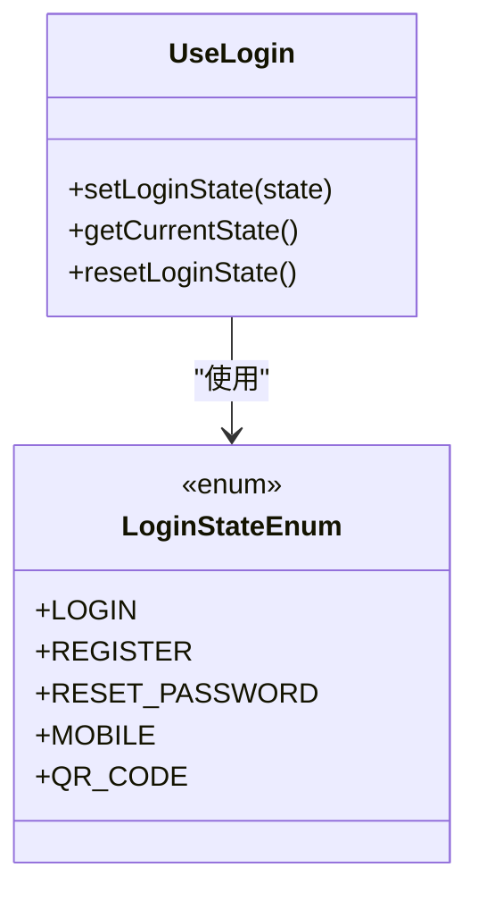
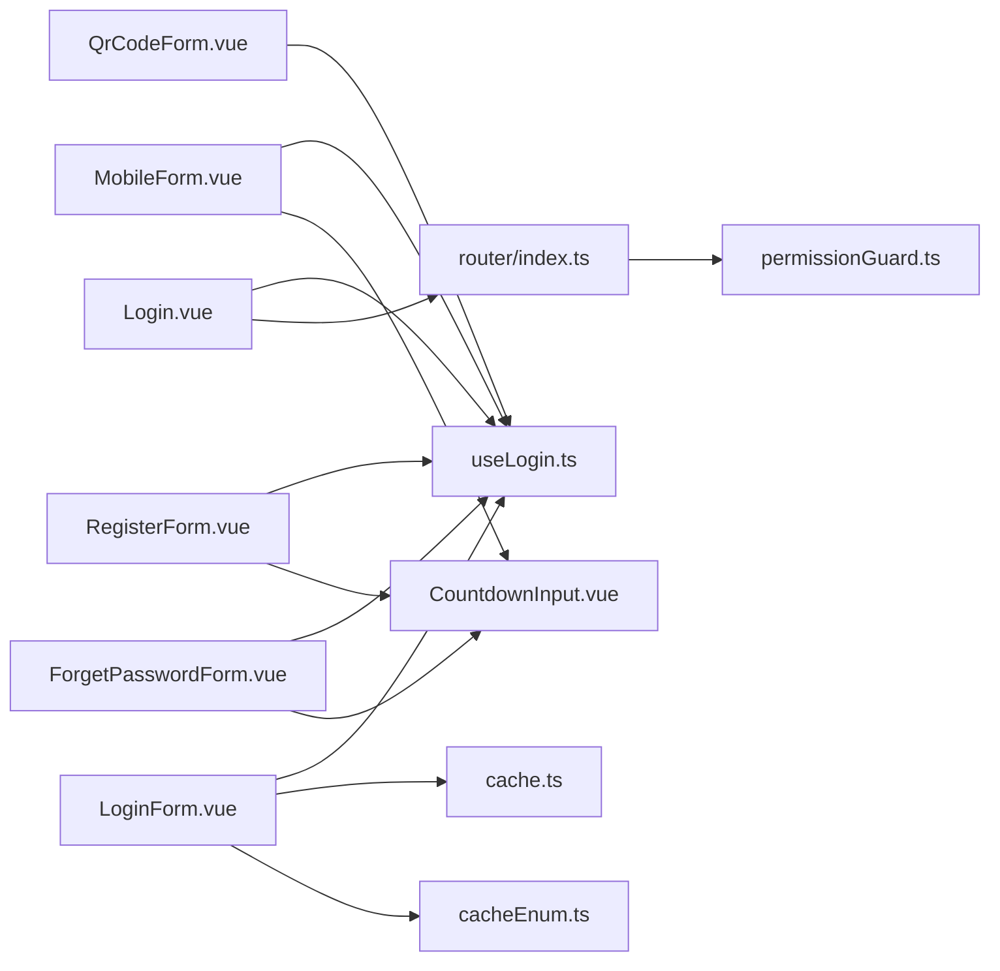

# 登录页面

<cite>
**本文引用的文件**
- [Login.vue](file://src/views/system/login/Login.vue)
- [useLogin.ts](file://src/views/system/login/useLogin.ts)
- [LoginForm.vue](file://src/views/system/login/components/LoginForm.vue)
- [MobileForm.vue](file://src/views/system/login/components/MobileForm.vue)
- [QrCodeForm.vue](file://src/views/system/login/components/QrCodeForm.vue)
- [RegisterForm.vue](file://src/views/system/login/components/RegisterForm.vue)
- [ForgetPasswordForm.vue](file://src/views/system/login/components/ForgetPasswordForm.vue)
- [LoginFormTitle.vue](file://src/views/system/login/components/LoginFormTitle.vue)
- [CountdownInput.vue](file://src/components/Countdown/src/CountdownInput.vue)
- [useCountdown.ts](file://src/components/Countdown/src/useCountdown.ts)
- [cache.ts](file://src/utils/cache.ts)
- [cacheEnum.ts](file://src/enums/cacheEnum.ts)
- [index.ts](file://src/router/index.ts)
- [permissionGuard.ts](file://src/router/guard/permissionGuard.ts)
- [index.ts](file://src/router/guard/index.ts)
</cite>

## 目录
1. [简介](#简介)
2. [项目结构](#项目结构)
3. [核心组件](#核心组件)
4. [架构总览](#架构总览)
5. [详细组件分析](#详细组件分析)
6. [依赖关系分析](#依赖关系分析)
7. [性能考量](#性能考量)
8. [故障排查指南](#故障排查指南)
9. [结论](#结论)
10. [附录：扩展与最佳实践](#附录扩展与最佳实践)

## 简介
本文件系统性梳理登录页面（Login.vue）的实现细节，覆盖多登录方式切换（账号密码、手机验证码、二维码扫描、注册、找回密码），解释主组件通过动态组件与组合式函数 useLogin.ts 实现的状态管理与表单切换；详述各子表单组件的职责与共享验证规则；说明异步请求处理、token 存储机制与登录成功后的路由跳转逻辑；并提供新增自定义登录方式或集成第三方 OAuth 的扩展指南，以及常见问题的解决方案。

## 项目结构
登录模块采用“主视图 + 子表单 + 组合式状态 + 公共组件”的分层设计：
- 主视图 Login.vue：负责布局、标题、暗色模式切换、异步加载子表单组件，并通过 useLogin.ts 提供的状态驱动子表单显隐。
- 子表单组件：LoginForm、MobileForm、QrCodeForm、RegisterForm、ForgetPasswordForm，各自维护独立的表单模型、校验规则与交互。
- 公共组件：CountdownInput 与 useCountdown 提供短信验证码倒计时能力；LoginFormTitle 动态展示当前表单标题。
- 状态与缓存：useLogin.ts 管理登录状态枚举与当前状态；cache.ts 与 cacheEnum.ts 提供本地缓存能力（如记住账号）。
- 路由与守卫：router 与 permissionGuard 提供路由初始化、动态路由注入与跳转控制；stateGuard 在进入登录页时重置状态（待完善）。

图表来源
- [Login.vue](file://src/views/system/login/Login.vue#L1-L122)
- [useLogin.ts](file://src/views/system/login/useLogin.ts#L1-L41)
- [LoginForm.vue](file://src/views/system/login/components/LoginForm.vue#L1-L81)
- [MobileForm.vue](file://src/views/system/login/components/MobileForm.vue#L1-L44)
- [QrCodeForm.vue](file://src/views/system/login/components/QrCodeForm.vue#L1-L36)
- [RegisterForm.vue](file://src/views/system/login/components/RegisterForm.vue#L1-L68)
- [ForgetPasswordForm.vue](file://src/views/system/login/components/ForgetPasswordForm.vue#L1-L49)
- [LoginFormTitle.vue](file://src/views/system/login/components/LoginFormTitle.vue#L1-L20)
- [CountdownInput.vue](file://src/components/Countdown/src/CountdownInput.vue#L1-L57)
- [useCountdown.ts](file://src/components/Countdown/src/useCountdown.ts#L1-L55)
- [cache.ts](file://src/utils/cache.ts#L1-L138)
- [cacheEnum.ts](file://src/enums/cacheEnum.ts#L1-L17)
- [index.ts](file://src/router/index.ts#L1-L38)
- [permissionGuard.ts](file://src/router/guard/permissionGuard.ts#L1-L59)
- [index.ts](file://src/router/guard/index.ts#L1-L62)

章节来源
- [Login.vue](file://src/views/system/login/Login.vue#L1-L122)
- [useLogin.ts](file://src/views/system/login/useLogin.ts#L1-L41)

## 核心组件
- Login.vue：主容器，负责布局、标题、暗色模式切换与子表单的异步加载与渲染。通过 createAsyncComponent 按需加载注册、重置密码、手机登录、二维码登录等子表单，避免首屏体积过大。
- useLogin.ts：提供 LoginStateEnum 枚举与 useLogin 组合式函数，统一管理当前登录状态（LOGIN、REGISTER、RESET_PASSWORD、MOBILE、QR_CODE），并暴露 setLoginState、getCurrentState、resetLoginState 方法，供子表单切换使用。
- 各子表单组件：LoginForm、MobileForm、QrCodeForm、RegisterForm、ForgetPasswordForm，均通过 computed getShow 控制自身在当前状态下的显隐；各自维护独立的表单模型与校验规则；通过按钮点击调用 setLoginState 切换到其他表单。
- CountdownInput 与 useCountdown：提供短信验证码发送与倒计时功能，支持参数透传与生命周期清理。
- cache.ts 与 cacheEnum.ts：提供统一的本地缓存接口，包含 TOKEN_KEY、USER_INFO_KEY、MEMORY_ACCOUNT_KEY 等键名，用于 token、用户信息与“记住账号”等场景。

章节来源
- [Login.vue](file://src/views/system/login/Login.vue#L1-L122)
- [useLogin.ts](file://src/views/system/login/useLogin.ts#L1-L41)
- [LoginForm.vue](file://src/views/system/login/components/LoginForm.vue#L1-L81)
- [MobileForm.vue](file://src/views/system/login/components/MobileForm.vue#L1-L44)
- [QrCodeForm.vue](file://src/views/system/login/components/QrCodeForm.vue#L1-L36)
- [RegisterForm.vue](file://src/views/system/login/components/RegisterForm.vue#L1-L68)
- [ForgetPasswordForm.vue](file://src/views/system/login/components/ForgetPasswordForm.vue#L1-L49)
- [LoginFormTitle.vue](file://src/views/system/login/components/LoginFormTitle.vue#L1-L20)
- [CountdownInput.vue](file://src/components/Countdown/src/CountdownInput.vue#L1-L57)
- [useCountdown.ts](file://src/components/Countdown/src/useCountdown.ts#L1-L55)
- [cache.ts](file://src/utils/cache.ts#L1-L138)
- [cacheEnum.ts](file://src/enums/cacheEnum.ts#L1-L17)

## 架构总览
登录页面采用“状态驱动 + 组合式函数 + 动态组件”的架构：
- 状态驱动：useLogin.ts 维护单一状态源，子表单通过 computed getShow 与 getCurrentState 协同显示。
- 组合式函数：useLogin 提供 setLoginState，子表单通过按钮事件触发状态切换。
- 动态组件：Login.vue 使用 createAsyncComponent 异步加载子表单，减少首屏资源压力。
- 验证与错误：各子表单内置 ant-design-vue Form/FormItem 规则，统一在 finish 事件中进行业务处理（当前示例中仅占位，实际请求逻辑需在业务层补充）。
- 缓存与 token：cache.ts 提供 TOKEN_KEY、USER_INFO_KEY 等键，用于登录成功后持久化 token 与用户信息；LoginForm 支持“记住账号”本地缓存。
- 路由与跳转：permissionGuard 与 router 提供动态路由注入与跳转控制；stateGuard 在进入登录页时重置状态（待完善）。

图表来源
- [Login.vue](file://src/views/system/login/Login.vue#L1-L122)
- [useLogin.ts](file://src/views/system/login/useLogin.ts#L1-L41)
- [LoginForm.vue](file://src/views/system/login/components/LoginForm.vue#L1-L81)
- [cache.ts](file://src/utils/cache.ts#L1-L138)
- [index.ts](file://src/router/index.ts#L1-L38)
- [permissionGuard.ts](file://src/router/guard/permissionGuard.ts#L1-L59)

## 详细组件分析

### 主组件 Login.vue
- 职责
  - 布局与样式：左侧品牌区、右侧登录区，暗色模式切换、站点标题。
  - 子表单加载：通过 createAsyncComponent 按需加载注册、重置密码、手机登录、二维码登录等子表单，避免首屏体积过大。
  - 状态驱动：引入 useLogin，配合子表单的 getShow 控制显隐。
- 关键点
  - 异步加载：RegisterForm、ForgetPasswordForm、MobileForm、QrCodeForm 采用 createAsyncComponent 包裹，loading: false，减少首屏等待。
  - 标题联动：LoginFormTitle 通过 useLogin.getCurrentState 动态显示当前表单标题。
  - 适配：针对小屏设备隐藏品牌区，适配移动端展示。

章节来源
- [Login.vue](file://src/views/system/login/Login.vue#L1-L122)
- [LoginFormTitle.vue](file://src/views/system/login/components/LoginFormTitle.vue#L1-L20)

### 组合式函数 useLogin.ts
- 职责
  - 定义 LoginStateEnum 枚举：LOGIN、REGISTER、RESET_PASSWORD、MOBILE、QR_CODE。
  - 提供 useLogin：setLoginState、getCurrentState、resetLoginState。
- 设计要点
  - 单一状态源：currentState 作为内部状态，通过 computed 暴露只读视图。
  - resetLoginState 默认回到 LOGIN，便于重置流程。

图表来源
- [useLogin.ts](file://src/views/system/login/useLogin.ts#L1-L41)

章节来源
- [useLogin.ts](file://src/views/system/login/useLogin.ts#L1-L41)

### 子表单组件（结构与职责）

#### LoginForm.vue
- 结构与职责
  - 表单项：账号、密码；底部“忘记密码？”、“手机登录”、“二维码登录”、“注册”按钮。
  - 验证规则：账号与密码必填。
  - 记住账号：onMounted 从缓存读取账号，支持勾选后写入缓存，取消勾选删除缓存。
  - 交互：点击“忘记密码？”切换到 RESET_PASSWORD；点击“手机登录/二维码登录/注册”切换到对应表单。
- 关键点
  - getShow 通过 computed 与 useLogin.getCurrentState 对比，决定是否显示。
  - loading 用于提交按钮的加载态，handlelogin 为占位逻辑，实际应在此处发起登录请求并处理 token 与路由跳转。

章节来源
- [LoginForm.vue](file://src/views/system/login/components/LoginForm.vue#L1-L81)
- [cacheEnum.ts](file://src/enums/cacheEnum.ts#L1-L17)
- [cache.ts](file://src/utils/cache.ts#L1-L138)

#### MobileForm.vue
- 结构与职责
  - 表单项：手机号、短信验证码；提交按钮与“返回”按钮。
  - 验证规则：手机号与验证码必填。
  - 倒计时：通过 CountdownInput 与 useCountdown 提供验证码发送与倒计时。
  - 交互：点击“返回”回到 LOGIN。
- 关键点
  - getParams 依赖手机号字段，用于 CountdownInput 的参数传递。
  - handlelogin 为占位逻辑，实际应在此处发起手机登录请求。

章节来源
- [MobileForm.vue](file://src/views/system/login/components/MobileForm.vue#L1-L44)
- [CountdownInput.vue](file://src/components/Countdown/src/CountdownInput.vue#L1-L57)
- [useCountdown.ts](file://src/components/Countdown/src/useCountdown.ts#L1-L55)

#### QrCodeForm.vue
- 结构与职责
  - 展示二维码区域、提示文案与“返回”按钮。
  - 交互：点击“返回”回到 LOGIN；onRefresh 为占位逻辑，可扩展刷新二维码。
- 关键点
  - getShow 仅在 QR_CODE 状态显示。
  - 二维码状态管理（active/loading/expired/scanned）与定时器清理为待完善项。

章节来源
- [QrCodeForm.vue](file://src/views/system/login/components/QrCodeForm.vue#L1-L36)

#### RegisterForm.vue
- 结构与职责
  - 表单项：账号、手机号、短信验证码、密码、确认密码、隐私政策勾选；提交按钮与“返回”按钮。
  - 验证规则：账号、手机号、验证码、密码必填；确认密码通过自定义校验器与密码一致性校验；隐私政策必须勾选。
  - 倒计时：通过 CountdownInput 与 useCountdown 提供验证码发送与倒计时。
  - 交互：点击“返回”回到 LOGIN。
- 关键点
  - getParams 依赖手机号字段，用于 CountdownInput 的参数传递。
  - handleRegister 为占位逻辑，实际应在此处发起注册请求。

章节来源
- [RegisterForm.vue](file://src/views/system/login/components/RegisterForm.vue#L1-L68)
- [CountdownInput.vue](file://src/components/Countdown/src/CountdownInput.vue#L1-L57)
- [useCountdown.ts](file://src/components/Countdown/src/useCountdown.ts#L1-L55)

#### ForgetPasswordForm.vue
- 结构与职责
  - 表单项：账号、手机号、短信验证码；提交按钮与“返回”按钮。
  - 验证规则：账号、手机号、验证码必填。
  - 倒计时：通过 CountdownInput 与 useCountdown 提供验证码发送与倒计时。
  - 交互：点击“返回”回到 LOGIN。
- 关键点
  - getParams 依赖手机号字段，用于 CountdownInput 的参数传递。
  - handlereset 为占位逻辑，实际应在此处发起重置密码请求。

章节来源
- [ForgetPasswordForm.vue](file://src/views/system/login/components/ForgetPasswordForm.vue#L1-L49)
- [CountdownInput.vue](file://src/components/Countdown/src/CountdownInput.vue#L1-L57)
- [useCountdown.ts](file://src/components/Countdown/src/useCountdown.ts#L1-L55)

### 验证与错误处理
- 验证规则
  - 各子表单均使用 ant-design-vue 的 Form/FormItem 定义规则，确保必填与提示文案一致。
  - RegisterForm 的“确认密码”与“隐私政策”使用自定义校验器，提升用户体验。
- 错误处理
  - 当前各表单的 handlelogin/handleRegister/handlereset 为占位逻辑，建议在真实业务中：
    - 使用统一的错误提示（如 message/notification）。
    - 对网络异常进行捕获与重试策略。
    - 对 401/403 等状态码进行路由跳转或登出处理。

章节来源
- [LoginForm.vue](file://src/views/system/login/components/LoginForm.vue#L1-L81)
- [RegisterForm.vue](file://src/views/system/login/components/RegisterForm.vue#L1-L68)
- [ForgetPasswordForm.vue](file://src/views/system/login/components/ForgetPasswordForm.vue#L1-L49)

### 异步请求处理、token 存储与路由跳转
- 异步请求处理
  - 各子表单在提交时应调用业务接口（如登录、注册、重置密码），并在 loading 状态下避免重复提交。
  - 建议在 handlelogin/handleRegister/handlereset 中封装统一的请求与错误处理逻辑。
- token 存储机制
  - 使用 cache.ts 的 TOKEN_KEY、USER_INFO_KEY 等键进行持久化存储。
  - 登录成功后写入 token 与用户信息，失败时清空或提示错误。
- 登录成功后的路由跳转
  - permissionGuard 在路由进入时处理动态路由注入与跳转；stateGuard 在进入登录页时重置状态（待完善）。
  - 建议在登录成功后根据 redirect 参数或默认首页进行跳转。

章节来源
- [cache.ts](file://src/utils/cache.ts#L1-L138)
- [cacheEnum.ts](file://src/enums/cacheEnum.ts#L1-L17)
- [permissionGuard.ts](file://src/router/guard/permissionGuard.ts#L1-L59)
- [index.ts](file://src/router/index.ts#L1-L38)
- [index.ts](file://src/router/guard/index.ts#L1-L62)

## 依赖关系分析
- 组件耦合
  - Login.vue 与 useLogin.ts：强耦合（状态驱动），Login.vue 仅负责渲染与异步加载。
  - 子表单组件与 useLogin.ts：弱耦合（通过 setLoginState 切换），彼此独立。
  - 子表单组件与 CountdownInput：弱耦合（通过 props 传参），便于复用。
- 外部依赖
  - ant-design-vue：Form/FormItem/Input/Button 等组件。
  - @vueuse/core：useCountdown 生命周期钩子。
  - pinia：store（用于用户与权限状态，登录成功后可更新）。
- 可能的循环依赖
  - Login.vue 与子表单之间无循环依赖；useLogin.ts 仅被子表单引用，无反向依赖。

图表来源
- [Login.vue](file://src/views/system/login/Login.vue#L1-L122)
- [useLogin.ts](file://src/views/system/login/useLogin.ts#L1-L41)
- [LoginForm.vue](file://src/views/system/login/components/LoginForm.vue#L1-L81)
- [MobileForm.vue](file://src/views/system/login/components/MobileForm.vue#L1-L44)
- [QrCodeForm.vue](file://src/views/system/login/components/QrCodeForm.vue#L1-L36)
- [RegisterForm.vue](file://src/views/system/login/components/RegisterForm.vue#L1-L68)
- [ForgetPasswordForm.vue](file://src/views/system/login/components/ForgetPasswordForm.vue#L1-L49)
- [CountdownInput.vue](file://src/components/Countdown/src/CountdownInput.vue#L1-L57)
- [cache.ts](file://src/utils/cache.ts#L1-L138)
- [cacheEnum.ts](file://src/enums/cacheEnum.ts#L1-L17)
- [index.ts](file://src/router/index.ts#L1-L38)
- [permissionGuard.ts](file://src/router/guard/permissionGuard.ts#L1-L59)

## 性能考量
- 按需加载：Login.vue 使用 createAsyncComponent 加载子表单，减少首屏资源占用。
- 表单显隐：通过 computed getShow 控制显示，避免不必要的 DOM 渲染。
- 倒计时清理：useCountdown 在组件卸载时自动清理定时器，避免内存泄漏。
- 缓存策略：cache.ts 将项目版本与键空间隔离，避免跨版本冲突。

[本节为通用指导，无需列出具体文件来源]

## 故障排查指南
- 表单重复提交
  - 现象：用户多次点击提交按钮导致重复请求。
  - 解决：在提交时设置 loading 并在 finally 中恢复，禁止在 loading 期间再次提交。
  - 参考路径：[LoginForm.vue](file://src/views/system/login/components/LoginForm.vue#L1-L81)、[MobileForm.vue](file://src/views/system/login/components/MobileForm.vue#L1-L44)、[RegisterForm.vue](file://src/views/system/login/components/RegisterForm.vue#L1-L68)、[ForgetPasswordForm.vue](file://src/views/system/login/components/ForgetPasswordForm.vue#L1-L49)
- 验证码倒计时状态丢失
  - 现象：切换表单或刷新页面后倒计时消失。
  - 解决：CountdownInput 通过 useCountdown 管理倒计时状态；确保组件卸载时清理定时器；必要时在父组件保存状态并在 mount 时恢复。
  - 参考路径：[CountdownInput.vue](file://src/components/Countdown/src/CountdownInput.vue#L1-L57)、[useCountdown.ts](file://src/components/Countdown/src/useCountdown.ts#L1-L55)
- “记住账号”失效
  - 现象：下次打开未自动填充账号。
  - 解决：检查 cacheEnum.MEMORY_ACCOUNT_KEY 是否正确使用；确认缓存位置（localStorage/sessionStorage）与版本隔离键是否一致。
  - 参考路径：[LoginForm.vue](file://src/views/system/login/components/LoginForm.vue#L1-L81)、[cacheEnum.ts](file://src/enums/cacheEnum.ts#L1-L17)、[cache.ts](file://src/utils/cache.ts#L1-L138)
- 登录成功后未跳转
  - 现象：提交成功但页面未跳转。
  - 解决：在 handlelogin/handleRegister/handlereset 中根据返回结果调用 router.push 或根据 redirect 参数跳转；确保 permissionGuard 正常工作。
  - 参考路径：[permissionGuard.ts](file://src/router/guard/permissionGuard.ts#L1-L59)、[index.ts](file://src/router/index.ts#L1-L38)

章节来源
- [LoginForm.vue](file://src/views/system/login/components/LoginForm.vue#L1-L81)
- [MobileForm.vue](file://src/views/system/login/components/MobileForm.vue#L1-L44)
- [RegisterForm.vue](file://src/views/system/login/components/RegisterForm.vue#L1-L68)
- [ForgetPasswordForm.vue](file://src/views/system/login/components/ForgetPasswordForm.vue#L1-L49)
- [CountdownInput.vue](file://src/components/Countdown/src/CountdownInput.vue#L1-L57)
- [useCountdown.ts](file://src/components/Countdown/src/useCountdown.ts#L1-L55)
- [cacheEnum.ts](file://src/enums/cacheEnum.ts#L1-L17)
- [cache.ts](file://src/utils/cache.ts#L1-L138)
- [permissionGuard.ts](file://src/router/guard/permissionGuard.ts#L1-L59)
- [index.ts](file://src/router/index.ts#L1-L38)

## 结论
登录页面通过 useLogin.ts 的单一状态源与各子表单的独立验证规则，实现了灵活的多登录方式切换；结合 CountdownInput 的倒计时能力与 cache.ts 的本地缓存，提供了良好的用户体验。当前代码以占位逻辑为主，建议在业务层补充登录、注册、重置密码的请求处理与 token 存储，并完善路由跳转与状态重置逻辑，以满足生产环境需求。

[本节为总结性内容，无需列出具体文件来源]

## 附录：扩展与最佳实践

### 新增自定义登录方式
- 步骤
  - 在 Login.vue 中添加新表单组件的异步加载与渲染。
  - 在 useLogin.ts 的 LoginStateEnum 中新增枚举值，并在 LoginFormTitle.vue 中补充标题映射。
  - 在新表单组件中定义表单模型、校验规则与交互逻辑，通过 setLoginState 切换到其他表单。
  - 如需验证码，复用 CountdownInput 与 useCountdown。
- 参考路径
  - [Login.vue](file://src/views/system/login/Login.vue#L1-L122)
  - [useLogin.ts](file://src/views/system/login/useLogin.ts#L1-L41)
  - [LoginFormTitle.vue](file://src/views/system/login/components/LoginFormTitle.vue#L1-L20)
  - [CountdownInput.vue](file://src/components/Countdown/src/CountdownInput.vue#L1-L57)
  - [useCountdown.ts](file://src/components/Countdown/src/useCountdown.ts#L1-L55)

### 集成第三方 OAuth
- 方案
  - 在 Login.vue 中新增第三方登录入口（如微信、GitHub 等），点击后跳转到授权页。
  - 授权回调页接收 code 并换取 token，随后调用 cache.ts 写入 TOKEN_KEY/USER_INFO_KEY，并跳转到首页。
  - 在 permissionGuard 中对 token 有效性进行校验，必要时拉取用户权限并动态注入路由。
- 参考路径
  - [cache.ts](file://src/utils/cache.ts#L1-L138)
  - [cacheEnum.ts](file://src/enums/cacheEnum.ts#L1-L17)
  - [permissionGuard.ts](file://src/router/guard/permissionGuard.ts#L1-L59)
  - [index.ts](file://src/router/index.ts#L1-L38)

### 常见问题与优化建议
- 表单重复提交：统一在提交时设置 loading 并在 finally 中恢复。
- 验证码倒计时状态丢失：确保 useCountdown 在组件卸载时清理定时器；必要时在父组件保存状态并在 mount 时恢复。
- token 存储：使用 cacheEnum.TOKEN_KEY 与 cacheEnum.USER_INFO_KEY，注意区分本地与会话缓存。
- 路由跳转：在登录成功后根据 redirect 参数或默认首页进行跳转，确保 permissionGuard 正常工作。

[本节为通用指导，无需列出具体文件来源]