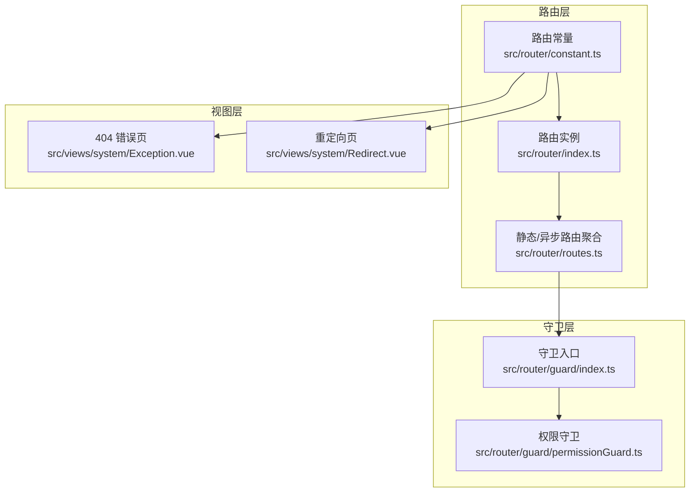
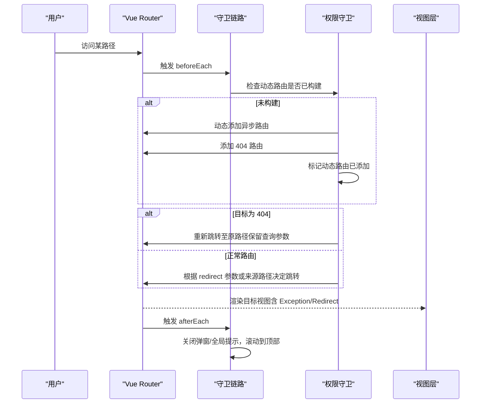
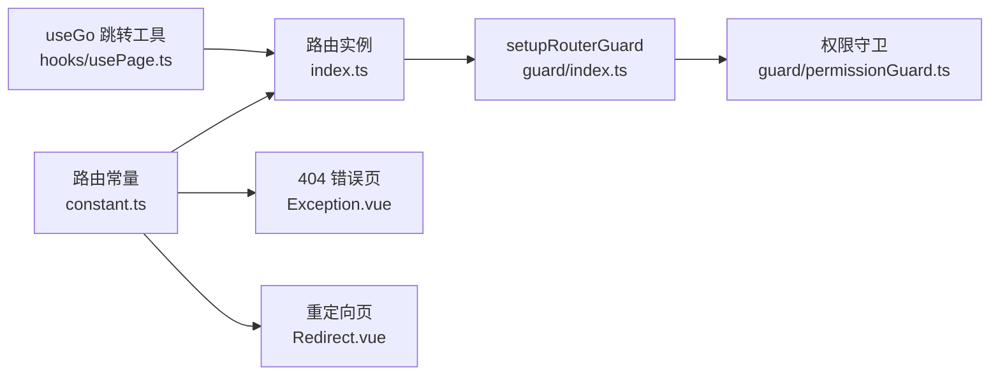

# 系统页面

<cite>
**本文引用的文件**
- [src/views/system/Exception.vue](file://src/views/system/Exception.vue)
- [src/views/system/Redirect.vue](file://src/views/system/Redirect.vue)
- [src/router/constant.ts](file://src/router/constant.ts)
- [src/router/routes.ts](file://src/router/routes.ts)
- [src/router/index.ts](file://src/router/index.ts)
- [src/router/guard/index.ts](file://src/router/guard/index.ts)
- [src/router/guard/permissionGuard.ts](file://src/router/guard/permissionGuard.ts)
- [src/stores/modules/permission.ts](file://src/stores/modules/permission.ts)
- [src/hooks/usePage.ts](file://src/hooks/usePage.ts)
</cite>

## 目录
1. [简介](#简介)
2. [项目结构](#项目结构)
3. [核心组件](#核心组件)
4. [架构总览](#架构总览)
5. [组件详解](#组件详解)
6. [依赖关系分析](#依赖关系分析)
7. [性能考量](#性能考量)
8. [故障排查指南](#故障排查指南)
9. [结论](#结论)
10. [附录](#附录)

## 简介
本文件聚焦于系统级页面的文档说明，重点覆盖以下内容：
- Exception.vue 的用途与触发机制：如何作为 404 错误页面承载组件，以及在 SPA 架构中对“未匹配路由”的兜底呈现。
- Redirect.vue 的作用与实现：在登录后跳转、外部链接代理等场景下的重定向逻辑。
- 两者与 Vue Router 导航守卫的协同：权限守卫、消息清理、滚动行为等如何保障一致的用户体验。
- 自定义错误页面内容与扩展错误码处理的建议：如何在现有路由常量与守卫基础上进行扩展与定制。

## 项目结构
系统页面位于 views/system 目录，配合路由常量与守卫共同构成 SPA 的错误与重定向处理体系。

图表来源
- [src/router/constant.ts](file://src/router/constant.ts#L1-L53)
- [src/router/index.ts](file://src/router/index.ts#L1-L39)
- [src/router/routes.ts](file://src/router/routes.ts#L1-L27)
- [src/router/guard/index.ts](file://src/router/guard/index.ts#L1-L63)
- [src/router/guard/permissionGuard.ts](file://src/router/guard/permissionGuard.ts#L1-L60)
- [src/views/system/Exception.vue](file://src/views/system/Exception.vue#L1-L6)
- [src/views/system/Redirect.vue](file://src/views/system/Redirect.vue#L1-L6)

章节来源
- [src/router/constant.ts](file://src/router/constant.ts#L1-L53)
- [src/router/routes.ts](file://src/router/routes.ts#L1-L27)
- [src/router/index.ts](file://src/router/index.ts#L1-L39)

## 核心组件
- Exception.vue：作为 404 错误页面的承载组件，当前模板仅包含占位文本，实际视觉与交互需在业务层扩展。
- Redirect.vue：作为重定向中间页，用于处理登录后跳转、外部链接代理等场景，当前模板同样为占位文本，具体逻辑在路由参数与守卫中体现。

章节来源
- [src/views/system/Exception.vue](file://src/views/system/Exception.vue#L1-L6)
- [src/views/system/Redirect.vue](file://src/views/system/Redirect.vue#L1-L6)

## 架构总览
系统页面与路由守卫协同的工作流如下：

图表来源
- [src/router/guard/permissionGuard.ts](file://src/router/guard/permissionGuard.ts#L1-L60)
- [src/router/guard/index.ts](file://src/router/guard/index.ts#L1-L63)
- [src/router/constant.ts](file://src/router/constant.ts#L1-L53)

## 组件详解

### Exception.vue：404 错误页面
- 触发机制
  - 当路由尚未构建完成且访问了不存在的路径时，权限守卫会在最后添加 404 路由；随后若再次命中 404，守卫会将用户重定向回原始路径，避免停留在 404 页面。
  - 该机制确保在动态路由构建期间，用户不会被卡在 404 页面，提升体验一致性。
- 错误类型与呈现
  - 当前模板为占位文本，未区分 404、403、500 等错误类型的具体视觉与文案。
  - 建议在业务层扩展：根据路由元信息或全局状态判断错误类型，渲染不同的标题、图标、按钮与引导语。
- 用户引导策略
  - 提供“返回首页”“刷新页面”“联系支持”等操作按钮。
  - 在 404 场景下，可提供最近访问、常用功能快捷入口。
- 与导航守卫的协作
  - 通过守卫在动态路由构建完成后，避免用户长时间停留在 404 页面。
  - afterEach 中的消息清理与滚动行为，保证每次进入错误页时的干净环境。

章节来源
- [src/router/guard/permissionGuard.ts](file://src/router/guard/permissionGuard.ts#L1-L60)
- [src/router/guard/index.ts](file://src/router/guard/index.ts#L1-L63)
- [src/router/constant.ts](file://src/router/constant.ts#L1-L53)
- [src/views/system/Exception.vue](file://src/views/system/Exception.vue#L1-L6)

### Redirect.vue：重定向中间页
- 作用与场景
  - 登录后跳转：当用户从受保护页面跳转至登录页后再返回，守卫会根据来源查询参数 redirect 决定最终跳转位置。
  - 外部链接代理：通过 /redirect/:path 将外部链接安全地代理到内部路由，便于统一处理与校验。
- 实现逻辑
  - 路由常量定义了 /redirect 子路由，其中包含 Redirect.vue 作为承载组件。
  - 守卫在动态路由构建完成后，会读取 from.query.redirect 或 to.path，解码后决定 next 的路径或替换行为。
- 与导航守卫的协作
  - beforeEach 中清理全局弹窗与提示，避免跨页面残留。
  - afterEach 中滚动到顶部，保证重定向后的页面从顶部开始阅读。

章节来源
- [src/router/constant.ts](file://src/router/constant.ts#L1-L53)
- [src/router/guard/permissionGuard.ts](file://src/router/guard/permissionGuard.ts#L1-L60)
- [src/router/guard/index.ts](file://src/router/guard/index.ts#L1-L63)
- [src/views/system/Redirect.vue](file://src/views/system/Redirect.vue#L1-L6)

### 导航守卫与路由配置的协同
- 权限守卫
  - 在首次访问或刷新页面时，动态构建路由并添加 404 路由，随后将用户重定向回原始目标，避免 404 卡死。
  - 已构建动态路由后，直接放行，减少重复构建成本。
- 消息与弹窗清理
  - beforeEach 中销毁全局提示、对话框与通知，避免跨页面状态污染。
- 滚动行为
  - afterEach 中滚动到顶部，确保每次路由切换都有统一的初始滚动位置。
- 路由实例与重置
  - 路由实例导出 resetRouter 方法，用于移除非白名单动态路由，便于重新构建。

章节来源
- [src/router/guard/permissionGuard.ts](file://src/router/guard/permissionGuard.ts#L1-L60)
- [src/router/guard/index.ts](file://src/router/guard/index.ts#L1-L63)
- [src/router/index.ts](file://src/router/index.ts#L1-L39)

### 自定义错误页面内容与扩展错误码处理
- 扩展思路
  - 在路由常量中新增错误码对应的路由节点，例如 403、500 的子路由，分别指向各自的错误页组件。
  - 在权限守卫中增加对特定错误类型的判断与重定向逻辑。
  - 在业务层根据错误码设置页面标题、图标、文案与引导按钮。
- 与 Pinia 状态结合
  - 可在权限 store 中维护错误状态，供错误页组件读取并渲染。
- 与异步组件加载器结合
  - 使用异步组件加载器增强网络异常时的容错能力，必要时提供重试与降级策略。

章节来源
- [src/router/constant.ts](file://src/router/constant.ts#L1-L53)
- [src/router/guard/permissionGuard.ts](file://src/router/guard/permissionGuard.ts#L1-L60)
- [src/stores/modules/permission.ts](file://src/stores/modules/permission.ts#L1-L67)

## 依赖关系分析
- 路由常量定义了根、登录、重定向与 404 的静态路由骨架，其中 404 与重定向均以布局组件包裹，并在其子路由中挂载对应页面组件。
- 路由实例负责创建路由器、导出 resetRouter 与 setupRouter，后者用于安装守卫。
- 权限守卫在 beforeEach 中完成动态路由构建与 404 路由添加，并在命中 404 时重定向回原路径。
- 守卫入口集中管理多个守卫，包括消息清理、滚动行为与状态清理。
- 页面跳转工具 useGo 提供统一的 push/replace 包装，便于在业务层进行统一错误处理与日志记录。

图表来源
- [src/router/constant.ts](file://src/router/constant.ts#L1-L53)
- [src/router/index.ts](file://src/router/index.ts#L1-L39)
- [src/router/guard/index.ts](file://src/router/guard/index.ts#L1-L63)
- [src/router/guard/permissionGuard.ts](file://src/router/guard/permissionGuard.ts#L1-L60)
- [src/views/system/Exception.vue](file://src/views/system/Exception.vue#L1-L6)
- [src/views/system/Redirect.vue](file://src/views/system/Redirect.vue#L1-L6)
- [src/hooks/usePage.ts](file://src/hooks/usePage.ts#L1-L47)

章节来源
- [src/router/constant.ts](file://src/router/constant.ts#L1-L53)
- [src/router/index.ts](file://src/router/index.ts#L1-L39)
- [src/router/guard/index.ts](file://src/router/guard/index.ts#L1-L63)
- [src/router/guard/permissionGuard.ts](file://src/router/guard/permissionGuard.ts#L1-L60)
- [src/hooks/usePage.ts](file://src/hooks/usePage.ts#L1-L47)

## 性能考量
- 动态路由构建仅在首次访问或刷新时执行，后续命中已构建路由，避免重复构建带来的性能损耗。
- beforeEach 中的全局弹窗与提示销毁，减少跨页面状态累积，降低内存占用。
- afterEach 中的滚动复位，避免页面滚动状态影响后续渲染。
- 异步组件加载器在加载失败时具备重试与降级能力，有助于在网络异常时提升稳定性。

## 故障排查指南
- 404 页面卡死
  - 检查权限守卫是否正确添加 404 路由并重定向回原路径。
  - 确认动态路由构建状态标志位是否被正确设置。
- 登录后无法回到原页面
  - 检查来源路由是否携带 redirect 查询参数，守卫是否正确读取与解码。
- 弹窗/提示残留
  - 确认 beforeEach 是否执行了消息清理逻辑。
- 重定向页面空白
  - 检查 /redirect/:path 的路由参数是否正确传递，守卫是否按预期决定 next 的路径或替换行为。

章节来源
- [src/router/guard/permissionGuard.ts](file://src/router/guard/permissionGuard.ts#L1-L60)
- [src/router/guard/index.ts](file://src/router/guard/index.ts#L1-L63)
- [src/router/constant.ts](file://src/router/constant.ts#L1-L53)

## 结论
Exception.vue 与 Redirect.vue 分别承担 SPA 架构中的“兜底错误页”与“重定向中间页”职责。它们通过与 Vue Router 导航守卫的紧密协作，实现了：
- 动态路由构建期间的平滑过渡，避免用户长时间停留在 404 页面；
- 登录后跳转与外部链接代理的统一处理；
- 一致的全局提示与弹窗清理、滚动行为，提升用户体验。

在现有基础上，可通过扩展路由常量、完善权限守卫分支与业务层错误页组件，进一步实现多错误码的差异化呈现与引导策略。

## 附录
- 路由常量与页面组件映射
  - 404：根路径通配符 -> 布局组件 -> Exception.vue
  - 重定向：/redirect -> 子路由 /redirect/:path -> Redirect.vue
- 导航守卫顺序
  - 消息清理 -> 滚动复位 -> 权限守卫 -> 菜单拦截（预留）