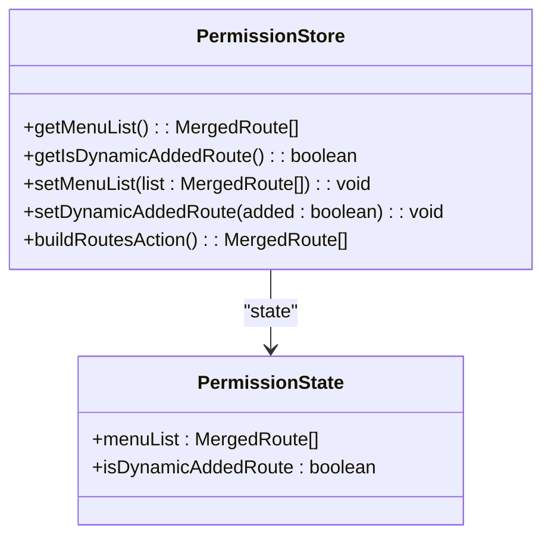
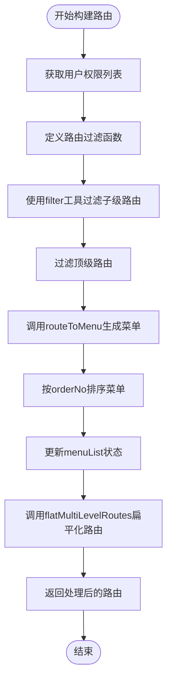
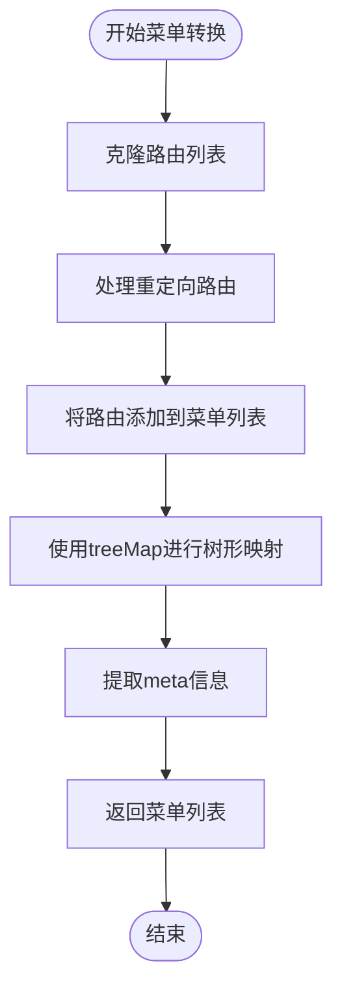
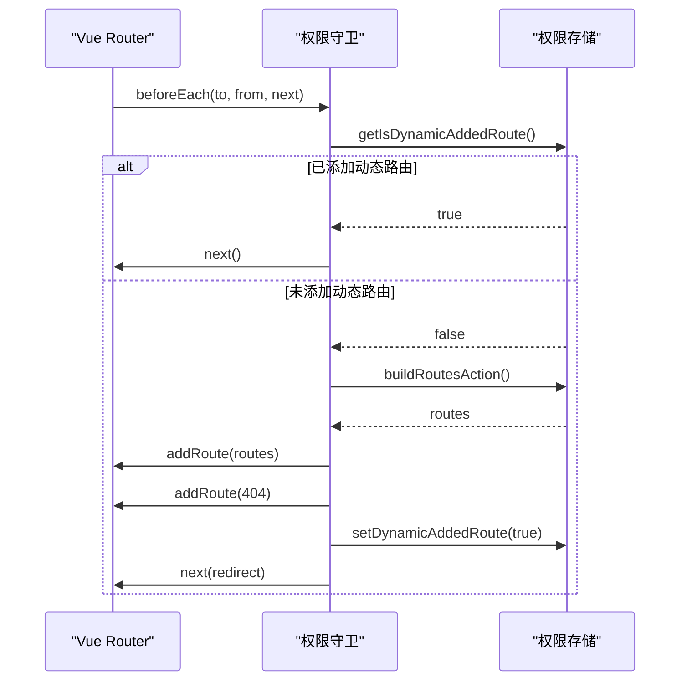
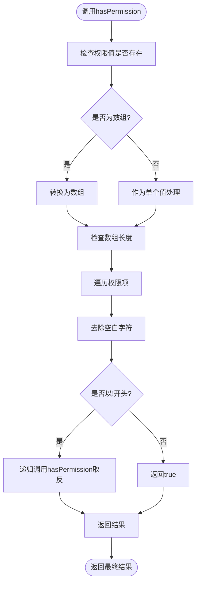
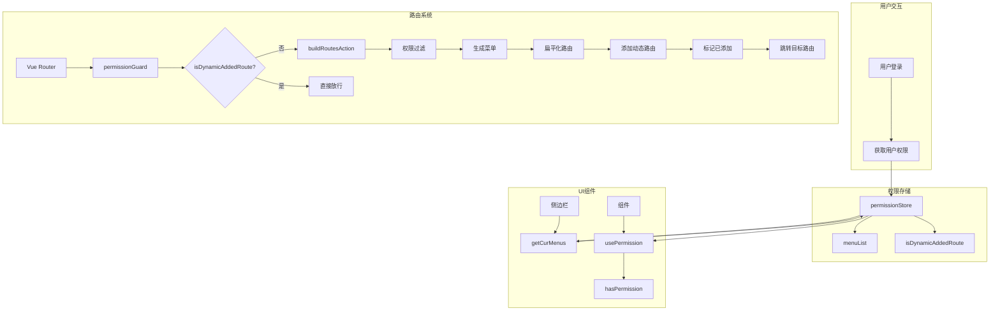

# 权限控制

<cite>
**本文档引用的文件**
- [permission.ts](file://src/stores/modules/permission.ts)
- [permissionGuard.ts](file://src/router/guard/permissionGuard.ts)
- [usePermission.ts](file://src/hooks/usePermission.ts)
- [menuHelper.ts](file://src/router/menuHelper.ts)
- [routes.ts](file://src/router/routes.ts)
- [types.ts](file://src/router/types.ts)
- [treeHelper.ts](file://src/utils/treeHelper.ts)
- [user.ts](file://src/stores/modules/user.ts)
- [constant.ts](file://src/router/constant.ts)
- [index.ts](file://src/router/index.ts)
- [helper.ts](file://src/layouts/sider/helper.ts)
- [vue-router.d.ts](file://types/vue-router.d.ts)
</cite>

## 目录
1. [权限控制系统概述](#权限控制系统概述)
2. [核心权限存储机制](#核心权限存储机制)
3. [动态路由构建流程](#动态路由构建流程)
4. [菜单生成与处理](#菜单生成与处理)
5. [路由守卫与权限拦截](#路由守卫与权限拦截)
6. [细粒度权限判定](#细粒度权限判定)
7. [权限系统架构图](#权限系统架构图)
8. [测试与排查指南](#测试与排查指南)

## 权限控制系统概述

本项目实现了一套完整的前端权限控制系统，基于Vue 3、Pinia和Vue Router构建。系统通过用户权限(auths)动态生成可访问的路由表和菜单列表，实现页面级别的访问控制。权限系统主要由四个核心部分组成：权限状态存储、动态路由构建、菜单生成和路由守卫。

系统的工作流程始于用户登录后，权限信息被存储在用户状态中。当用户访问应用时，路由守卫会拦截导航请求，调用权限存储中的`buildRoutesAction`方法，基于用户权限过滤异步路由表，生成用户可访问的路由集合。同时，系统会将这些路由转换为菜单项，供侧边栏组件使用。整个过程通过`isDynamicAddedRoute`标志位防止重复执行，确保路由只被动态添加一次。

**Section sources**
- [permission.ts](file://src/stores/modules/permission.ts#L1-L66)
- [permissionGuard.ts](file://src/router/guard/permissionGuard.ts#L1-L59)

## 核心权限存储机制

权限存储基于Pinia状态管理库实现，定义在`src/stores/modules/permission.ts`文件中。该存储模块维护了两个关键状态：`menuList`用于存储用户可访问的菜单列表，`isDynamicAddedRoute`作为标志位，标记动态路由是否已被添加。

**Diagram sources**
- [permission.ts](file://src/stores/modules/permission.ts#L8-L32)

**Section sources**
- [permission.ts](file://src/stores/modules/permission.ts#L8-L32)

## 动态路由构建流程

`buildRoutesAction`方法是权限控制系统的核心，负责基于用户权限过滤异步路由表。该方法首先从用户状态中获取用户的权限列表`userAuths`，然后定义一个路由过滤函数`routeFilter`，该函数检查路由元信息中的`auths`字段是否与用户权限匹配。

**Diagram sources**
- [permission.ts](file://src/stores/modules/permission.ts#L35-L60)
- [menuHelper.ts](file://src/router/menuHelper.ts#L47-L57)
- [treeHelper.ts](file://src/utils/treeHelper.ts#L24-L34)

**Section sources**
- [permission.ts](file://src/stores/modules/permission.ts#L35-L60)

## 菜单生成与处理

菜单生成过程由`routeToMenu`和`flatMultiLevelRoutes`两个工具函数协同完成。`routeToMenu`函数位于`src/router/menuHelper.ts`中，负责将路由对象转换为菜单项，同时处理路由重定向等特殊情况。该函数使用`treeMap`工具对路由树进行深度遍历，提取菜单所需的信息。

**Diagram sources**
- [menuHelper.ts](file://src/router/menuHelper.ts#L15-L40)
- [treeHelper.ts](file://src/utils/treeHelper.ts#L44-L65)

**Section sources**
- [menuHelper.ts](file://src/router/menuHelper.ts#L15-L40)

## 路由守卫与权限拦截

路由守卫实现在`src/router/guard/permissionGuard.ts`文件中，通过`createPermissionGuard`函数注册全局前置守卫。该守卫在每次路由跳转前执行，实现了权限控制的关键逻辑。

**Diagram sources**
- [permissionGuard.ts](file://src/router/guard/permissionGuard.ts#L9-L59)
- [permission.ts](file://src/stores/modules/permission.ts#L35-L60)
- [index.ts](file://src/router/index.ts#L17-L22)

**Section sources**
- [permissionGuard.ts](file://src/router/guard/permissionGuard.ts#L9-L59)

## 细粒度权限判定

系统提供了`usePermission`自定义Hook，位于`src/hooks/usePermission.ts`文件中，用于组件内的细粒度权限判定。该Hook暴露`hasPermission`方法，支持单个权限字符串或权限数组的检查。

**Diagram sources**
- [usePermission.ts](file://src/hooks/usePermission.ts#L7-L31)
- [vue-router.d.ts](file://types/vue-router.d.ts#L28-L29)

**Section sources**
- [usePermission.ts](file://src/hooks/usePermission.ts#L7-L31)

## 权限系统架构图

**Diagram sources**
- [permission.ts](file://src/stores/modules/permission.ts#L13-L66)
- [permissionGuard.ts](file://src/router/guard/permissionGuard.ts#L9-L59)
- [usePermission.ts](file://src/hooks/usePermission.ts#L7-L31)
- [helper.ts](file://src/layouts/sider/helper.ts#L8-L11)

## 测试与排查指南

### 模拟不同用户角色权限

要测试不同用户角色的权限表现，可以通过修改`user.ts`中的用户状态来模拟不同权限的用户。由于当前`user.ts`文件中的用户存储模块尚未完全实现，需要在实际开发中补充用户权限的存储逻辑。

### 常见权限问题排查

1. **路由无法访问**：检查目标路由的`meta.auths`配置是否正确，确认用户权限列表中包含相应的权限标识。
2. **菜单不显示**：验证`menuList`是否正确生成，检查`hideMenu`元信息设置。
3. **动态路由重复添加**：确保`isDynamicAddedRoute`标志位在路由添加后被正确设置为`true`。
4. **权限判断失效**：检查`hasPermission`方法的调用方式，确认权限字符串格式正确。

**Section sources**
- [user.ts](file://src/stores/modules/user.ts#L1-L29)
- [permissionGuard.ts](file://src/router/guard/permissionGuard.ts#L30-L34)
- [usePermission.ts](file://src/hooks/usePermission.ts#L14-L28)