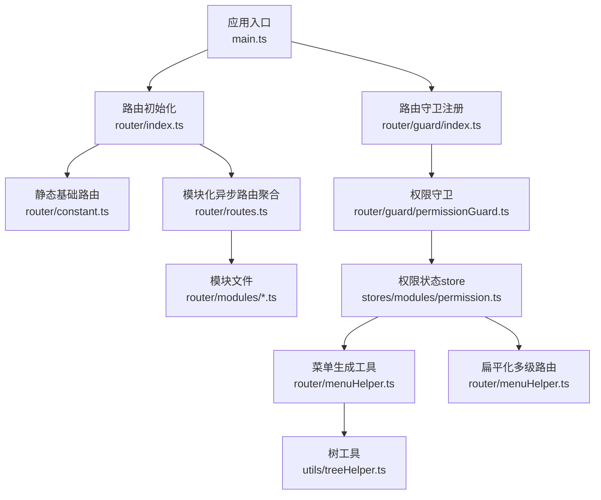
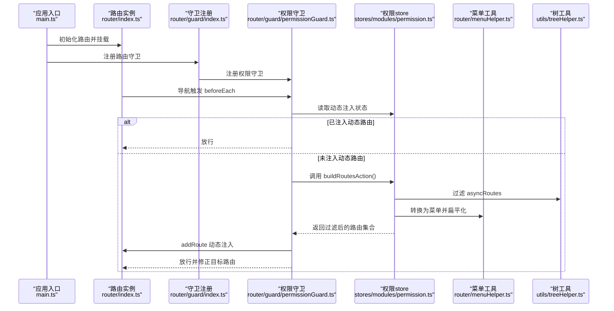
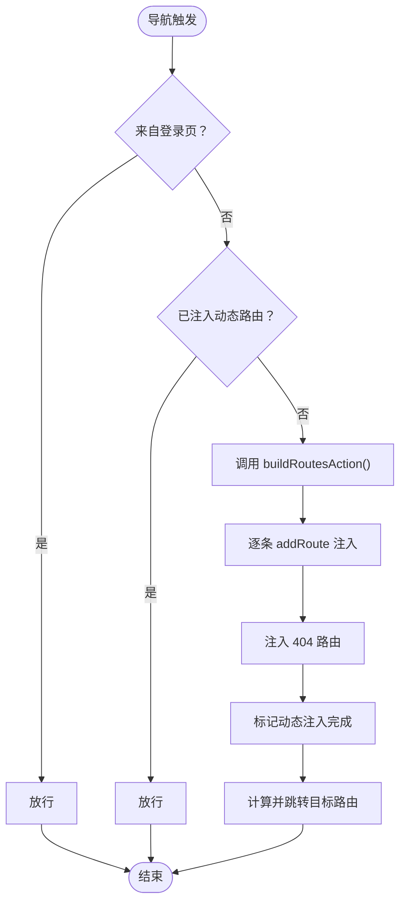
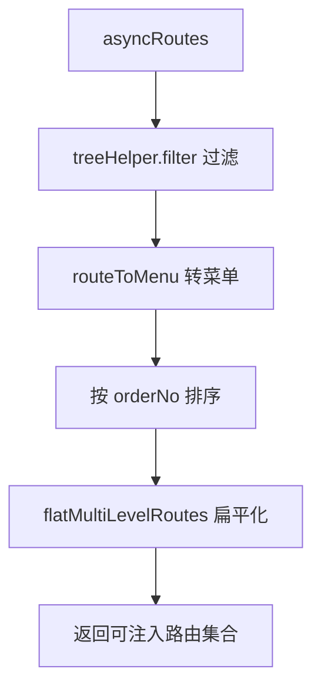
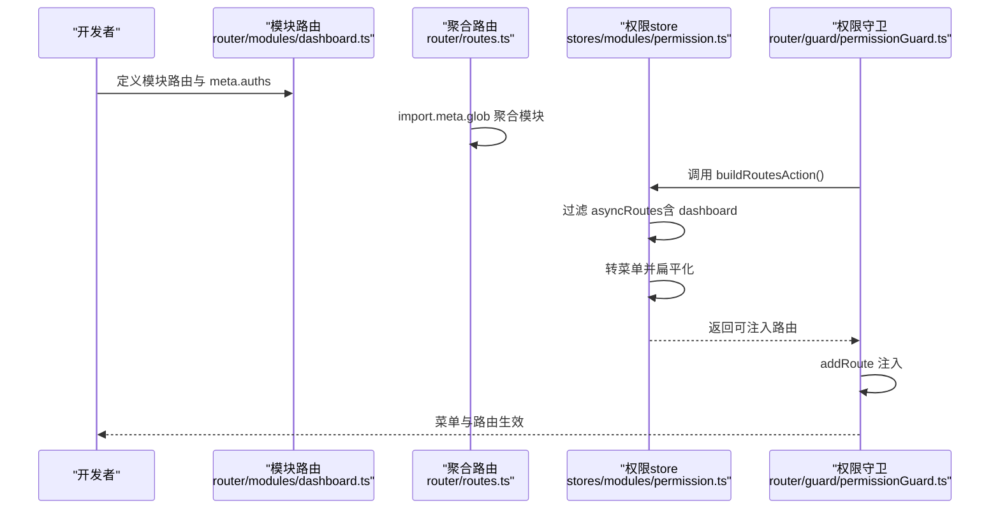
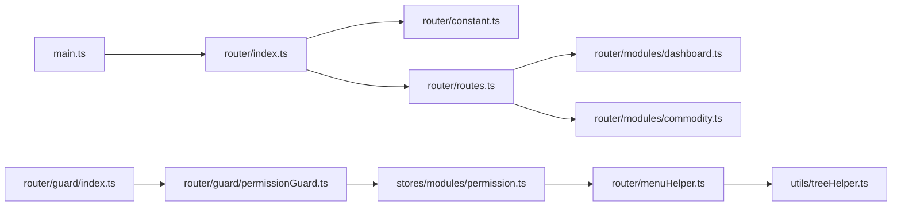

# 路由与权限

<cite>
**本文引用的文件**
- [main.ts](file://src/main.ts)
- [router/index.ts](file://src/router/index.ts)
- [router/routes.ts](file://src/router/routes.ts)
- [router/constant.ts](file://src/router/constant.ts)
- [router/types.ts](file://src/router/types.ts)
- [router/guard/index.ts](file://src/router/guard/index.ts)
- [router/guard/permissionGuard.ts](file://src/router/guard/permissionGuard.ts)
- [router/menuHelper.ts](file://src/router/menuHelper.ts)
- [utils/treeHelper.ts](file://src/utils/treeHelper.ts)
- [stores/modules/permission.ts](file://src/stores/modules/permission.ts)
- [stores/modules/user.ts](file://src/stores/modules/user.ts)
- [router/modules/dashboard.ts](file://src/router/modules/dashboard.ts)
- [router/modules/commodity.ts](file://src/router/modules/commodity.ts)
</cite>

## 目录
1. [引言](#引言)
2. [项目结构](#项目结构)
3. [核心组件](#核心组件)
4. [架构总览](#架构总览)
5. [详细组件分析](#详细组件分析)
6. [依赖关系分析](#依赖关系分析)
7. [性能考量](#性能考量)
8. [故障排查指南](#故障排查指南)
9. [结论](#结论)
10. [附录：新增路由与权限配置标准流程](#附录新增路由与权限配置标准流程)

## 引言
本文件系统性梳理本项目的“路由架构与权限控制”机制，重点覆盖：
- 路由组织方式：静态基础路由与模块化异步路由的划分与加载策略
- 路由守卫：权限拦截逻辑、导航拦截与动态路由注入流程
- 权限状态与菜单生成：基于权限过滤后的路由如何转化为菜单列表
- 完整示例：以 dashboard 模块为例，展示从路由定义到权限控制的全流程
- 新增规范：如何添加新路由并正确配置权限

## 项目结构
项目采用“静态基础路由 + 模块化异步路由”的双层路由体系：
- 静态基础路由：根、登录、重定向、404 等固定页面，定义于常量路由文件
- 模块化异步路由：业务模块路由（如 dashboard、commodity）按文件自动批量导入
- 路由守卫：统一在入口处注册，先执行权限守卫，再处理参数菜单守卫
- 权限状态：通过 Pinia 的 permission store 维护菜单列表与动态路由注入状态
- 菜单生成：将过滤后的异步路由转换为菜单树，支持扁平化多级路由

图表来源
- [main.ts](file://src/main.ts#L1-L29)
- [router/index.ts](file://src/router/index.ts#L1-L39)
- [router/constant.ts](file://src/router/constant.ts#L1-L53)
- [router/routes.ts](file://src/router/routes.ts#L1-L27)
- [router/guard/index.ts](file://src/router/guard/index.ts#L1-L63)
- [router/guard/permissionGuard.ts](file://src/router/guard/permissionGuard.ts#L1-L60)
- [router/menuHelper.ts](file://src/router/menuHelper.ts#L1-L123)
- [utils/treeHelper.ts](file://src/utils/treeHelper.ts#L1-L96)
- [stores/modules/permission.ts](file://src/stores/modules/permission.ts#L1-L67)

章节来源
- [main.ts](file://src/main.ts#L1-L29)
- [router/index.ts](file://src/router/index.ts#L1-L39)
- [router/routes.ts](file://src/router/routes.ts#L1-L27)
- [router/constant.ts](file://src/router/constant.ts#L1-L53)
- [router/guard/index.ts](file://src/router/guard/index.ts#L1-L63)

## 核心组件
- 静态基础路由与常量路由
  - 根路由、登录页、重定向、404 错误页均在常量路由中定义，作为应用启动时的固定路由骨架
- 模块化异步路由
  - 通过 import.meta.glob 动态批量导入 modules 下的路由模块，聚合为 asyncRoutes
- 路由守卫
  - 在 beforeEach 中进行权限拦截：判断是否已注入动态路由、是否前往登录页、必要时构建并注入路由
- 权限 store
  - 维护菜单列表与动态路由注入状态；提供 buildRoutesAction，负责权限过滤、菜单生成与路由扁平化
- 菜单生成与路由扁平化
  - 使用 treeHelper 工具对路由进行过滤与映射，再通过 menuHelper 将多级路由扁平化为二级路由

章节来源
- [router/constant.ts](file://src/router/constant.ts#L1-L53)
- [router/routes.ts](file://src/router/routes.ts#L1-L27)
- [router/guard/permissionGuard.ts](file://src/router/guard/permissionGuard.ts#L1-L60)
- [stores/modules/permission.ts](file://src/stores/modules/permission.ts#L1-L67)
- [router/menuHelper.ts](file://src/router/menuHelper.ts#L1-L123)
- [utils/treeHelper.ts](file://src/utils/treeHelper.ts#L1-L96)

## 架构总览
下图展示了从应用启动到权限拦截、动态路由注入与菜单生成的关键交互：

图表来源
- [main.ts](file://src/main.ts#L1-L29)
- [router/index.ts](file://src/router/index.ts#L1-L39)
- [router/guard/index.ts](file://src/router/guard/index.ts#L1-L63)
- [router/guard/permissionGuard.ts](file://src/router/guard/permissionGuard.ts#L1-L60)
- [stores/modules/permission.ts](file://src/stores/modules/permission.ts#L1-L67)
- [router/menuHelper.ts](file://src/router/menuHelper.ts#L1-L123)
- [utils/treeHelper.ts](file://src/utils/treeHelper.ts#L1-L96)

## 详细组件分析

### 路由组织与加载
- 静态基础路由
  - 根路由、登录页、重定向、404 错误页在常量路由中定义，作为应用启动时的固定骨架
- 模块化异步路由
  - 通过 import.meta.glob 聚合 modules 下的路由模块，形成 asyncRoutes
  - baseRoutes 仅包含静态路由，router 实例初始时只挂载 baseRoutes
- 白名单与重置
  - 通过递归收集 baseRoutes 的路由名称，形成白名单，用于 resetRouter 时保留静态路由，移除动态路由

章节来源
- [router/constant.ts](file://src/router/constant.ts#L1-L53)
- [router/routes.ts](file://src/router/routes.ts#L1-L27)
- [router/index.ts](file://src/router/index.ts#L1-L39)

### 权限守卫逻辑
- 导航拦截流程
  - 若来自登录页，直接放行（便于登录成功后跳转）
  - 若已注入动态路由，直接放行（避免重复注入）
  - 否则调用 permission store 的 buildRoutesAction 构建路由
  - 将构建结果逐条 addRoute 注入
  - 最后注入 404 路由，标记动态注入完成
  - 重新计算目标路由并跳转，避免进入 404
- 关键点
  - 动态注入与白名单配合，确保 resetRouter 可安全移除动态路由
  - 重定向处理：优先使用查询参数中的 redirect，否则回退到目标路径

图表来源
- [router/guard/permissionGuard.ts](file://src/router/guard/permissionGuard.ts#L1-L60)
- [router/index.ts](file://src/router/index.ts#L1-L39)
- [stores/modules/permission.ts](file://src/stores/modules/permission.ts#L1-L67)

章节来源
- [router/guard/permissionGuard.ts](file://src/router/guard/permissionGuard.ts#L1-L60)
- [router/index.ts](file://src/router/index.ts#L1-L39)

### 权限过滤与菜单生成
- 权限过滤
  - 从 asyncRoutes 中过滤出当前用户可访问的路由，依据路由 meta.auths 与用户权限集合匹配
  - 使用 treeHelper 的 filter 对树进行过滤，保证父子一致性
- 菜单生成
  - 将过滤后的路由映射为菜单结构，支持重定向场景下的路径修正
  - 对菜单按 orderNo 排序，便于前端展示
- 路由扁平化
  - 将多级路由提升为二级路由，便于侧边栏等 UI 展示

图表来源
- [stores/modules/permission.ts](file://src/stores/modules/permission.ts#L1-L67)
- [router/menuHelper.ts](file://src/router/menuHelper.ts#L1-L123)
- [utils/treeHelper.ts](file://src/utils/treeHelper.ts#L1-L96)

章节来源
- [stores/modules/permission.ts](file://src/stores/modules/permission.ts#L1-L67)
- [router/menuHelper.ts](file://src/router/menuHelper.ts#L1-L123)
- [utils/treeHelper.ts](file://src/utils/treeHelper.ts#L1-L96)

### 类型与接口
- MergedRoute
  - 在 RouteRecordRaw 的基础上扩展了 meta、component、children 等字段，统一路由定义形态
- Menu
  - 菜单结构，包含 name、path、orderNo、auths、hideMenu、children、meta 等字段
- auths 字段
  - 用于声明路由所需的权限标识，权限守卫据此进行过滤

章节来源
- [router/types.ts](file://src/router/types.ts#L1-L73)

### dashboard 模块：从路由定义到权限控制的完整流程
- 路由定义
  - dashboard 模块定义了父级布局与子路由，父级 meta 中可配置排序、图标、标题等
  - 子路由通过异步组件加载，meta 中可配置隐藏菜单、面包屑等
- 权限控制
  - 若该模块路由包含 meta.auths，则在权限过滤阶段按用户权限集合进行筛选
  - 过滤后的路由会被注入到路由表，并转换为菜单
- 菜单生成
  - 通过 routeToMenu 生成菜单树，扁平化后供 UI 展示

图表来源
- [router/modules/dashboard.ts](file://src/router/modules/dashboard.ts#L1-L21)
- [router/routes.ts](file://src/router/routes.ts#L1-L27)
- [stores/modules/permission.ts](file://src/stores/modules/permission.ts#L1-L67)
- [router/guard/permissionGuard.ts](file://src/router/guard/permissionGuard.ts#L1-L60)

章节来源
- [router/modules/dashboard.ts](file://src/router/modules/dashboard.ts#L1-L21)
- [router/routes.ts](file://src/router/routes.ts#L1-L27)
- [stores/modules/permission.ts](file://src/stores/modules/permission.ts#L1-L67)
- [router/guard/permissionGuard.ts](file://src/router/guard/permissionGuard.ts#L1-L60)

### commodity 模块（对比参考）
- 与 dashboard 类似，定义父级布局与子路由，meta 中包含排序、标题、图标等
- 通过 modules 聚合后参与权限过滤与菜单生成

章节来源
- [router/modules/commodity.ts](file://src/router/modules/commodity.ts#L1-L27)

## 依赖关系分析
- 应用入口 main.ts 依次完成 Pinia 初始化、路由初始化、守卫注册、指令与全局配置初始化
- 路由初始化 router/index.ts 创建基础路由，提供 resetRouter 以便清理动态路由
- 权限守卫 router/guard/permissionGuard.ts 依赖 permission store，后者依赖 menuHelper 与 treeHelper
- 菜单生成与扁平化依赖 treeHelper 的树操作能力

图表来源
- [main.ts](file://src/main.ts#L1-L29)
- [router/index.ts](file://src/router/index.ts#L1-L39)
- [router/constant.ts](file://src/router/constant.ts#L1-L53)
- [router/routes.ts](file://src/router/routes.ts#L1-L27)
- [router/modules/dashboard.ts](file://src/router/modules/dashboard.ts#L1-L21)
- [router/modules/commodity.ts](file://src/router/modules/commodity.ts#L1-L27)
- [router/guard/index.ts](file://src/router/guard/index.ts#L1-L63)
- [router/guard/permissionGuard.ts](file://src/router/guard/permissionGuard.ts#L1-L60)
- [stores/modules/permission.ts](file://src/stores/modules/permission.ts#L1-L67)
- [router/menuHelper.ts](file://src/router/menuHelper.ts#L1-L123)
- [utils/treeHelper.ts](file://src/utils/treeHelper.ts#L1-L96)

章节来源
- [main.ts](file://src/main.ts#L1-L29)
- [router/index.ts](file://src/router/index.ts#L1-L39)
- [router/guard/index.ts](file://src/router/guard/index.ts#L1-L63)
- [stores/modules/permission.ts](file://src/stores/modules/permission.ts#L1-L67)

## 性能考量
- 动态路由注入时机
  - 首次导航时才构建并注入，避免启动时大量异步组件加载导致首屏卡顿
- 路由扁平化
  - 多级路由扁平化有助于减少嵌套层级，降低 UI 渲染复杂度
- 过滤算法
  - treeHelper.filter 采用深度遍历，时间复杂度近似 O(n)，n 为路由节点数
- 白名单与重置
  - 通过白名单保留静态路由，resetRouter 可快速清理动态路由，避免内存泄漏

[本节为通用建议，不直接分析具体文件]

## 故障排查指南
- 登录后无法跳转或反复进入 404
  - 检查权限守卫是否正确标记动态注入完成
  - 确认目标路由名称不在白名单之外，避免被 resetRouter 移除
- 菜单不显示或顺序异常
  - 检查路由 meta.orderNo 是否设置，以及是否参与了权限过滤
  - 确认扁平化流程未遗漏子路由
- 权限过滤无效
  - 确认路由 meta.auths 是否存在且与用户权限集合匹配
  - 检查 permission store 的 buildRoutesAction 是否被调用

章节来源
- [router/guard/permissionGuard.ts](file://src/router/guard/permissionGuard.ts#L1-L60)
- [router/index.ts](file://src/router/index.ts#L1-L39)
- [stores/modules/permission.ts](file://src/stores/modules/permission.ts#L1-L67)

## 结论
本项目通过“静态基础路由 + 模块化异步路由”的组合，配合权限守卫与 Pinia 权限 store，实现了灵活的权限控制与菜单生成。dashboard 与 commodity 等模块均遵循相同模式，具备良好的可扩展性。建议在新增模块时严格遵循权限配置与路由扁平化的规范，确保菜单与路由的一致性与性能表现。

[本节为总结，不直接分析具体文件]

## 附录：新增路由与权限配置标准流程
- 步骤一：创建模块路由文件
  - 在 router/modules 下新增模块文件，定义父级布局与子路由，设置 meta.auths（若需权限控制）、排序、标题、图标等
  - 参考路径：[router/modules/dashboard.ts](file://src/router/modules/dashboard.ts#L1-L21)、[router/modules/commodity.ts](file://src/router/modules/commodity.ts#L1-L27)
- 步骤二：确认路由聚合
  - 不需手动修改聚合文件，import.meta.glob 会自动扫描 modules 下的路由模块
  - 参考路径：[router/routes.ts](file://src/router/routes.ts#L1-L27)
- 步骤三：配置权限
  - 在 permission store 的 buildRoutesAction 中，确保用户权限集合可用，并与 meta.auths 匹配
  - 参考路径：[stores/modules/permission.ts](file://src/stores/modules/permission.ts#L1-L67)
- 步骤四：检查菜单生成
  - 确认 routeToMenu 与扁平化流程正常，菜单按 orderNo 排序
  - 参考路径：[router/menuHelper.ts](file://src/router/menuHelper.ts#L1-L123)
- 步骤五：验证导航
  - 通过权限守卫测试：首次导航时应触发动态注入；刷新页面时应直接放行
  - 参考路径：[router/guard/permissionGuard.ts](file://src/router/guard/permissionGuard.ts#L1-L60)

章节来源
- [router/modules/dashboard.ts](file://src/router/modules/dashboard.ts#L1-L21)
- [router/modules/commodity.ts](file://src/router/modules/commodity.ts#L1-L27)
- [router/routes.ts](file://src/router/routes.ts#L1-L27)
- [stores/modules/permission.ts](file://src/stores/modules/permission.ts#L1-L67)
- [router/menuHelper.ts](file://src/router/menuHelper.ts#L1-L123)
- [router/guard/permissionGuard.ts](file://src/router/guard/permissionGuard.ts#L1-L60)