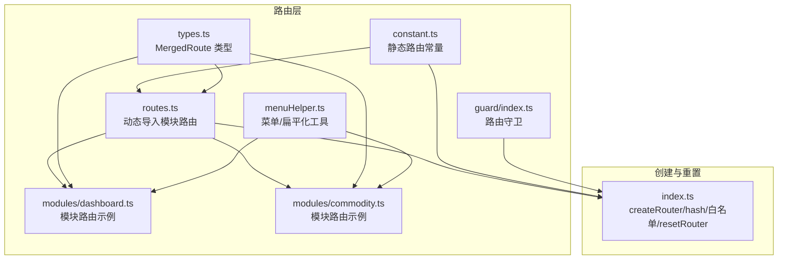
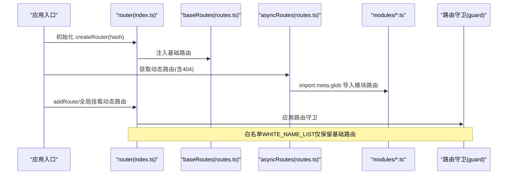
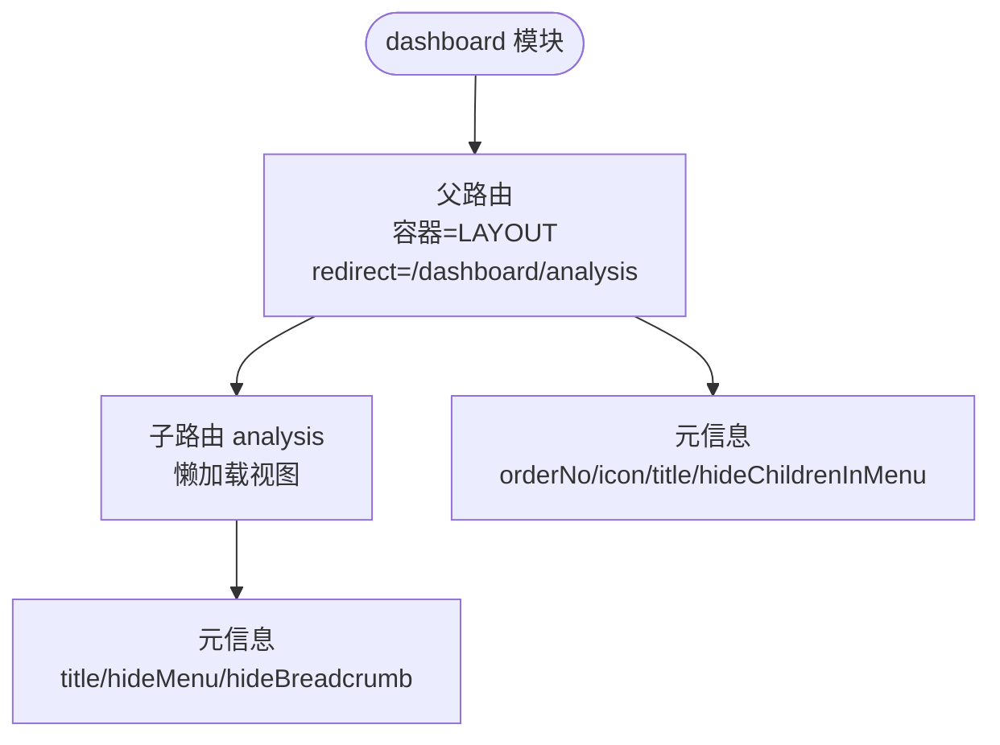
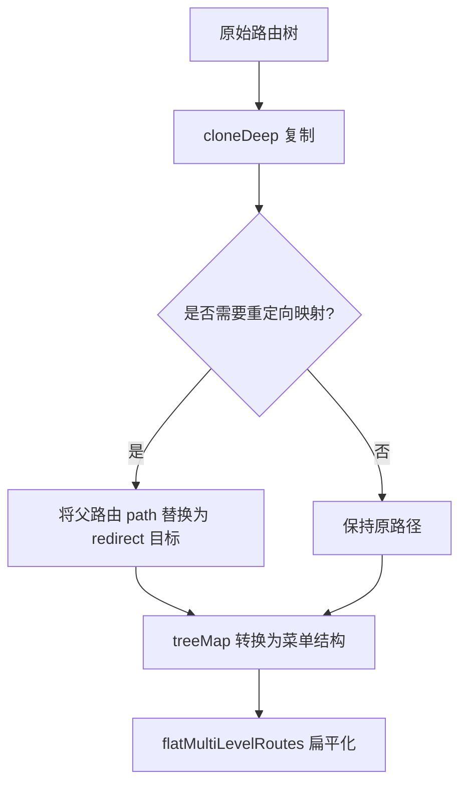
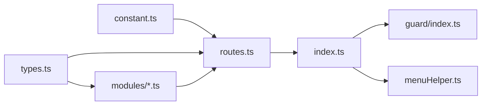

# 路由配置

<cite>
**本文引用的文件**
- [src/router/index.ts](file://src/router/index.ts)
- [src/router/routes.ts](file://src/router/routes.ts)
- [src/router/constant.ts](file://src/router/constant.ts)
- [src/router/modules/dashboard.ts](file://src/router/modules/dashboard.ts)
- [src/router/modules/commodity.ts](file://src/router/modules/commodity.ts)
- [src/router/types.ts](file://src/router/types.ts)
- [src/router/menuHelper.ts](file://src/router/menuHelper.ts)
- [src/router/guard/index.ts](file://src/router/guard/index.ts)
</cite>

## 目录
1. [简介](#简介)
2. [项目结构](#项目结构)
3. [核心组件](#核心组件)
4. [架构总览](#架构总览)
5. [详细组件分析](#详细组件分析)
6. [依赖关系分析](#依赖关系分析)
7. [性能考量](#性能考量)
8. [故障排查指南](#故障排查指南)
9. [结论](#结论)
10. [附录：新增模块路由标准流程](#附录新增模块路由标准流程)

## 简介
本文件系统性解析本项目的路由配置机制，重点覆盖：
- baseRoutes 中静态路由（根路由、登录路由、重定向路由、404 路由）的结构与职责
- routes.ts 使用 import.meta.glob 动态导入 modules/ 下模块化路由的方式
- dashboard.ts 模块路由的定义格式与嵌套路由组织
- asyncRoutes 的组成逻辑及与 404 页面路由的合并策略
- index.ts 中 createRouter 的 hash 模式历史记录管理、路由白名单机制（WHITE_NAME_LIST）以及 resetRouter 安全移除动态路由的实现
- 新增功能模块路由的标准流程与最佳实践

## 项目结构
路由相关代码集中于 src/router 目录，采用“静态基础路由 + 动态模块路由”的分层设计：
- constant.ts 定义静态基础路由常量（根、登录、重定向、404）
- routes.ts 负责批量导入 modules 下的模块路由并组合为 asyncRoutes/baseRoutes
- modules/*.ts 定义各业务模块的路由（如 dashboard.ts、commodity.ts）
- index.ts 创建路由实例、维护白名单、提供 resetRouter
- menuHelper.ts 提供路由转菜单、多级路由扁平化等辅助能力
- guard/index.ts 提供路由守卫（滚动、消息、状态等）

图表来源
- [src/router/constant.ts](file://src/router/constant.ts#L1-L53)
- [src/router/routes.ts](file://src/router/routes.ts#L1-L27)
- [src/router/modules/dashboard.ts](file://src/router/modules/dashboard.ts#L1-L21)
- [src/router/modules/commodity.ts](file://src/router/modules/commodity.ts#L1-L27)
- [src/router/types.ts](file://src/router/types.ts#L1-L73)
- [src/router/menuHelper.ts](file://src/router/menuHelper.ts#L1-L123)
- [src/router/guard/index.ts](file://src/router/guard/index.ts#L1-L63)
- [src/router/index.ts](file://src/router/index.ts#L1-L39)

章节来源
- [src/router/constant.ts](file://src/router/constant.ts#L1-L53)
- [src/router/routes.ts](file://src/router/routes.ts#L1-L27)
- [src/router/index.ts](file://src/router/index.ts#L1-L39)

## 核心组件
- 静态基础路由集合 baseRoutes：包含根路由、登录路由、重定向路由、404 路由，作为初始路由表注入 router 实例
- 动态模块路由集合 asyncRoutes：在应用启动或权限变更后，将模块路由与 404 路由合并，形成可按需加载的完整路由集
- 路由白名单 WHITE_NAME_LIST：在初始化时收集 baseRoutes 及其子路由的 name，用于 resetRouter 安全移除动态路由
- resetRouter：遍历当前已注册路由，仅移除非白名单的动态路由，避免误删基础路由

章节来源
- [src/router/index.ts](file://src/router/index.ts#L6-L39)
- [src/router/routes.ts](file://src/router/routes.ts#L22-L27)
- [src/router/constant.ts](file://src/router/constant.ts#L10-L53)

## 架构总览
下面以序列图展示从创建路由到动态挂载模块路由的关键流程。

图表来源
- [src/router/index.ts](file://src/router/index.ts#L17-L39)
- [src/router/routes.ts](file://src/router/routes.ts#L13-L27)
- [src/router/guard/index.ts](file://src/router/guard/index.ts#L11-L20)

## 详细组件分析

### 静态基础路由（baseRoutes）
- 根路由 ROOT_ROUTE：重定向至 /dashboard，作为应用默认入口
- 登录路由 LOGIN_ROUTE：独立页面，不参与菜单渲染
- 重定向路由 REDIRECT_ROUTE：支持带参数的重定向，常用于刷新后恢复目标地址
- 404 路由 PAGE_NOT_FOUND_ROUTE：兜底路由，确保未知路径安全回退

这些路由共同构成初始路由表，保证应用在无权限或未加载动态路由时仍可正常导航。

章节来源
- [src/router/constant.ts](file://src/router/constant.ts#L10-L53)
- [src/router/routes.ts](file://src/router/routes.ts#L26-L27)

### 动态模块路由（asyncRoutes 与 import.meta.glob）
- 动态导入：通过 import.meta.glob("./modules/*.ts", { eager: true }) 在构建期批量读取模块路由
- 合并与扩展：将 PAGE_NOT_FOUND_ROUTE 放置于首位，随后追加模块路由数组，形成 asyncRoutes
- 组成逻辑：asyncRoutes = [404 路由, ...模块路由数组]

该机制使新增模块路由无需修改主路由配置，只需在 modules 目录下新增对应文件即可自动生效。

章节来源
- [src/router/routes.ts](file://src/router/routes.ts#L13-L24)

### 模块路由示例：dashboard.ts
- 结构要点：
  - 外层容器使用 LAYOUT，统一布局
  - redirect 指向子路由 /dashboard/analysis
  - meta 字段包含排序、图标、标题等菜单元信息
  - children 定义子路由，其中 analysis 子路由懒加载对应视图组件
- 嵌套规则：父路由负责布局与重定向；子路由承载具体页面，可进一步嵌套

图表来源
- [src/router/modules/dashboard.ts](file://src/router/modules/dashboard.ts#L1-L21)

章节来源
- [src/router/modules/dashboard.ts](file://src/router/modules/dashboard.ts#L1-L21)

### 另一个模块路由示例：commodity.ts
- 结构要点：
  - 外层容器 LAYOUT
  - children 包含 pro-category 与 product 两个子路由
  - product 子路由可继续嵌套子路由（空数组占位）
  - meta 字段包含排序、标题、图标等菜单元信息

章节来源
- [src/router/modules/commodity.ts](file://src/router/modules/commodity.ts#L1-L27)

### 类型系统：MergedRoute
- MergedRoute 在 RouteRecordRaw 的基础上补充了 name、meta、component、children 等字段
- 与 RouteMeta 对齐，便于菜单与路由的元信息复用
- 为路由与菜单工具提供统一的数据模型

章节来源
- [src/router/types.ts](file://src/router/types.ts#L52-L73)

### 菜单与路由转换：menuHelper 工具
- routeToMenu：将路由转换为菜单结构，支持根据 hideChildrenInMenu 与 redirect 进行路径映射
- flatMultiLevelRoutes：将多级路由扁平化为二级路由，便于菜单渲染
- promoteRouteLevel/addToChildren：内部递归处理，将深层子路由提升到二级，避免层级过深导致的菜单渲染问题

图表来源
- [src/router/menuHelper.ts](file://src/router/menuHelper.ts#L15-L40)
- [src/router/menuHelper.ts](file://src/router/menuHelper.ts#L47-L123)

章节来源
- [src/router/menuHelper.ts](file://src/router/menuHelper.ts#L1-L123)

### 路由守卫：scroll/message/state 等
- createScrollGuard：页面跳转后滚动到顶部
- createMessageGuard：跳转前销毁全局消息、对话框与通知
- createStateGuard：进入登录页时进行状态清理（预留）
- setupRouterGuard：统一装配多个守卫

章节来源
- [src/router/guard/index.ts](file://src/router/guard/index.ts#L1-L63)

## 依赖关系分析
- routes.ts 依赖 constant.ts 提供的静态路由常量，并通过 import.meta.glob 动态引入 modules 下的模块路由
- index.ts 依赖 routes.ts 的 baseRoutes 与 asyncRoutes，创建 hash 模式路由实例，并维护 WHITE_NAME_LIST 与 resetRouter
- menuHelper.ts 依赖 types.ts 的 MergedRoute 类型，为路由与菜单转换提供工具方法
- guard/index.ts 依赖 router 实例，提供全局守卫

图表来源
- [src/router/constant.ts](file://src/router/constant.ts#L1-L53)
- [src/router/routes.ts](file://src/router/routes.ts#L1-L27)
- [src/router/index.ts](file://src/router/index.ts#L1-L39)
- [src/router/types.ts](file://src/router/types.ts#L1-L73)
- [src/router/menuHelper.ts](file://src/router/menuHelper.ts#L1-L123)
- [src/router/guard/index.ts](file://src/router/guard/index.ts#L1-L63)

章节来源
- [src/router/constant.ts](file://src/router/constant.ts#L1-L53)
- [src/router/routes.ts](file://src/router/routes.ts#L1-L27)
- [src/router/index.ts](file://src/router/index.ts#L1-L39)
- [src/router/types.ts](file://src/router/types.ts#L1-L73)
- [src/router/menuHelper.ts](file://src/router/menuHelper.ts#L1-L123)
- [src/router/guard/index.ts](file://src/router/guard/index.ts#L1-L63)

## 性能考量
- 动态导入使用 eager: true，构建期一次性读取模块路由，减少运行时 IO 开销，适合模块数量可控的场景
- hash 模式避免后端配置复杂度，但不利于 SEO；若需 SPA 部署，建议配合服务端回退至 index.html
- 菜单扁平化与路由转换在菜单渲染前执行，降低前端渲染压力
- resetRouter 仅移除非白名单动态路由，避免频繁重建基础路由带来的开销

[本节为通用指导，不直接分析具体文件]

## 故障排查指南
- 动态路由未生效
  - 检查 modules 下是否存在对应模块文件且导出默认 MergedRoute
  - 确认 routes.ts 的 import.meta.glob 路径正确
- 404 路由未触发
  - 确认 asyncRoutes 首项为 PAGE_NOT_FOUND_ROUTE
  - 检查是否存在同名或冲突路由导致优先匹配
- 白名单误删基础路由
  - 确保 WHITE_NAME_LIST 在初始化时已收集 baseRoutes 及其子路由 name
  - resetRouter 仅移除非白名单动态路由
- 菜单显示异常
  - 使用 menuHelper.routeToMenu 与 flatMultiLevelRoutes 进行转换与扁平化
  - 检查 meta.hideMenu、hideChildrenInMenu、redirect 等字段设置

章节来源
- [src/router/routes.ts](file://src/router/routes.ts#L13-L24)
- [src/router/index.ts](file://src/router/index.ts#L6-L39)
- [src/router/menuHelper.ts](file://src/router/menuHelper.ts#L15-L40)
- [src/router/menuHelper.ts](file://src/router/menuHelper.ts#L47-L123)

## 结论
本项目采用“静态基础路由 + 动态模块路由”的清晰分层架构：
- baseRoutes 提供稳定的基础导航骨架
- routes.ts 通过 import.meta.glob 自动聚合模块路由，形成 asyncRoutes
- index.ts 以 hash 模式创建路由实例，维护白名单并提供安全的 resetRouter
- menuHelper 与 guard 为菜单渲染与用户体验提供了配套能力

该设计既保证了路由的可维护性与扩展性，又兼顾了运行时性能与开发体验。

[本节为总结性内容，不直接分析具体文件]

## 附录：新增模块路由标准流程
- 在 src/router/modules 下新增模块文件（如 mymodule.ts），导出默认 MergedRoute
- 在模块路由中：
  - 外层使用 LAYOUT 作为容器
  - 如需重定向，设置 redirect 指向子路由
  - 在 meta 中配置排序、图标、标题等菜单元信息
  - children 中定义子路由，必要时懒加载对应视图组件
- 不需要手动修改 routes.ts 或 index.ts，系统会自动扫描 modules 并合并到 asyncRoutes
- 若需在菜单中隐藏某路由，可在 meta 中设置 hideMenu/hideChildrenInMenu
- 如需在登录后挂载动态路由，可在业务逻辑中调用 router.addRoute 并在登出时调用 resetRouter

章节来源
- [src/router/modules/dashboard.ts](file://src/router/modules/dashboard.ts#L1-L21)
- [src/router/modules/commodity.ts](file://src/router/modules/commodity.ts#L1-L27)
- [src/router/routes.ts](file://src/router/routes.ts#L13-L24)
- [src/router/index.ts](file://src/router/index.ts#L17-L39)