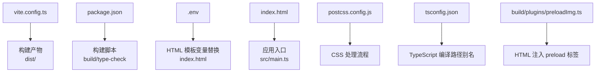
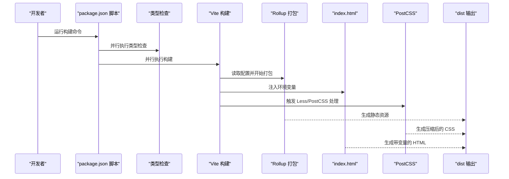
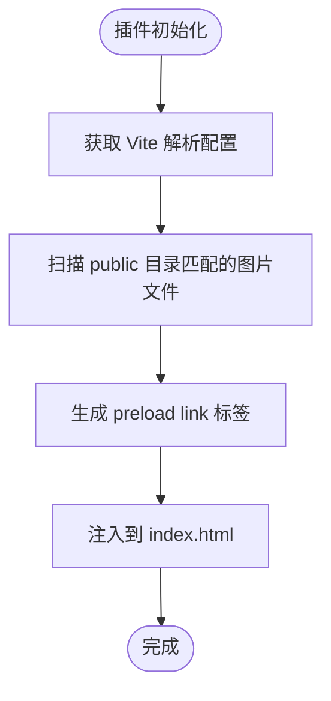
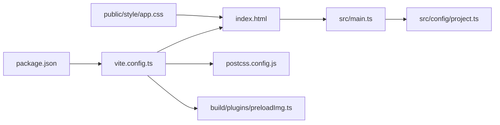

# 部署与构建

<cite>
**本文引用的文件**
- [vite.config.ts](file://vite.config.ts)
- [package.json](file://package.json)
- [.env](file://.env)
- [index.html](file://index.html)
- [src/main.ts](file://src/main.ts)
- [src/config/project.ts](file://src/config/project.ts)
- [build/plugins/preloadImg.ts](file://build/plugins/preloadImg.ts)
- [postcss.config.js](file://postcss.config.js)
- [tsconfig.json](file://tsconfig.json)
- [public/style/app.css](file://public/style/app.css)
</cite>

## 目录
1. [简介](#简介)
2. [项目结构](#项目结构)
3. [核心组件](#核心组件)
4. [架构总览](#架构总览)
5. [详细组件分析](#详细组件分析)
6. [依赖关系分析](#依赖关系分析)
7. [性能考量](#性能考量)
8. [故障排查指南](#故障排查指南)
9. [结论](#结论)
10. [附录](#附录)

## 简介
本指南面向从“构建到部署”的完整流程，聚焦以下方面：
- 解析并说明构建配置对输出结果的影响，重点覆盖构建目录、静态资源目录、Rollup 分包策略以及压缩与日志策略。
- 通过环境变量（.env 文件）区分开发、测试与生产环境，并配置不同 API 地址与功能开关。
- 解释 package.json 中构建脚本的执行顺序与并行策略，包括类型检查与实际构建的协同。
- 提供构建产物的部署建议：Nginx 配置要点、CDN 加速与缓存策略。
- 总结常见问题与解决方案：资源路径错误、环境变量未生效等。

## 项目结构
该仓库采用 Vite + Vue 3 的前端工程化结构，关键目录与文件如下：
- 构建与运行配置：vite.config.ts、package.json、postcss.config.js、tsconfig.json
- 环境变量：.env
- 入口页面：index.html
- 应用入口：src/main.ts
- 项目配置：src/config/project.ts
- 自定义插件：build/plugins/preloadImg.ts
- 静态样式：public/style/app.css

图表来源
- [vite.config.ts](file://vite.config.ts#L19-L71)
- [package.json](file://package.json#L1-L20)
- [.env](file://.env#L1-L1)
- [index.html](file://index.html#L1-L27)
- [src/main.ts](file://src/main.ts#L1-L29)
- [postcss.config.js](file://postcss.config.js#L1-L13)
- [tsconfig.json](file://tsconfig.json#L27-L41)
- [build/plugins/preloadImg.ts](file://build/plugins/preloadImg.ts#L1-L60)

章节来源
- [vite.config.ts](file://vite.config.ts#L19-L71)
- [package.json](file://package.json#L1-L20)
- [.env](file://.env#L1-L1)
- [index.html](file://index.html#L1-L27)
- [src/main.ts](file://src/main.ts#L1-L29)
- [postcss.config.js](file://postcss.config.js#L1-L13)
- [tsconfig.json](file://tsconfig.json#L27-L41)
- [build/plugins/preloadImg.ts](file://build/plugins/preloadImg.ts#L1-L60)

## 核心组件
- 构建配置（vite.config.ts）
  - 输出目录与静态资源目录：通过构建选项控制产物输出位置与资源目录。
  - Rollup 分包策略：通过手动分包配置优化代码拆分。
  - 压缩与体积报告：按环境启用压缩与体积报告，便于体积监控。
  - CSS 变量注入：通过 Less 变量注入统一组件前缀。
  - 别名与路径解析：通过路径别名提升导入可读性与维护性。
- 环境变量（.env）
  - 使用 Vite 约定的前缀进行注入，并在 HTML 模板中进行变量替换。
- 构建脚本（package.json）
  - 并行执行类型检查与构建，确保质量门禁。
- 自定义插件（build/plugins/preloadImg.ts）
  - 在 HTML 中注入关键图片的预加载标签，提升首屏性能。
- CSS 后处理（postcss.config.js）
  - 生产环境启用 CSS 压缩，降低传输体积。
- 类型与路径（tsconfig.json）
  - 定义路径别名，配合 Vite 别名与插件解析。

章节来源
- [vite.config.ts](file://vite.config.ts#L19-L71)
- [.env](file://.env#L1-L1)
- [index.html](file://index.html#L1-L27)
- [package.json](file://package.json#L1-L20)
- [build/plugins/preloadImg.ts](file://build/plugins/preloadImg.ts#L1-L60)
- [postcss.config.js](file://postcss.config.js#L1-L13)
- [tsconfig.json](file://tsconfig.json#L27-L41)

## 架构总览
下图展示从命令到产物的关键流程：构建脚本触发类型检查与 Vite 构建，Vite 依据配置生成 dist，HTML 由模板注入变量，CSS 经由 PostCSS 处理，最终产出可部署的静态资源。

图表来源
- [package.json](file://package.json#L1-L20)
- [vite.config.ts](file://vite.config.ts#L19-L71)
- [index.html](file://index.html#L1-L27)
- [postcss.config.js](file://postcss.config.js#L1-L13)

## 详细组件分析

### 构建配置详解（vite.config.ts）
- 输出目录与静态资源目录
  - 输出目录：构建产物输出至仓库根目录下的 dist 目录。
  - 静态资源目录：默认由 Vite 决定，结合 base 配置影响资源相对路径。
- 基础路径 base
  - 设置为相对路径，有助于在子路径部署时保持资源引用正确。
- 构建优化
  - 按环境启用压缩，生产环境开启压缩以减小体积。
  - 启用压缩体积报告，便于持续监控体积变化。
  - 调整警告阈值，避免大体积 chunk 导致误报。
- Rollup 分包策略
  - 提供手动分包配置入口，可根据依赖特征进行拆分，减少重复依赖与提升缓存命中率。
- CSS 变量注入
  - 通过 Less 变量注入统一组件前缀，保证样式命名空间一致性。
- 路径别名与解析
  - 定义多组路径别名，简化导入路径，提升可读性与可维护性。

章节来源
- [vite.config.ts](file://vite.config.ts#L19-L71)

### 环境变量与 API 地址配置
- 环境变量文件
  - 当前仓库仅包含一个示例变量，用于 HTML 模板标题注入。
- HTML 模板变量替换
  - HTML 中使用占位符进行变量替换，构建时由 Vite 注入实际值。
- API 地址与功能开关
  - 建议在应用逻辑中通过环境变量区分不同环境的 API 地址与功能开关；在开发、测试、生产环境中分别维护对应的 .env 文件（例如 .env.development、.env.test、.env.production），并在应用启动时读取相应变量。

章节来源
- [.env](file://.env#L1-L1)
- [index.html](file://index.html#L1-L27)

### 构建脚本执行流程（package.json）
- 并行执行
  - 构建脚本通过并行组合同时执行类型检查与实际构建，提高整体效率。
- 类型检查
  - 使用类型检查工具在构建前进行静态校验，避免潜在类型错误进入产物。
- 实际构建
  - 由 Vite 负责打包与输出，遵循配置文件中的各项设置。

章节来源
- [package.json](file://package.json#L1-L20)

### 自定义插件：图片预加载（build/plugins/preloadImg.ts）
- 功能概述
  - 在 HTML 中自动注入关键图片资源的预加载标签，提升首屏渲染性能。
- 工作原理
  - 通过扫描 public 目录下匹配的图片文件，计算相对路径并生成 preload link 标签。
- 使用建议
  - 在开发与生产环境均可生效，建议仅对关键首屏图片启用，避免过度预加载导致带宽浪费。

图表来源
- [build/plugins/preloadImg.ts](file://build/plugins/preloadImg.ts#L1-L60)

章节来源
- [build/plugins/preloadImg.ts](file://build/plugins/preloadImg.ts#L1-L60)

### CSS 处理与体积优化（postcss.config.js）
- 生产环境启用 CSS 压缩
  - 通过条件判断在生产环境引入压缩插件，降低传输体积。
- 与 Vite 协同
  - Vite 负责编译与打包，PostCSS 在构建阶段进行进一步优化。

章节来源
- [postcss.config.js](file://postcss.config.js#L1-L13)

### 路径别名与类型配置（tsconfig.json）
- 路径别名
  - 定义多组路径别名，与 Vite 别名保持一致，减少路径解析歧义。
- 类型声明
  - 引入 Vite 客户端类型声明，增强开发体验与类型安全。

章节来源
- [tsconfig.json](file://tsconfig.json#L27-L41)

## 依赖关系分析
- 构建链路依赖
  - package.json 的构建脚本依赖 Vite 与类型检查工具。
  - Vite 构建依赖于配置文件、插件与模板。
  - HTML 模板依赖于环境变量注入。
  - CSS 处理依赖于 PostCSS 配置。
- 资源依赖
  - 应用入口依赖路由、状态管理与指令初始化。
  - 静态样式位于 public 目录，HTML 直接引用。

图表来源
- [package.json](file://package.json#L1-L20)
- [vite.config.ts](file://vite.config.ts#L19-L71)
- [index.html](file://index.html#L1-L27)
- [src/main.ts](file://src/main.ts#L1-L29)
- [src/config/project.ts](file://src/config/project.ts#L1-L39)
- [build/plugins/preloadImg.ts](file://build/plugins/preloadImg.ts#L1-L60)
- [postcss.config.js](file://postcss.config.js#L1-L13)
- [public/style/app.css](file://public/style/app.css#L1-L117)

章节来源
- [package.json](file://package.json#L1-L20)
- [vite.config.ts](file://vite.config.ts#L19-L71)
- [index.html](file://index.html#L1-L27)
- [src/main.ts](file://src/main.ts#L1-L29)
- [src/config/project.ts](file://src/config/project.ts#L1-L39)
- [build/plugins/preloadImg.ts](file://build/plugins/preloadImg.ts#L1-L60)
- [postcss.config.js](file://postcss.config.js#L1-L13)
- [public/style/app.css](file://public/style/app.css#L1-L117)

## 性能考量
- 体积与分包
  - 合理使用手动分包策略，将稳定且体积较大的依赖拆分为独立 chunk，提升缓存命中率。
  - 关注体积报告，定期评估第三方依赖的体积贡献。
- 资源加载
  - 对关键首屏图片启用预加载，减少白屏时间。
  - 使用相对路径 base，避免在子路径部署时出现资源 404。
- CSS 优化
  - 生产环境启用 CSS 压缩，减少传输体积。
- 类型检查前置
  - 将类型检查纳入构建流程，提前发现潜在问题，避免低级错误进入生产。

## 故障排查指南
- 资源路径错误（404）
  - 检查 base 是否为相对路径，确保在子路径部署时资源引用正确。
  - 确认静态资源放置在 public 目录，HTML 中引用路径与实际一致。
- 环境变量未生效
  - 确保变量名符合 Vite 约定前缀，并在对应环境文件中定义。
  - 检查 HTML 模板中是否使用了正确的占位符进行替换。
- 预加载标签未注入
  - 确认插件已启用并正确配置扫描规则，检查 public 目录下图片路径是否匹配。
- 类型检查失败
  - 修复类型错误后再进行构建，避免构建产物包含潜在问题。
- CSS 样式异常
  - 检查 Less 变量注入与 PostCSS 配置，确认生产环境 CSS 压缩未破坏样式。

章节来源
- [vite.config.ts](file://vite.config.ts#L19-L71)
- [index.html](file://index.html#L1-L27)
- [build/plugins/preloadImg.ts](file://build/plugins/preloadImg.ts#L1-L60)
- [postcss.config.js](file://postcss.config.js#L1-L13)

## 结论
本指南梳理了从构建到部署的关键环节：明确构建配置对输出目录、资源路径与体积的影响；通过环境变量区分不同环境并注入到 HTML；利用并行脚本在构建前进行类型检查；借助自定义插件与 CSS 后处理优化首屏与传输体积。结合合理的部署策略与故障排查方法，可稳定高效地交付高质量的前端产物。

## 附录
- 部署建议（概念性说明）
  - Nginx 配置要点：设置静态资源根目录、开启 gzip/br 压缩、配置缓存头、处理 SPA 回退。
  - CDN 加速：将静态资源托管至 CDN，合理设置缓存策略与回源参数。
  - 缓存策略：对内容不变的资源设置长缓存，对 HTML 与动态资源设置短缓存或 no-cache。
- 常见问题清单（概念性说明）
  - 子路径部署：确保 base 为相对路径，资源引用使用相对路径。
  - 环境变量：统一前缀、多环境文件分离、模板占位符正确。
  - 预加载：仅对关键图片启用，避免带宽浪费。
  - 类型检查：构建前先通过类型检查，减少运行时错误。