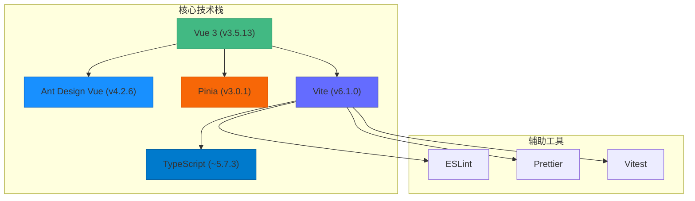
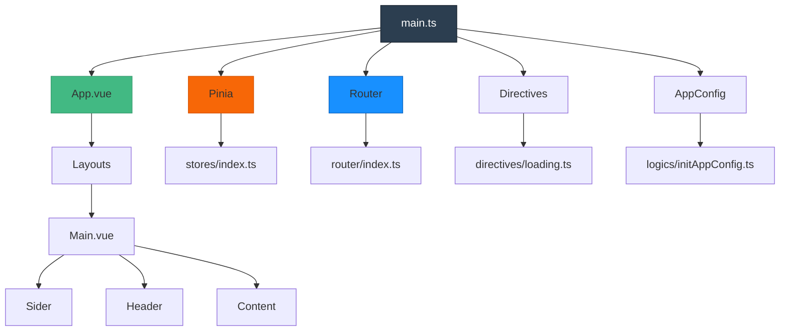
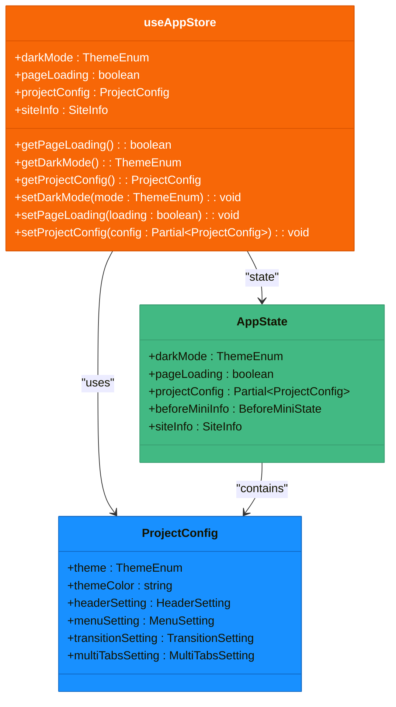
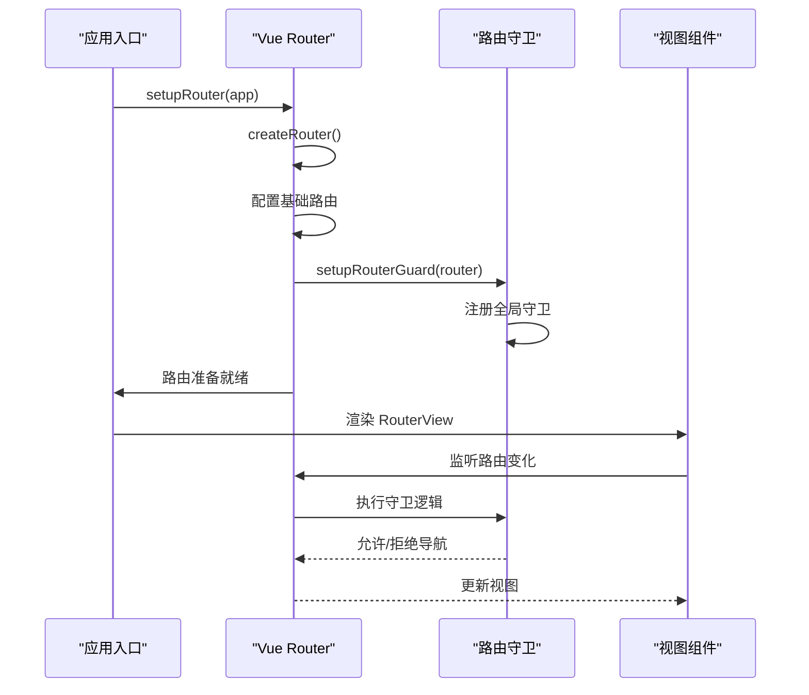
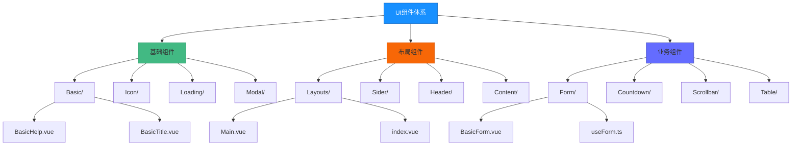
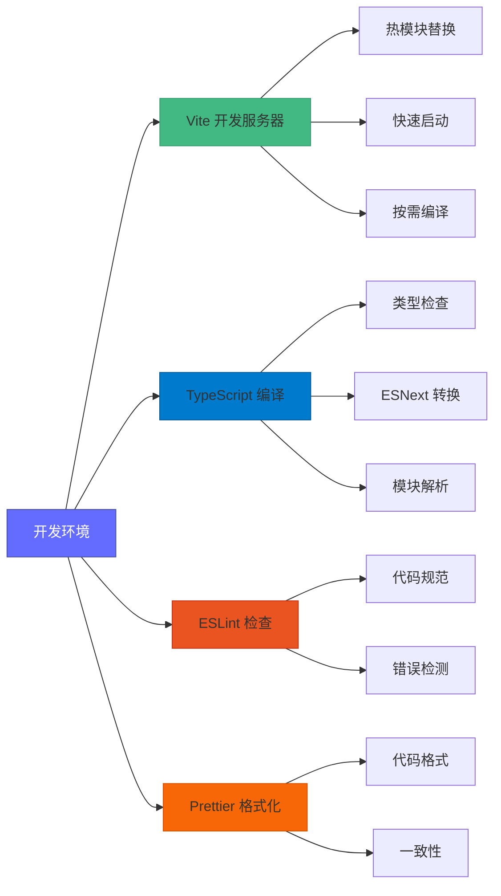
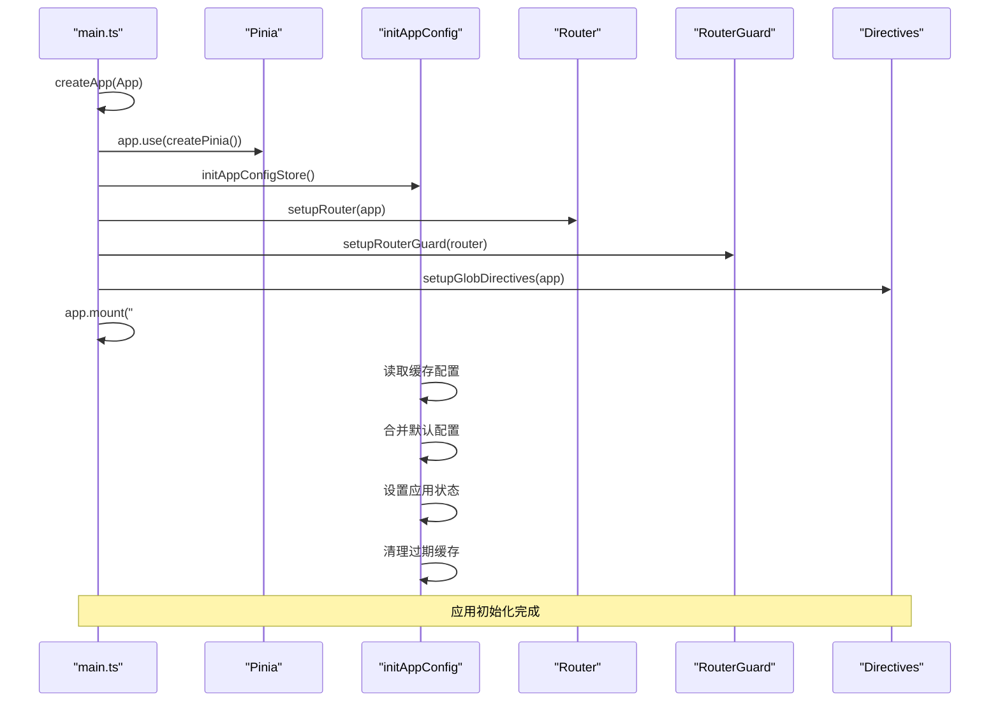
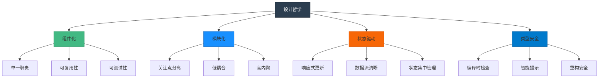
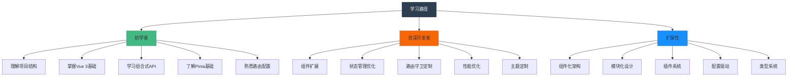

# 项目概述

<cite>
**本文档引用的文件**
- [package.json](file://package.json)
- [src/main.ts](file://src/main.ts)
- [src/App.vue](file://src/App.vue)
- [vite.config.ts](file://vite.config.ts)
- [tsconfig.json](file://tsconfig.json)
- [src/router/index.ts](file://src/router/index.ts)
- [src/stores/index.ts](file://src/stores/index.ts)
- [src/config/project.ts](file://src/config/project.ts)
- [src/layouts/Main.vue](file://src/layouts/Main.vue)
- [src/enums/appEnum.ts](file://src/enums/appEnum.ts)
- [src/stores/modules/app.ts](file://src/stores/modules/app.ts)
- [src/logics/initAppConfig.ts](file://src/logics/initAppConfig.ts)
- [src/directives/loading.ts](file://src/directives/loading.ts)
- [src/utils/createAsyncComponent.tsx](file://src/utils/createAsyncComponent.tsx)
- [index.html](file://index.html)
</cite>

## 目录
1. [项目简介](#项目简介)
2. [技术选型与架构](#技术选型与架构)
3. [核心架构分析](#核心架构分析)
4. [状态管理设计](#状态管理设计)
5. [路由系统](#路由系统)
6. [UI组件体系](#ui组件体系)
7. [构建与开发配置](#构建与开发配置)
8. [项目初始化流程](#项目初始化流程)
9. [设计哲学与最佳实践](#设计哲学与最佳实践)
10. [学习路径与扩展性](#学习路径与扩展性)

## 项目简介

voir-ui 是一个现代化的中后台管理系统解决方案，旨在为开发者提供开箱即用的管理界面基础架构。该项目基于最新的前端技术栈构建，专注于提供高效、可维护且易于扩展的开发体验。系统采用组件化架构和模块化设计，通过状态驱动UI的方式实现响应式交互。项目不仅为初学者提供了清晰的学习路径，同时也为资深开发者展示了强大的可扩展性和定制潜力，适用于各种规模的企业级应用开发。

**Section sources**
- [package.json](file://package.json#L2-L64)
- [index.html](file://index.html#L1-L27)

## 技术选型与架构

voir-ui 项目采用了当前最前沿的前端技术栈，包括 Vue 3、Ant Design Vue、Pinia 和 Vite，结合 TypeScript 提供了完整的类型安全开发环境。Vue 3 的组合式 API 极大地提升了代码的可读性和可维护性，使复杂业务逻辑的组织更加清晰。Pinia 作为官方推荐的状态管理库，以其简洁的 API 和优秀的 TypeScript 支持，为应用提供了可靠的状态管理方案。Vite 构建工具则带来了极速的开发体验，其基于原生 ES 模块的开发服务器能够在毫秒级完成启动和热更新。

**Diagram sources**
- [package.json](file://package.json#L18-L25)
- [vite.config.ts](file://vite.config.ts#L9-L10)

**Section sources**
- [package.json](file://package.json#L18-L58)
- [tsconfig.json](file://tsconfig.json#L14-L87)

## 核心架构分析

项目采用了清晰的分层架构设计，各模块职责分明，便于维护和扩展。从项目结构可以看出，src 目录下包含了 components（组件）、layouts（布局）、views（视图）、stores（状态管理）、router（路由）等核心模块，形成了完整的应用架构。入口文件 main.ts 负责应用的初始化，通过 createApp 创建 Vue 实例，并依次注册 Pinia 状态管理、路由系统、全局指令等核心功能。

**Diagram sources**
- [src/main.ts](file://src/main.ts#L12-L28)
- [src/App.vue](file://src/App.vue#L1-L42)
- [src/layouts/Main.vue](file://src/layouts/Main.vue#L1-L44)

**Section sources**
- [src/main.ts](file://src/main.ts#L1-L29)
- [src/App.vue](file://src/App.vue#L1-L42)
- [src/layouts/Main.vue](file://src/layouts/Main.vue#L1-L44)

## 状态管理设计

项目采用 Pinia 作为状态管理解决方案，通过模块化的方式组织应用状态。store/index.ts 文件定义了全局状态管理实例，而 stores/modules/app.ts 则实现了具体的应用状态模块。这种设计模式使得状态管理更加清晰和可维护。useAppStore 定义了应用的核心状态，包括暗色模式、页面加载状态、项目配置等，并通过 getters 提供计算属性，actions 提供状态变更方法。

**Diagram sources**
- [src/stores/index.ts](file://src/stores/index.ts#L1-L11)
- [src/stores/modules/app.ts](file://src/stores/modules/app.ts#L1-L76)

**Section sources**
- [src/stores/index.ts](file://src/stores/index.ts#L1-L11)
- [src/stores/modules/app.ts](file://src/stores/modules/app.ts#L1-L76)

## 路由系统

项目的路由系统基于 Vue Router 4 构建，采用模块化设计，支持静态路由和动态路由的混合使用。router/index.ts 文件定义了路由实例的创建和配置，通过 createWebHashHistory 实现基于 hash 的路由模式。系统内置了路由白名单机制，通过 WHITE_NAME_LIST 存储基础路由名称，为后续的路由重置功能提供支持。路由守卫机制确保了应用的安全性和一致性。

**Diagram sources**
- [src/router/index.ts](file://src/router/index.ts#L1-L39)
- [src/main.ts](file://src/main.ts#L10-L11)

**Section sources**
- [src/router/index.ts](file://src/router/index.ts#L1-L39)
- [src/main.ts](file://src/main.ts#L6-L7)

## UI组件体系

项目构建了一个完整的UI组件体系，采用Ant Design Vue作为基础UI库，并在此基础上进行了二次封装和扩展。components目录下包含了Application、Basic、Countdown、Form、Icon、Loading、Modal、Scrollbar等组件模块，形成了层次分明的组件库。这种设计既利用了Ant Design Vue丰富的组件生态，又通过自定义封装满足了特定业务需求，实现了组件的复用性和一致性。

**Diagram sources**
- [src/components/](file://src/components/#L1-L50)
- [src/layouts/](file://src/layouts/#L1-L50)

**Section sources**
- [src/components/](file://src/components/#L1-L50)
- [src/layouts/](file://src/layouts/#L1-L50)

## 构建与开发配置

项目采用 Vite 作为构建工具，提供了卓越的开发体验。vite.config.ts 文件定义了完整的构建配置，包括服务器设置、插件配置、构建选项等。系统配置了 @vitejs/plugin-vue 和 @vitejs/plugin-vue-jsx 插件支持 Vue 单文件组件和 JSX 语法，通过 unplugin-vue-components 实现组件的自动导入。TypeScript 配置在 tsconfig.json 中定义，启用了严格类型检查和模块解析，确保代码质量和类型安全。

**Diagram sources**
- [vite.config.ts](file://vite.config.ts#L1-L72)
- [tsconfig.json](file://tsconfig.json#L1-L126)

**Section sources**
- [vite.config.ts](file://vite.config.ts#L1-L72)
- [tsconfig.json](file://tsconfig.json#L1-L126)

## 项目初始化流程

项目的初始化流程设计严谨，确保了应用的稳定启动。从 main.ts 入口开始，系统依次执行应用创建、Pinia 状态管理注册、应用配置初始化、路由设置、路由守卫注册和全局指令设置等步骤。initAppConfig.ts 文件负责初始化项目配置，从本地缓存中读取持久化的配置信息，并进行版本兼容性检查和过期缓存清理，确保了配置的一致性和安全性。

**Diagram sources**
- [src/main.ts](file://src/main.ts#L12-L28)
- [src/logics/initAppConfig.ts](file://src/logics/initAppConfig.ts#L1-L54)

**Section sources**
- [src/main.ts](file://src/main.ts#L12-L28)
- [src/logics/initAppConfig.ts](file://src/logics/initAppConfig.ts#L1-L54)

## 设计哲学与最佳实践

项目遵循现代化前端开发的最佳实践，体现了清晰的设计哲学。组件化架构确保了代码的复用性和可维护性，每个组件都具有明确的职责和接口。模块化设计将功能按领域划分，降低了模块间的耦合度。状态驱动UI的设计模式使得应用状态的变化能够自动反映到用户界面，实现了响应式交互。TypeScript 的全面应用提供了完整的类型安全，减少了运行时错误。

**Diagram sources**
- [src/components/](file://src/components/#L1-L50)
- [src/stores/](file://src/stores/#L1-L50)
- [src/router/](file://src/router/#L1-L50)
- [tsconfig.json](file://tsconfig.json#L90-L91)

**Section sources**
- [src/components/](file://src/components/#L1-L50)
- [src/stores/](file://src/stores/#L1-L50)
- [src/router/](file://src/router/#L1-L50)
- [tsconfig.json](file://tsconfig.json#L90-L91)

## 学习路径与扩展性

项目为不同层次的开发者提供了清晰的学习路径和扩展机制。初学者可以从项目结构入手，理解 Vue 3 组合式 API 的基本用法，逐步掌握 Pinia 状态管理和 Vue Router 路由系统。资深开发者则可以利用项目的模块化设计，轻松实现功能扩展和定制。通过 components 目录的组件封装机制，开发者可以快速构建符合项目规范的自定义组件；通过 stores 模块，可以扩展应用状态管理能力；通过 router 模块，可以灵活配置路由规则。

**Diagram sources**
- [src/components/](file://src/components/#L1-L50)
- [src/stores/](file://src/stores/#L1-L50)
- [src/router/](file://src/router/#L1-L50)
- [src/config/project.ts](file://src/config/project.ts#L1-L39)

**Section sources**
- [src/components/](file://src/components/#L1-L50)
- [src/stores/](file://src/stores/#L1-L50)
- [src/router/](file://src/router/#L1-L50)
- [src/config/project.ts](file://src/config/project.ts#L1-L39)